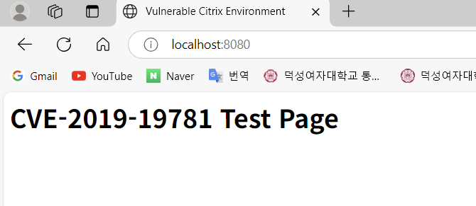

# CVE-2019-19781 - Citrix ADC Path Traversal Vulnerability

- **작성자** : 화이트햇 3기 6반 김현진
- **github** : https://github.com/hyunjin0334/kr-vulhub/tree/main/CVE-2019-19781
- **Pull Requests** : 


## 개요
- **CVE 번호** : CVE-2019-19781
  
- **취약점 요약** : Citrix ADC(Application Delivery Controller)는 WEB/WAN 가속, 웹-방화벽, L7 DDoS 방어 등 다양한 기능이 포함된 올인원 제품입니다. Citrix Gateway는 원격 엑세스를 단순하게 만들어주며, 앱과 리소스에 대한 액세스를 보호합니다.  
이 두 장비의 일부 버전에서 입력값에 대한 적절한 검증이 부족하여 공격자가 임의 코드를 실행시킬 수 있는 취약점이 발견되었습니다. Directory Traversal을 허용하는 문제점이 발견된 것입니다. /vpns/ 폴더에 대한 검증이 부족하여 민감한 파일을 읽거나 원격 코드를 실행(RCE)시킬 수 있습니다.

- **영향을 받는 버전** : (2020년 7월 이전에 지원된 버전)
  - Citrix ADC 13.0 이하
  - Citrix ADC 12.1 이하
  - Citrix ADC 12.0 이하
  - Citrix ADC 11.1 이하
  - Citrix ADC 10.5 이하


## 환경 구성 
- **Base Image** : nginx:1.17-alpine
  
    - **선정 이유** : Citrix ADC는 라이선스 없이 사용할 수 없으며 Base image가 존재하지 않기 때문에 직접 사용할 수 없었습니다. 따라서 오픈 웹서버이며 경로 매핑을 자유롭게 할 수 있는 것을 선정하여 실습 환경을 구성하여야 했습니다. nginx는 경로 매핑을 자유롭게 할 수 있기 때문에 Direatory Traversal 환경을 구축할 수 있었습니다. 또한 alpine 기반 이미지를 통해 빌드 속도와, 가벼운 Docker환경을 구축하고자 하였습니다.
 
- **구성 파일** :
  - Dockerfile
  - docker-compose.yml
  - nginx.conf
  - html/index.html
  - html/etc/passwd
 
- **Directory**
```text
cve201919781/
├── Dockerfile
├── docker-compose.yml
├── nginx.conf
└── html/
    ├── index.html
    └── etc/
        └── passwd
```

## 익스플로잇
- **1. Docker 빌드 및 실행** :
```
docker-compose up --build
```
  

- **2. 브라우저 접속 확인** :
```
http://localhost:8080/
```
  
정상적으로 접속되면 'CVE-2019-19781 Test Page'가 뜨게 됩니다.   

