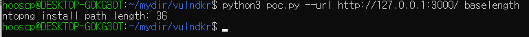

# ntopng 인증 우회 (CVE-2021-28073)

**ntopng**은 서버가 캡처한 트래픽으로부터 얻은 흐름(Flow) 및 통계에 중점을 둔 패시브 네트워크 모니터링 도구입니다.

ntopng 4.2 및 그 이전 버전에는 인증 우회 취약점이 존재합니다.

참고 링크:

- http://noahblog.360.cn/ntopng-multiple-vulnerabilities/

## 취약점 환경

다음 명령어를 실행하여 ntopng을 시작합니다:

```
docker compose up -d
```

서버가 시작된 후, 브라우저에서 `http://your-ip:3000`으로 접속하면 로그인 페이지를 볼 수 있습니다.  
기본 로그인 계정은 **admin/admin**이며, 최초 로그인 시 비밀번호 재설정을 요구합니다.

## 취약점 재현

참고 링크 및 간단한 [poc.py](poc.py) 스크립트에 따라, ntopng lua 디렉터리의 경로 길이를 계산합니다:

```
python poc.py --url http://your-ip:3000/ baselength
```



Vulhub 컨테이너에서 경로 길이가 **36**임을 확인할 수 있습니다.

그 다음, 인증 없이 접근하고 싶은 페이지나 인터페이스(예: `/lua/find_prefs.lua`)를 브라우저로 열어봅니다.  
이때 로그인 페이지로 리다이렉트되는 것을 확인할 수 있습니다.

POC를 이용해 비인가 접근용 URL을 생성합니다:

```
python poc.py --url http://your-ip:3000/ generate -l 36 -p find_prefs.lua
```


생성된 URL을 통해 해당 인터페이스에 인증 없이 접근할 수 있습니다:


