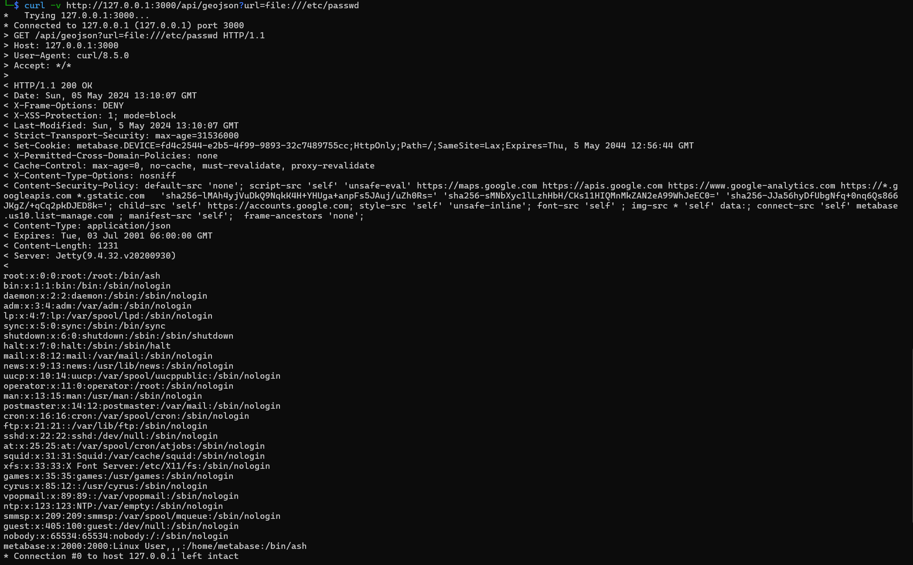

# Metabase의 사전 인증 로컬 파일 포함 문제 (CVE-2021-41277)

Metabase는 오픈소스 데이터 분석 플랫폼입니다.

x.40.0 부터 x.40.4 버전에서 인증되지 않은 공격자가 로컬 파일을 읽을 수 있는 취약점이 발견되었습니다.

해당 취약점은 `custom GeoJSON map(admin → settings → maps → custom maps → add a map)`을 지원하는 부분에서 발생합니다.

URL이 로드되기 전에 유효성 검사가 이루어지지 않아, 인증되지 않은 공격자가 로컬 파일을 읽을 수 있었습니다.

## 환경 구성 및 실행
1) `docker compose up -d`를 실행하여 테스트 환경을 실행할 수 있습니다.
2) `http://your-ip:3000/`에 접속하여 Metabase 페이지를 확인할 수 있습니다.
3) `python3 poc.py` 실행 후, `your-ip:3000`을 입력하여 CVE-2021-41277 취약점이 존재함을 확인할 수 있습니다.

4) 프롬프트에 `curl -v http://127.0.0.1:3000/api/geojson?url=file:///etc/passwd`를 입력하면 `/etc/passwd` 파일의 내용을 읽을 수 있습니다. 

## 정리
공격자는 해당 취약점을 이용해, 서버의 `/etc/passwd`와 같은 민감한 파일에 접근할 수 있습니다.

역방향 프록시, 로드 밸런서, WAF 등에 적절한 규칙을 설정하여 유효성 검사 필터링을 제공하면, 이 문제를 완화할 수 있습니다.
