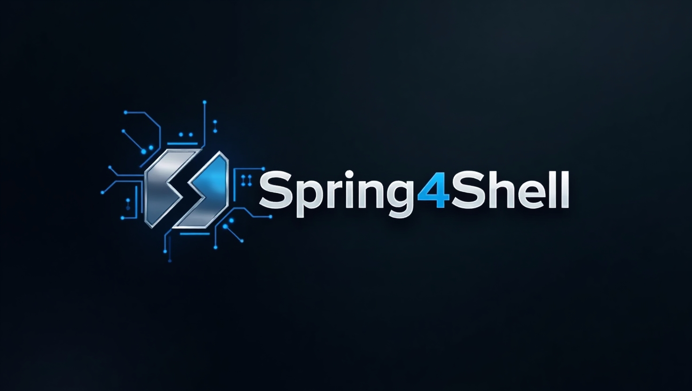
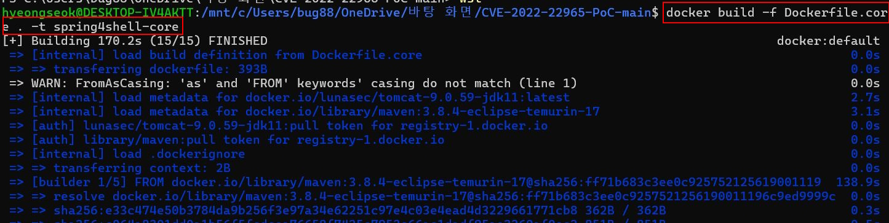
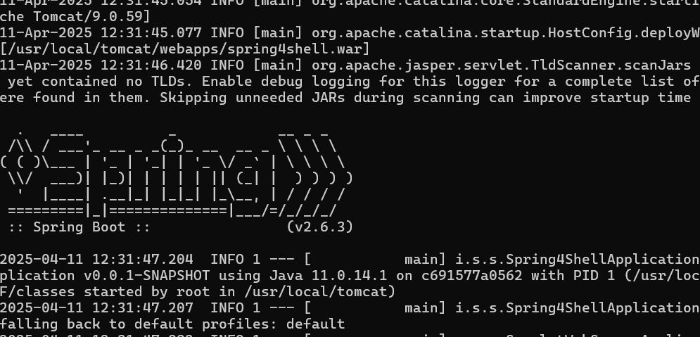
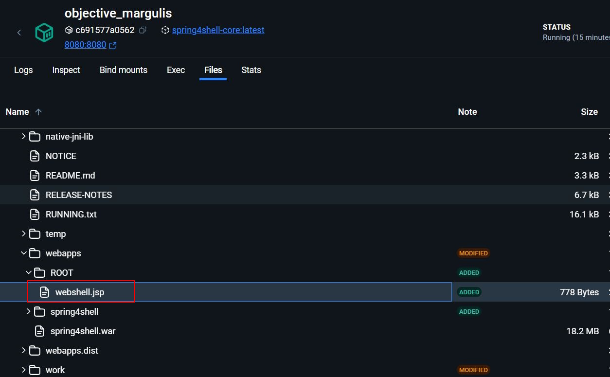

# CVE-2022-22965

> 화이트햇 스쿨 3기 - [김형석] ([https://github.com/hyeongseok88](https://github.com/hyeongseok88/kr-vulhub/tree/main/CVE-2022-22965))


 
<br/>

## 요약

- CVE-2022-22965는 Spring Framework에서 발견된 **원격 코드 실행(RCE)** 취약점
- 2022년 3월 29일 제로데이 형태로 공개되었으며, 공격자가 웹쉘을 생성하고 명령 실행 가능
- 특정 조건(SPRING Framework 버전, JDK 9 이상, WAR 배포 등)에서 취약점 발생
- 단순한 공격 방식과 높은 파급력으로 Log4Shell과 유사하다는 이유로 ‘Spring4Shell’이라는 별명 붙음

<br/>

## 환경 구성



```console
docker build -f Dockerfile.core . -t spring4shell-core
```

커맨드를 입력해 테스트 환경 이미지 설치




```console
docker run --rm -p 8080:8080 spring4shell-core
```

커맨드를 입력해 이미지를 컨테이너로 생성


<br>

`http://127.0.0.1:8080/spring4shell/exploitme`에 접속하면 Spring4Shell 취약점 페이지에 성공적으로 접근할 수 있습니다.


<br/>

## Poc 테스트

- `pip install requsets` 커맨드로 poc.py 실행을 위한 requests 모듈 설치
- `python poc.py` 를 실행하면 웹쉘이 생성되고 생성된 경로를 통해 명령 실행 가능


<br>

poc 코드 실행하여 웹쉘 생성


<br>

생성된 웹쉘 경로로 이동 후 시스템 명령 실행이 가능합니다.



<br>

실제 Docker 환경에서 웹쉘이 생성된 경로를 확인해보면 `/user/local/tomcat/webapps/Root` 디렉토리 내부에 생성된 것을 확인할 수 있습니다.


