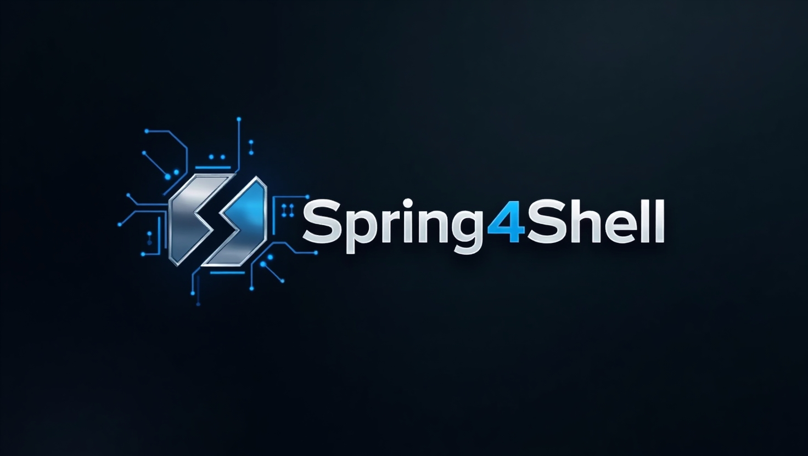
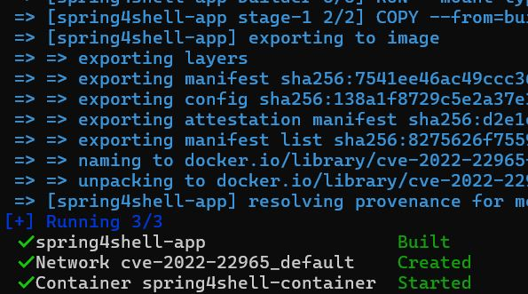
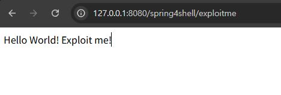
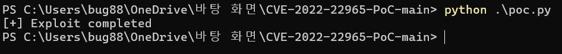
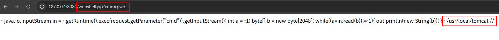
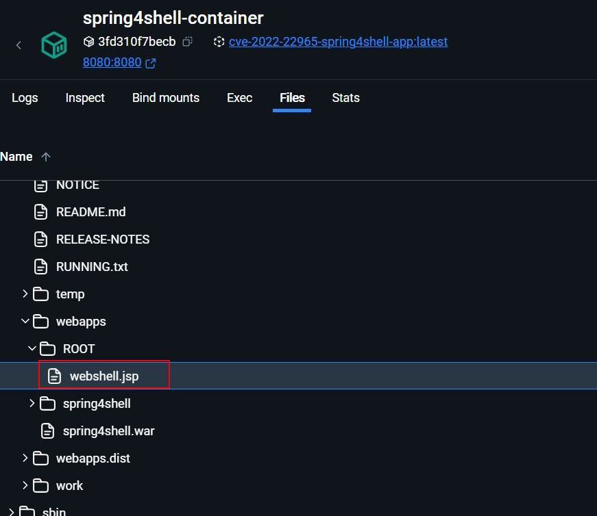
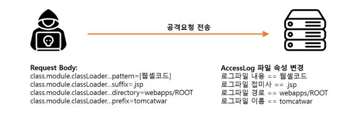
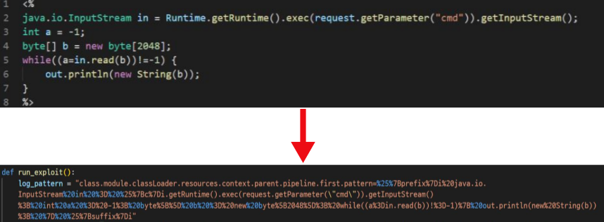

# CVE-2022-22965

> 화이트햇 스쿨 3기 - [김형석] ([https://github.com/hyeongseok88](https://github.com/hyeongseok88/kr-vulhub/tree/main/CVE-2022-22965))

<br>


 
<br/>

## 요약

- CVE-2022-22965는 Spring Framework에서 발견된 **원격 코드 실행(RCE)** 취약점
- 2022년 3월 29일 제로데이 형태로 공개되었으며 공격자가 웹쉘을 생성하고 명령 실행 가능
- 특정 조건(SPRING Framework 버전, JDK 9 이상, WAR 배포 등)에서 취약점 발생
- 단순한 공격 방식과 높은 파급력으로 Log4Shell과 유사하다는 이유로 ‘Spring4Shell’이라는 별명 붙음

<br/>

## 환경 구성



```console
 docker compose up -d
```

커맨드를 입력하여 테스트 환경을 설치합니다
<br>




`http://127.0.0.1:8080/spring4shell/exploitme`에 접속하면 Spring4Shell 취약점 페이지에 성공적으로 접근할 수 있습니다.


<br/>

## PoC 실행

- `pip install requests` 커맨드로 poc.py 실행을 위한 requests 모듈 설치
- `python poc.py` 를 실행하면 웹쉘이 생성되고 생성된 경로를 통해 명령 실행 가능
<br>




poc 코드 실행하여 웹쉘 생성




생성된 웹쉘 경로로 이동 후 시스템 명령 실행이 가능합니다.



<br>

실제 Docker 환경에서 웹쉘이 생성된 경로를 확인해보면 `/user/local/tomcat/webapps/Root` 디렉토리 내부에 생성된 것을 알 수 있습니다.

<br>

## PoC 분석
<br>




테스트로 사용한 PoC를 살펴보면 Tomcat 의 AccessLogValve 의 속성을 변조하여 웹 디렉토리에
웹쉘을 생성하고 있다. 요청에 ClassLoader 를 변경하는 파라미터를 실어 보내면 AccessLog 의
패턴, 확장자, 경로, 이름을 공격자가 의도한 내용으로 바꿀 수 있기 때문에 최종적으로는 웹
디렉터리 아래 웹쉘코드가 포함된 jsp 파일을 생성할 수 있다.

<br>

## 🔍 웹쉘 생성 메커니즘
<br>



`log_pattern` 변수는 웹쉘 코드가 포함된 로그 패턴 문자열이며 아래 설정들과 함께 전송되어 Tomcat의 액세스 로그를 **웹쉘(`webshell.jsp`)로 생성**하도록 유도합니다.

---

### 📌 설정 파라미터 설명

- `class.module.classLoader.resources.context.parent.pipeline.first.suffix=.jsp`  
  → **로그 파일 확장자를 `.jsp`로 설정**하여 웹에서 실행 가능한 파일로 만듭니다.

- `class.module.classLoader.resources.context.parent.pipeline.first.directory=webapps/ROOT`  
  → **로그 파일을 웹 루트 디렉토리에 생성**하여 외부에서 접근 가능하게 합니다.

- `class.module.classLoader.resources.context.parent.pipeline.first.prefix=webshell`  
  → **로그 파일 이름을 `webshell`로 설정**합니다.

- `class.module.classLoader.resources.context.parent.pipeline.first.fileDateFormat=`  
  → **날짜 포맷을 비워두어 `webshell.jsp`로 정확히 생성**되도록 합니다.

---

이 설정 값들은 `log_pattern`과 함께 전송되어 Tomcat의 로그 시스템을 조작하고  
다음 경로에 **웹쉘(`webapps/ROOT/webshell.jsp`)을 생성**하는 역할을 합니다.

## ✅ 대응 방안

Spring Framework에서 발생한 취약점에 대한 대응 방안은 다음과 같습니다.

### 🔹 1. Spring Framework 업그레이드

- **Spring Framework를 최신 버전으로 업그레이드**합니다.
  - 권장 버전:
    - `5.2.20`
    - `5.3.18`

---

### 🔹 2. 업그레이드가 어려운 경우의 대안

Spring 공식 블로그는 업그레이드가 어려운 경우 다음과 같은 조치를 권장합니다:

1. **Apache Tomcat 업그레이드**
   - 다음 버전 이상으로 업그레이드:
     - `10.0.2`
     - `9.0.62`
     - `8.5.78`

2. **JDK 버전 변경**
   - JDK 9 이상을 사용 중이라면, **JDK 8로 다운그레이드**합니다.

3. **코드 레벨 보안 조치**
   - `@ControllerAdvice`를 사용하여 **ClassLoader의 내부 필드 할당 차단**을 구현합니다.

---

## 📚 참고

- https://www.skshieldus.com/download/files/download.do?o_fname=EQST%20insight_Research%20Technique_202204.pdf&r_fname=20220419081950184.pdf
- https://github.com/sunnyvale-it/CVE-2022-22965-PoC
- https://mokpo.tistory.com/836
- https://www.igloo.co.kr/security-information/spring4shellcve-2022-22965-%EC%B7%A8%EC%95%BD%EC%A0%90-%EC%9B%90%EC%9D%B8%EB%B6%84%EC%84%9D-%EB%B0%8F-%EB%8C%80%EC%9D%91%EB%B0%A9%EC%95%88/
- https://www.microsoft.com/en-us/security/blog/2022/04/04/springshell-rce-vulnerability-guidance-for-protecting-against-and-detecting-cve-2022-22965/


