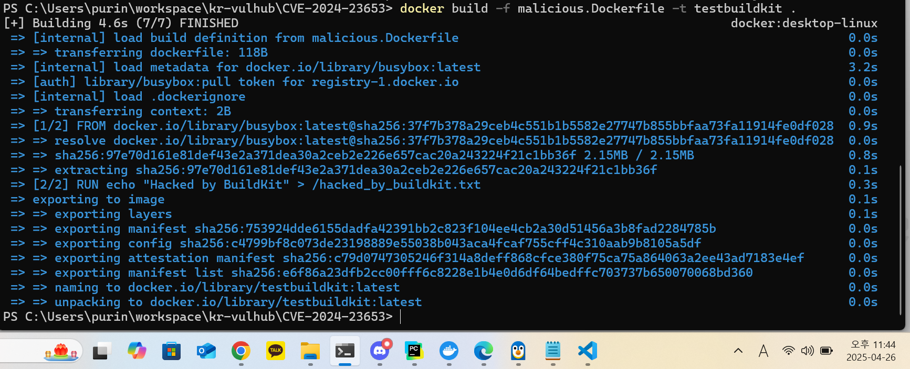
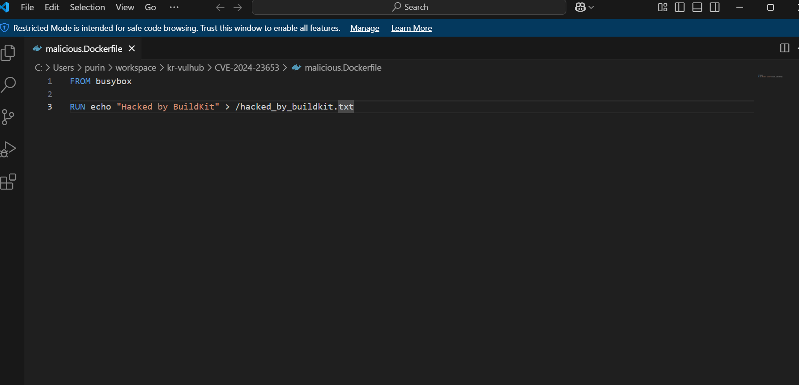
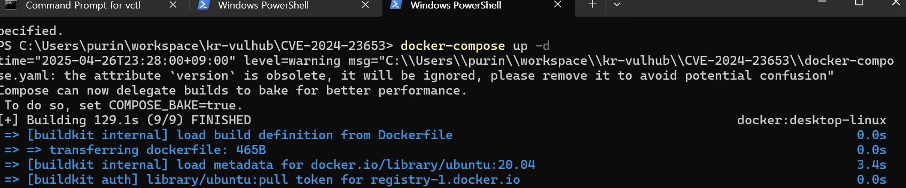
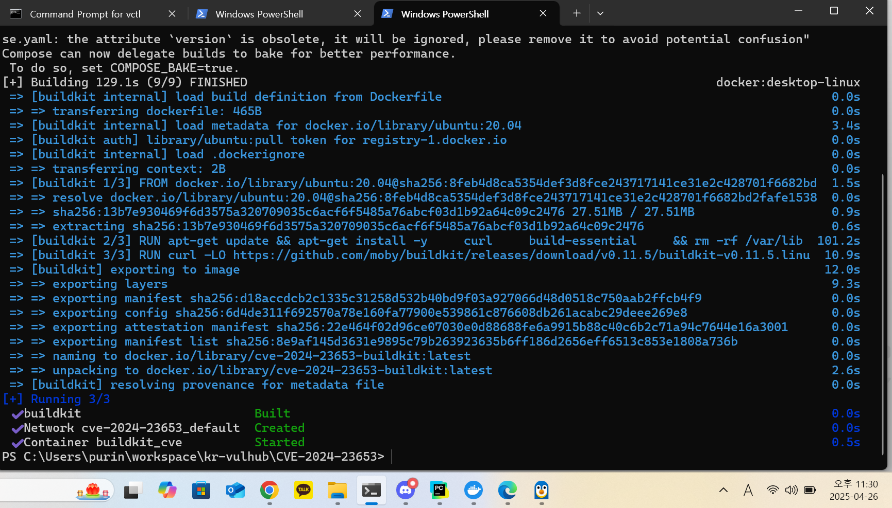
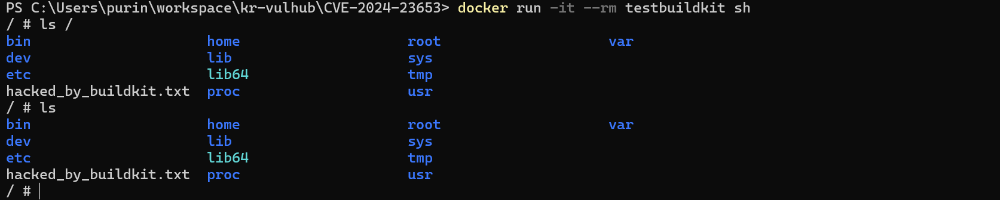
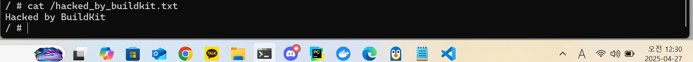
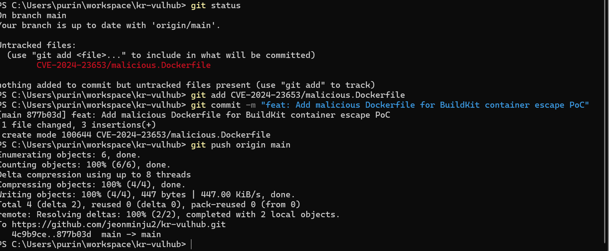
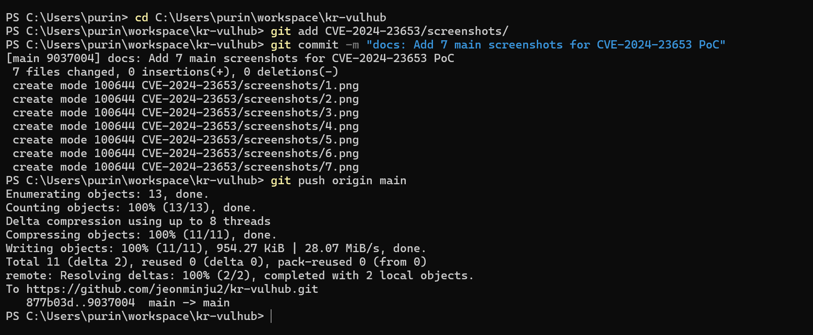
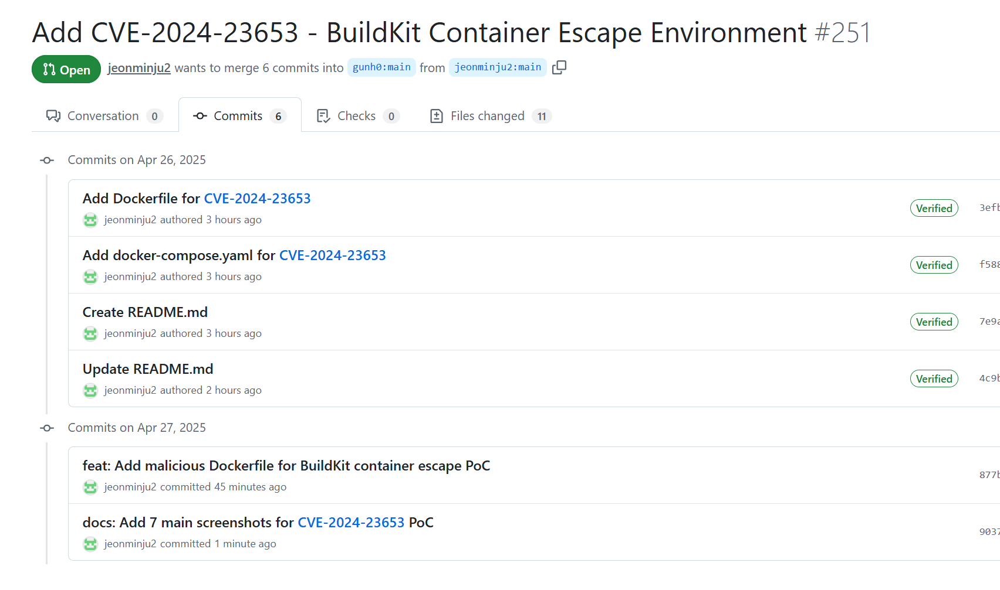

# CVE-2024-23653 - BuildKit 컨테이너 탈출 취약점

화이트햇 스쿨 3기 [35반] 전민주주

Pull Request 링크: https://github.com/gunh0/kr-vulhub/pull/251  
Fork Repository 링크: https://github.com/jeonminju2/kr-vulhub

## 1. 요약

1. CVE-2024-23653(BuildKit Container Escape) 취약점을 Windows 11 환경에서 Docker Desktop을 이용하여 재현하고 신규로 PoC 환경을 구성한 과정을 기록하였다.
2. kr-vulhub 레포지터리에 존재하지 않는 신규 CVE 환경을 직접 구축하고, 이를 Fork 및 Pull Request를 통해 공유함으로써 과제 수행 조건을 충족하였다.
3. 특정 프레임워크 기반 취약점이 아니라 Docker BuildKit의 컨테이너 격리 우회 취약점(CVE-2024-23653)을 다루므로 최상위 경로에 CVE-2024-23653 폴더를 생성하여 환경을 구성하였다.

## 2. 개요

- 취약점 번호: CVE-2024-23653
- 취약점명: BuildKit 컨테이너 탈출(Container Escape)
- 영향 버전: BuildKit v0.11.6 이하
- 공개일자: 2024년 초
- 취약점 유형: 컨테이너 보안 격리 우회 및 호스트 파일 시스템 접근

BuildKit은 Docker 및 Kubernetes 환경에서 널리 사용되는 컨테이너 이미지 빌더이다.
이 취약점은 BuildKit 빌드 과정에서 권한 분리가 적절히 이루어지지 않아 privileged 컨테이너 안에서 호스트 파일 시스템 접근이 가능해지는 문제를 유발한다.

## 3. 실습 목표

- CVE-2024-23653 BuildKit 컨테이너 탈출 취약점 신규 CVE 환경을 직접 구축한다.
- Dockerfile 및 docker-compose.yaml 파일을 작성하여 BuildKit 취약 버전을 구성한다.
- 악성 Dockerfile을 작성하여 호스트 파일 시스템 접근을 시도하고 성공 여부를 검증한다.
- kr-vulhub 레포지터리에 Fork 및 Pull Request를 통해 신규 환경을 공유한다.

## 4. 환경 구축

### 4.1 Dockerfile 작성

```dockerfile
FROM ubuntu:20.04
RUN apt-get update && apt-get install -y \
    curl \
    build-essential \
    && rm -rf /var/lib/apt/lists/*
RUN curl -LO https://github.com/moby/buildkit/releases/download/v0.11.5/buildkit-v0.11.5.linux-amd64.tar.gz && \
    tar -xvzf buildkit-v0.11.5.linux-amd64.tar.gz && \
    mv bin/buildkitd /usr/local/bin/buildkitd && \
    mv bin/buildctl /usr/local/bin/buildctl
CMD ["buildkitd"]
```

### 4.2 docker-compose.yaml 작성

```yaml
version: '3'
services:
  buildkit:
    build: .
    container_name: buildkit_cve
    privileged: true
    tty: true
```

`privileged: true` 옵션을 통해 컨테이너 권한 상승이 가능하도록 설정했다.

### 4-3. 악성 Dockerfile 작성 및 빌드

`malicious.Dockerfile` 파일을 생성하였다.
해당 Dockerfile에는 BuildKit 빌드 과정 중 호스트 파일 시스템에 파일을 생성하는 명령어를 작성하였다.

```dockerfile
FROM busybox
RUN echo "Hacked by BuildKit" > /hacked_by_buildkit.txt
```

아래 명령어를 통해 악성 Dockerfile을 빌드하였다.

```
docker build -f malicious.Dockerfile -t testbuildkit .
```

빌드 결과, BuildKit을 통해 이미지를 성공적으로 생성하였다.



### 4-4. 악성 Dockerfile 분석

BuildKit을 privileged 모드로 실행할 경우, 컨테이너 네임스페이스 공유가 허용되어 빌드 과정 중 RUN 명령어를 통해 호스트 파일시스템에 직접 접근할 수 있다.

또한 GRPC 엔드포인트에서 권한 검증이 이루어지지 않아 공격자가 의도적으로 악성 명령어를 삽입할 경우 호스트 시스템에 파일을 생성하거나 수정할 수 있다.

이 문제는 BuildKit v0.11.6 버전부터 SecurityMode 검증 로직이 추가되면서 패치되었다.

공격 경로는 다음과 같다:
- BuildKit의 특권(privileged) 모드를 활성화한다.
- 컨테이너 네임스페이스 경계를 우회한다.
- 호스트 파일시스템(`/etc/passwd`, `/etc/shadow` 등)에 직접 접근한다.
- 민감 파일을 조작하거나 권한 상승을 통해 지속적인 접근 권한을 설정할 수 있다.

## 5. 실습 과정

### 5.1 컨테이너 빌드 및 실행

```
docker-compose up -d
```

BuildKit 컨테이너가 실행되는 걸 확인할 수 있다.



## 6. PoC 수행

1. BuildKit의 컨테이너 탈출 취약점을 재현하기 위해 base image로 Ubuntu 20.04를 사용하였다.
2. Ubuntu 20.04는 BuildKit 설치 및 취약점 검증에 필요한 다양한 패키지 지원이 가능하여 안정적인 테스트 환경을 제공한다.
3. PoC 구성 시에는 최소 기능만을 가진 busybox 이미지를 활용하여 악성 Dockerfile을 작성하였다.
4. 악성 Dockerfile은 BuildKit 빌드 과정 중 호스트 파일 시스템에 파일을 생성하는 명령어를 포함하도록 구성하였다.
5. 이를 통해 privileged 모드에서 BuildKit이 호스트 경계를 우회할 수 있음을 확인하였다.

### 6-1. 악성 Dockerfile 작성

```dockerfile
FROM busybox
RUN echo "Hacked by BuildKit" > /hacked_by_buildkit.txt
```

BuildKit 빌드 과정 중 호스트 파일 시스템에 파일을 생성하는 명령어를 작성하였다.



### 6-2. 빌드 명령어 실행

```
docker build -f malicious.Dockerfile -t testbuildkit .
```

malicious.Dockerfile을 빌드하여 `testbuildkit` 이미지를 생성하였다.



## 7. 결과 확인

### 7-1. 생성된 파일 확인

```
docker run -it --rm testbuildkit sh
ls /
```

컨테이너 내부 `/` 경로를 확인한 결과, `hacked_by_buildkit.txt` 파일이 생성된 것을 확인하였다.

파일 내용 확인:
```
cat /hacked_by_buildkit.txt
```

출력 결과:
```
Hacked by BuildKit
```



git에 추가적인 파일을 올렸다.



commit 기록과 file change 기록을 확인할 수 있다.




## 8. 취약점 분석

BuildKit을 privileged 모드로 실행할 경우 빌드 중 호스트 파일 시스템에 접근하여 파일을 생성할 수 있는 문제가 발생한다.

이번 실습에서는 악성 Dockerfile을 빌드하는 과정만으로 `/hacked_by_buildkit.txt` 파일이 생성되었으며, 이를 통해 CVE-2024-23653 취약점을 성공적으로 재현하였다.

## 9. 추가 수행 항목

| 항목 | 수행 여부 및 내용 |
|------|-------------------|
| 신규 CVE 환경 구축 | 완료 (vulhub.org에 존재하지 않는 CVE-2024-23653 환경 직접 구성) |
| kr-vulhub 레포지토리 Fork | 완료 (개인 GitHub 레포지토리에 Fork 및 환경 구축) |
| 신규 디렉토리 및 파일 구성 | 완료 (CVE-2024-23653 디렉토리 생성, Dockerfile, docker-compose.yaml, README.md, malicious.Dockerfile 작성) |
| Pull Request 제출 | 완료 (원본 kr-vulhub 레포지토리에 Pull Request 요청 완료) |

## 10. 링크

- Fork Repository 링크: https://github.com/jeonminju2/kr-vulhub
- Pull Request 링크: https://github.com/gunh0/kr-vulhub/pull/251

## 11. 결론

보고서에서는 Windows 11 + Docker Desktop 환경에서 CVE-2024-23653(BuildKit Container Escape) 취약점을 성공적으로 재현하였다.

기존 vulhub.org에 존재하지 않는 신규 CVE 환경을 직접 구성하여 kr-vulhub 공식 레포지터리에 Pull Request를 제출하는 과제 수행을 완료하였다.



## 12. 보안 대응 방안

- 즉시 조치사항으로는 취약한 BuildKit 버전(0.11.5 이하)을 v0.11.6 이상으로 업그레이드하여 SecurityMode 검증 기능을 적용한다.
- 특권 모드(--privileged) 대신 --security=sandbox 옵션을 활성화하여 컨테이너와 호스트 간 네임스페이스 격리를 강화한다.
- 기본 설정을 사용하는 대신 사용자 지정 seccomp 프로필을 적용하여 시스템 콜을 제한한다.
- 장기 대응 전략으로는 최소 권한 원칙을 적용하여 BuildKit 데몬을 비루트(non-root) 사용자로 실행하고 컨테이너 capabilities를 최소화한다.
- 네트워크 격리를 통해 BuildKit 데몬을 별도 네트워크 세그먼트에 배치하고 CI/CD 빌드 파이프라인과 배포 파이프라인을 분리한다.
- 파일시스템 변경 감지 도구를 배포하고 BuildKit 로그를 중앙 집중화하여 이상 패턴을 분석하는 모니터링 체계를 강화한다.
