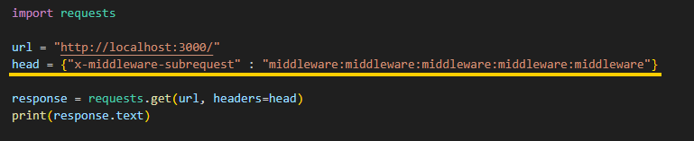

# 🧾Next.js 미들웨어 인증 우회(CVE-2025-29927)
> 화이트햇 스쿨 3기 16반 이지상 (0101) 
> 깃허브 링크-<https://github.com/fring-cloud/kr-vulhub/tree/main/CVE-2025-29927(Next.JS)>
> Pull Requests-<https://github.com/gunh0/kr-vulhub/pull/210>
---

## 📝목차 
1. Next.js 미들웨어 인증 우회 취약점이란?
2. 취약한 환경 구축
3. 취약점 테스트
4. 대처 방안
5. 참고 자료
---

## 💡1. Next.js 미들웨어 인증 우회 취약점이란?
Next.js는 편리한 웹 개발을 위한 다양한 기능을 제공하는 React 기반 웹 애플리케이션 프레임워크입니다. 
Next.js에는 내부적으로 사용 할 수 있는 x-middleware-subrequest라는 http header가 존재합니다.

내부적으로 사용하는 header인 만큼 철저한 검사가 이루어지지 않는 경우가 많으며, Next.js내부의 파일 이름과
위치가 header의 값으로 사용되기 때문에 공격자는 x-middleware-subrequest가 어떤 방식으로 사용될지 쉽게 예측 할 수 있습니다.
그렇기 때문에 공격자는 이러한 x-middleware-subrequest의 취약점을 악용하여, 외부에서 x-middleware-subrequest 를 주입하면,
기존 웹 사이트에 적용되고 있는 접근 제어 로직을 위회 할 가능성이 있습니다.

인증 및 권한 부여 목적으로 미들웨어를 사용하는 경우, 14.2.25 및 15.2.3 이전 버전은 이러한 권한 부여 우회에 취약합니다.

---

## 🚀2. 취약한 환경 구축
> step 1. 현재 README 문서와 같은 깃허브 디렉토리의 `docker-compose.yml` 파일을 로컬환경으로 다운로드 혹은 복사합니다.
> step 2. `docker compose up -d` ← 이 명령어를 입력해 취약한 도커 환경을 빌드합니다.

> step 3. `docker ps` 명령어를 입력해 아래 사진과 같은 내용일 출력된다면, 환경 구성 끝

---

## 🔫3. 취약점 테스트
앞선 "취약한 환경 구축"을 제대로 따라왔다면, 'http://localhost:3000` ← 이 url로 접속하면, 아래 사진과 같은 로그인 페이지를 확인 할 수 있습니다.

로그인 페이지에서 `id = admin, 비밀번호 = password` ← 이 계정 정보를 입력하면, 로그인에 성공하여 admin dashboard에 접근 할 수 있습니다.

여기서 알아야 할 것은 admin dashboard에 접근하기 위해선 로그인에 성공해야 한다는 것 입니다.
만약 로그인 없이 admin dashboard에 접근하면, 아래 사진처럼 로그인 페이지로 redirection 됩니다.

이 처럼, 대부분의 웹 사이트는 권한에 의한 접근 제어로 민감한 자산을 관리합니다. 하지만 이 때, 웹 사이트가 Next.js의 권한 부여 기능을 
사용한다면, http 요청에 `x-middleware-subrequest: middleware:middleware:middleware:middleware:middleware` ← 이 header를 추가하여 
접근 제어를 우회 할 수 있습니다. 아래의 파이썬 코드를 사용하면, 접근 제어를 위회해 민감한 자원에 접근 할 수 있습니다.
> (vulhub엔 burpsuit을 사용한 방법이 나와 있는데, 해당 방법이 되지 않아 파이썬의 requests 모듈로 취약점이 작동함을 확인 했습니다.)

위 코드를 실행하면, 아래 처럼 admin dashboard의 html이 출력되는 것을 확인 할 수 있습니다. 

---

## 🛡️4. 대처 방안
x-middleware-subrequest에 의한 Next.js 인증 우회 취약점을 아래의 버전에서 수정되었습니다.
- Next.js 15.x → 15.2.3
- Next.js 14.x → 14.2.25
- Next.js 13.x → 13.5.9
- Next.js 12.x → 12.3.5
 안전한 버전으로의 업데이트로 취약점을 예방 할 수 있으며, 만약 업그레이드가 어려운 경우 x-middleware-subrequest 헤더가 포함된 외부 요청이
Next.js 애플리케이션에 도달하지 않도록 웹 서버에서 해당 헤더에 대한 엄격한 검증을 수행하는 방법으로 취약점을 완화 할 수 있습니다..
---

## 💾5. 참고 자료
- [vulhub Next.js 미들웨어 인증 우회(CVE-2025-29927)](https://github.com/vulhub/vulhub/tree/master/next.js/CVE-2025-29927)
- [(CVE-2025-29927)취약점 설명 깃허브](https://github.com/aydinnyunus/CVE-2025-29927)
- [hakcyboiz (CVE-2025-29927)취약점](https://hackyboiz.github.io/2025/03/27/bekim/2025-03-27/)
