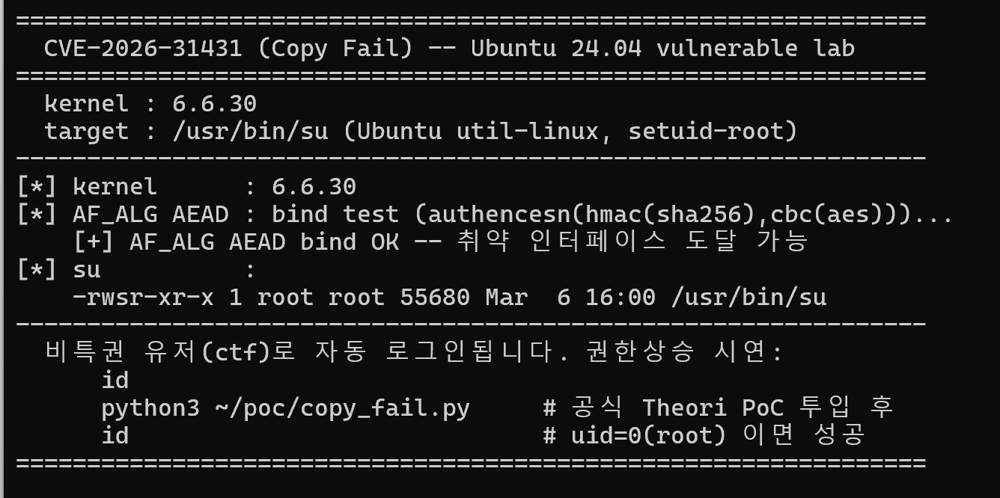
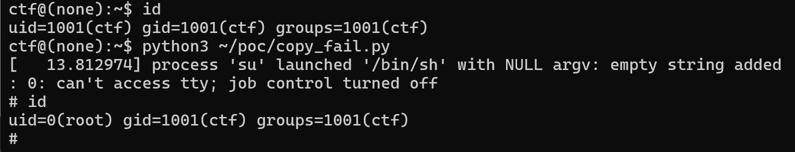

# CVE-2026-31431 — "Copy Fail" 취약점 환경 분석 보고서

| 항목 | 내용 |
|------|------|
| CVE | CVE-2026-31431 (코드네임 **Copy Fail**) |
| 유형 | 로컬 권한 상승 (LPE), Linux 커널 |
| 위치 | 커널 crypto 서브시스템 `algif_aead` (AF_ALG 유저스페이스 AEAD 인터페이스) |
| CVSS | 7.8 (HIGH) |
| 공개 | 2026-04-29, Theori (Xint Code 로 발견) |
| 영향 | 2017년 도입된 결함 — 4.14 이후 ~ 2026.04 패치 이전의 광범위한 커널 |
| 재현 환경 | QEMU + 취약 커널 6.6.30(소스 컴파일) + Ubuntu 24.04 rootfs |

> TL;DR: 비특권 로컬 유저가 `splice()` 를 통해 임의의 읽기 가능 파일의 **page cache** 에 컨트롤된 바이트를 써넣어, setuid-root 바이너리를 변조하고 root 권한을 획득하는 결함. Dirty Pipe(CVE-2022-0847)와 동일 클래스의 프리미티브가 다른 서브시스템에서 재현된 사례다.

> **구성요소 출처**: 익스플로잇 스크립트(`poc/copy_fail.py`)는 **Theori 의 공식 공개 PoC**(`theori-io/copy-fail-CVE-2026-31431`)이며, 과제 규정상 허용된 공개 오픈소스 참조로서 포함했다. 취약점의 발견·공개·PoC 원저작권은 Theori/Xint 에 있다.

---

## 0. 환경 구조 — QEMU + Ubuntu rootfs

**Copy Fail 은 커널 취약점이고, 도커 컨테이너는 호스트 커널을 공유한다.** 일반적인 방식으로는 재현이 불가능하다(컨테이너 안에 취약 커널을 넣을 수 없고, 채점자 호스트 커널이 패치돼 있으면 트리거되지 않음).

그래서 이 환경은 **컨테이너 안에서 QEMU 로 취약 커널을 직접 부팅**하며, 게스트 루트파일시스템으로 **실제 Ubuntu 24.04 userland** 를 쓴다.

```
[채점자 호스트 커널 — 패치 여부 무관]
   └─ Docker 컨테이너 (qemu-system-x86_64)
        └─ 취약 커널 6.6.30 (kernel.org 소스 컴파일, 이미지에 내장)
             └─ Ubuntu 24.04 rootfs (ext4 이미지, /usr/bin/su = 진짜 util-linux su)
                  └─ 비특권 유저 ctf 로 자동 로그인 → PoC 실행 → root
```

### 설계 근거

- **커널 취약점의 자체완결 재현**: 취약 커널을 kernel.org 소스에서 **버전 고정 컴파일**해 이미지에 내장한다. 호스트 커널이 무엇이든 동일하게 재현되고, `docker pull 취약이미지` 같은 통제 불가 외부 의존이 아니라 **직접 빌드**한다.
- **공식 PoC 무수정 동작**: 공식 Theori PoC 는 실제 배포판의 `/usr/bin/su` 바이너리에 맞춰 동작한다. 게스트를 실제 Ubuntu 24.04 로 두면 `/usr/bin/su` 가 PoC 대상과 동일해, 원본 PoC 를 수정 없이 실행할 수 있다.
- **환경 무관 실행**: KVM 가속이 없어도 QEMU TCG 로 동작하므로 채점 환경을 가리지 않는다.

---

## 1. 요약

`algif_aead` 는 AF_ALG 소켓을 통해 커널의 AEAD 암호 연산을 유저스페이스에 노출한다. 2017년 8월, AEAD 연산을 in-place(입력=출력) 처리로 전환하는 최적화 커밋(`72548b093ee3`)이 들어가면서 출력 scatterlist 가 입력의 tag 페이지를 그대로 물게 되는 경로가 생겼다. 이 상태에서 `splice()` 로 파일을 소켓에 흘려 넣으면, AEAD 연산이 ESN(Extended Sequence Number) 재배치용으로 쓰는 쓰기가 해당 파일의 page cache 안으로 떨어진다. 파일 권한 검사를 우회하므로, 읽기만 가능한 setuid-root 바이너리를 변조해 root 를 얻을 수 있다(출처: Theori, Microsoft Threat Intelligence, Sysdig TRT, Bugcrowd).

---

## 2. 취약점 분석

### 2.1 배경 — AF_ALG 와 algif_aead

AF_ALG 는 유저스페이스가 커널 암호 API 를 소켓 인터페이스로 사용하게 해준다. `algif_aead` 는 그중 AEAD(인증된 암호화) 알고리즘을 노출한다. 클라이언트는 `socket(AF_ALG, SOCK_SEQPACKET, 0)` → `bind()` 로 알고리즘을 지정한다. 이 PoC 가 쓰는 알고리즘은 `authencesn(hmac(sha256),cbc(aes))` 다.

### 2.2 결함 — in-place 최적화가 만든 cross-over

2017년 최적화는 AEAD 요청에서 `req->src = req->dst` 로 두고, 소스 scatterlist 의 tag 페이지를 `sg_chain()` 으로 출력 scatterlist 에 이어 붙인다.

- 유저가 `splice()` 로 **파일**을 소켓에 흘려 넣으면, 그 tag 페이지가 **파일의 page cache 페이지**를 가리키게 되고,
- `authencesn` 은 ESN 재배치를 위해 `assoclen + cryptlen` 오프셋에 4바이트를 scratch 로 기록하는데,
- 결함으로 출력 scatterlist 가 chain 된 page cache 페이지까지 확장되어, **그 쓰기가 spliced 파일의 캐시 데이터 안으로 떨어진다.**

이 프리미티브를 오프셋을 옮겨가며 반복하면 대상 setuid 바이너리의 page cache 를 페이로드로 채울 수 있고, 이후 그 바이너리를 실행하면 페이로드가 root 권한으로 돈다.

### 2.3 익스플로잇 흐름

1. `AF_ALG` 소켓을 열고 `authencesn(hmac(sha256),cbc(aes))` 로 bind
2. 변조 대상(setuid-root `/usr/bin/su`)을 `splice()` 로 소켓에 주입
3. AEAD 연산을 트리거하여 page cache 내 대상 파일에 페이로드 write (4바이트 단위 반복)
4. 변조된 `/usr/bin/su` 를 실행해 root 획득

> 본 저장소의 `poc/copy_fail.py`(Theori 원본)를 코드 레벨로 대응시키면: `socket(38,5,0)` = `AF_ALG`/`SOCK_SEQPACKET`, `bind("aead","authencesn(hmac(sha256),cbc(aes))")`, `os.open("/usr/bin/su")` 후 `while i<len(e): c(f,i,e[i:i+4])` 로 페이로드를 4바이트씩 주입, 마지막 `os.system("su")` 로 변조된 su 실행.

### 2.4 Dirty Pipe 와의 관계

Copy Fail 은 Dirty Pipe(CVE-2022-0847)와 **같은 클래스의 프리미티브**다. 둘 다 비특권 유저가 `splice()` 로 읽기 전용 파일의 page cache 에 데이터를 써넣는다는 점이 동일하고, 차이는 트리거하는 서브시스템(Dirty Pipe = pipe buffer, Copy Fail = algif_aead)뿐이다. page cache 가 호스트와 컨테이너 간 공유되므로, 컨테이너 안에서의 write 가 호스트에 영향을 주어 멀티테넌트 환경에서 특히 위험하다.

### 2.5 도입·수정 이력

- **도입:** 2017년, AEAD in-place 최적화 커밋(`72548b093ee3`)
- **수정:** 2026년 4월 초, 해당 최적화를 되돌리는 패치 시리즈(끝 커밋 `fafe0fa2995a`)
- **영향 범위:** 커널 4.14 대역 이후 ~ 패치 이전. 6.18.x 는 6.18.22 미만, 6.19.x 는 6.19.12 미만이 취약. 본 랩이 고정한 6.6.30 은 2024년 릴리스로 패치 이전 = 취약.

---

## 3. 환경 구성

### 3.1 요구사항

- Docker + Docker Compose (v2)
- 빌드 시 인터넷(ubuntu 베이스 이미지 · apt · kernel.org 커널 소스)
- (선택) `/dev/kvm` — 있으면 QEMU 가속, 없으면 TCG

### 3.2 디렉토리 구조

```
CVE-2026-31431-copy-fail/
├── docker-compose.yml          # 한 명령으로 빌드+부팅
├── Dockerfile                  # 4스테이지: rootfs / kernelbuild / assemble / runtime
├── run.sh                      # QEMU 부팅(virtio ext4, KVM/TCG 자동)
├── kernel/
│   └── vuln.config.fragment    # 커널 옵션: AF_ALG AEAD + virtio + ext4 + serial
├── rootfs/
│   ├── init                    # 커스텀 PID1 (systemd 대신 최소 부팅 + ctf 자동 로그인)
│   └── check_env.sh            # AF_ALG AEAD 도달성 점검(탐지 전용)
├── poc/
│   └── copy_fail.py            # Theori 공식 PoC (출처 상단 명시)
└── images/                     # 실행결과 스크린샷
```

### 3.3 익스플로잇 스크립트 (출처)

`poc/copy_fail.py` 는 **Theori 의 공식 공개 PoC**(`theori-io/copy-fail-CVE-2026-31431` 의 `copy_fail_exp.py`)다. 과제가 허용하는 공개 오픈소스 참조로서 원본 그대로 포함했으며, 원저작권은 Theori/Xint 에 있다. 게스트가 실제 Ubuntu 24.04 라 `/usr/bin/su` 가 PoC 대상과 동일하여 **수정 없이** 동작한다.

---

## 4. 재현 절차

모든 경로는 저장소 루트 기준 상대경로다.

```bash
# 빌드 + 부팅 (한 명령). 첫 빌드는 커널 컴파일로 십수 분 소요.
docker compose run --rm copy-fail-lab
```

부팅이 끝나면 QEMU 시리얼 콘솔에 배너가 뜨고 비특권 유저 `ctf` 로 자동 로그인된다. 게스트 셸에서:

```sh
id                                   # uid=1001(ctf) ... 비특권 확인
ls -l /usr/bin/su                    # -rwsr-xr-x root ... setuid 타깃 확인
python3 ~/poc/copy_fail.py           # 권한상승 PoC 실행
id                                   # uid=0(root) 이면 성공
```

종료: 게스트에서 `poweroff`, 또는 `Ctrl-A` 후 `x`.

---

## 5. 실행 결과

### 5.1 부팅 및 환경 검증

부팅 직후 커널 버전, AF_ALG AEAD 인터페이스 도달성, setuid 타깃이 자동 출력된다.



```text
================================================================
  CVE-2026-31431 (Copy Fail) -- Ubuntu 24.04 vulnerable lab
================================================================
  kernel : 6.6.30
  target : /usr/bin/su (Ubuntu util-linux, setuid-root)
----------------------------------------------------------------
[*] kernel      : 6.6.30
[*] AF_ALG AEAD : bind test (authencesn(hmac(sha256),cbc(aes)))...
    [+] AF_ALG AEAD bind OK -- 취약 인터페이스 도달 가능
[*] su          :
    -rwsr-xr-x 1 root root 55680 Mar  6 16:00 /usr/bin/su
----------------------------------------------------------------
```

부팅 로그에서 취약 인터페이스 등록과 rootfs 마운트도 확인된다:

```text
[    1.412829] NET: Registered PF_ALG protocol family
[    1.496416] virtio_blk virtio0: [vda] 5242880 512-byte logical blocks (2.68 GB/2.50 GiB)
[    2.408283] EXT4-fs (vda): mounted filesystem ... r/w with ordered data mode
[    2.588905] Run /init as init process
```

### 5.2 권한 상승 (LPE)

비특권 유저 `ctf`(uid 1001)에서 PoC 를 실행하면 `/usr/bin/su` 의 page cache 가 변조되고, 변조된 su 가 실행되며 root 셸이 뜬다.



```text
ctf@(none):~$ id
uid=1001(ctf) gid=1001(ctf) groups=1001(ctf)
ctf@(none):~$ python3 ~/poc/copy_fail.py
[   13.812974] process 'su' launched '/bin/sh' with NULL argv: empty string added
: 0: can't access tty; job control turned off
# id
uid=0(root) gid=1001(ctf) groups=1001(ctf)
#
```

커널 로그 `process 'su' launched '/bin/sh' with NULL argv` 는 변조된 setuid `su` 가 페이로드 셸을 실행한 순간이다. `uid=1001(ctf)` → `uid=0(root)` 전환으로 권한 상승이 확인된다.

> 콘솔의 `job control turned off` / `can't access tty` 메시지는 시리얼 콘솔에서 controlling tty 가 없어 나오는 것으로, 명령 실행·PoC 동작에는 영향이 없다.

---

## 6. 대응 방안

### 6.1 근본 대응 — 커널 패치

2026년 4월 패치 시리즈(`fafe0fa2995a`)로 in-place 최적화가 제거되었다. 배포판별 보안 업데이트로 커널을 갱신한다.

- 6.18.x → 6.18.22 이상, 6.19.x → 6.19.12 이상
- 그 외 LTS(6.6/6.1 등)는 각 배포판의 해당 백포트 버전 이상으로 업데이트

### 6.2 완화 — 패치 적용 전 임시 조치

- **AF_ALG 차단:** 대다수 워크로드는 `algif_aead` 가 불필요하다. 커널에서 `CONFIG_CRYPTO_USER_API_AEAD` 비활성, 또는 seccomp/LSM 으로 `socket(AF_ALG, ...)` 호출 차단.
- **컨테이너 seccomp 프로파일**에서 AF_ALG 소켓 생성 거부.
- **컨테이너 RCE = 호스트 침해**로 간주: 침해 지표 발견 시 노드를 신속히 교체.

### 6.3 탐지

Sysdig TRT 가 공개한 Falco 룰 계열은 디스크 암호화 도구 체인(cryptsetup 등) **이외의** 프로세스가 AEAD 용 `AF_ALG SOCK_SEQPACKET` 소켓을 여는 것을 탐지한다. AEAD 연산은 `SOCK_SEQPACKET` 을 쓰는 반면 일반적인 해시/대칭키 사용자는 `SOCK_DGRAM` 을 써서, 이 타입 구분으로 정상 사용 대부분을 걸러낼 수 있다. 본 저장소의 `check_env.sh` 도 같은 인터페이스(AEAD bind)를 점검 용도로 사용한다.

---

## 7. 참고

- 공식 PoC: `theori-io/copy-fail-CVE-2026-31431` (`copy_fail_exp.py`) — 본 저장소 `poc/copy_fail.py` 의 출처
- 기술 writeup: Xint / Theori 공개 블로그
- NVD: CVE-2026-31431
- Red Hat / Ubuntu / Debian / SUSE 보안 트래커
- 공개 분석: Theori, Microsoft Threat Intelligence, Sysdig TRT, Bugcrowd, The Hacker News

