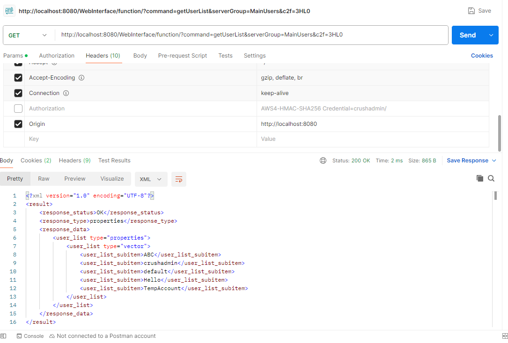

# CVE-2025-2825

> [안우진 (@awj1052)](https://github.com/awj1052)

<br/>

### 요약

-   CrushFTP의 특정 버전에서 AWS S3 인증 헤더 처리와 관련된 취약점입니다.
-   알려진 사용자명을 이용해 인증되지 않은 공격자가 해당 사용자처럼 수행할 수 있습니다.
-   이 취약점으로 관리자 권한으로 작업을 수행하거나 데이터에 접근할 수 있습니다.

 - 참고 자료
    - [attackerkb.com/topics/k0EgiL9Psz/cve-2025-2825/rapid7-analysis](https://attackerkb.com/topics/k0EgiL9Psz/cve-2025-2825/rapid7-analysis)
    - [velog.io/@awj1052/CVE-2025-2825-CrushFTP-PoC](https://velog.io/@awj1052/CVE-2025-2825-CrushFTP-PoC)
    - [github.com/NetLah/docker-crushftp](https://github.com/NetLah/docker-crushftp)

### 결과



<br/>

# CrushFTP 10

CrushFTP 10 Server provides FTP, Implicit FTPS, SFTP, HTTP, or HTTPS

## Docker Specifications

- Base: Alpine 3.19 Linux, OpenJDK 17, `eclipse-temurin:17-jre-alpine`
- CrushFTP 10 (v10.8.0) (required commercial license [pricing](https://www.crushftp.com/pricing.html))
- Dockerfile: https://github.com/NetLah/docker-crushftp

This container [hub.docker.com/r/netlah/crushftp](https://hub.docker.com/r/netlah/crushftp) is distributed under the [MIT Licence](LICENSE).

## Configuration

### Volumes

- Configuration and binary volume: `/var/opt/crushftp`
- Volume ftproot can be mounted additional like `/ftproot`

### Ports

- FTP: 21
- Passive FTP Ports: 20000-20100
- SFTP: 2222
- HTTPS/WebDAV: 443
- HTTP/WebDAV: 8080
- HTTP Alt/WebDAV: 9090

### Environments

- Admin user of CrushFTP `ADMIN_USER`, default `crushadmin`
- Password for admin user `ADMIN_PASSWORD`, default is random one time
- Health check HTTP protocol `WEB_PROTOCOL` http/https, default `http`
- Health check HTTP port `WEB_PORT`, default `8080`

## Installation

Run container and mount volume `/var/opt/crushftp` to the host in order to keep CrushFTP's configuration and binary persistent. Access browser to `http://localhost:8080` with the admin user to complete the setup.

```
docker run -p 21:21 -p 443:443 -p 20000-20100:20000-20100 -p 2222:2222 -p 8080:8080 -p 9090:9090 -v <volume>:/var/opt/crushftp netlah/crushftp:latest
```

To view the random admin password or the log, use `docker logs`

```
docker logs <container_id/container_name>
```


## References

- Visit the [CrushFTP 10 Wiki](https://www.crushftp.com/crush10wiki/)
- Docker sample [CrushFTP 10 Docker sample](https://www.crushftp.com/crush10wiki/Wiki.jsp?page=Docker)
- A [CrushFTP 10 Dockerization](https://github.com/MarkusMcNugen/docker-CrushFTP)
- Prebuilt OpenJDK by [Adoptium](https://adoptium.net/), project [Eclipse Temurin](https://adoptium.net/temurin/)
- Java docker [eclipse-temurin](https://hub.docker.com/_/eclipse-temurin)
