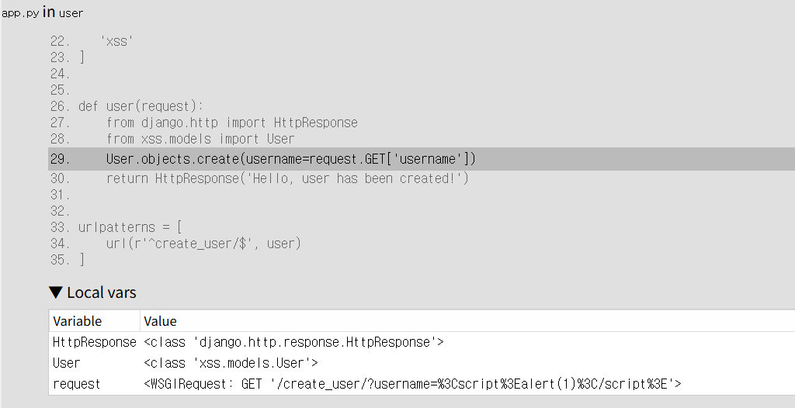

# Django 500 Debug Page Cross-Site Scripting (XSS) (CVE-2017-12794)

Django는 빠른 개발과 깔끔하고 실용적인 설계를 제공하는 고수준 Python 웹 프레임워크입니다.

Django 1.11.5와 1.10.8의 이전 버전은 Debug Error Page에서 corss-ste scripting(XSS) 취약점이 있습니다.

디버그 모드가 활성화 되어 있을 때 에러 페이지는 escape 되지 않은 HTML을 통해 잠재적으로 민감한 정보에 노출될 수 있습니다. 

이 취약점은 데이터베이스 오류가 발생했을 때 트리거되고
오류 세부 정보가 디버그 페이지에 표시되는 과정에서
데이터베이스로부터 전달된 오류 메시지가 템플릿에 렌더링되기 전에 적절히 escape 되지 않아 발생합니다.


출처:

- <https://www.djangoproject.com/weblog/2017/sep/05/security-releases/>
- <https://nvd.nist.gov/vuln/detail/CVE-2017-12794>
- <https://www.leavesongs.com/PENETRATION/django-debug-page-xss.html>


## 환경 설정

이 명령어를 통해 Django 서버를 시작할 수 있습니다. 
(Django 버전- 1.11.4):

```
docker compose up -d
```

서버가 시작되면 `http://your-ip:8000`를 통해 Django 홈페이지에 접속할 수 있습니다.


## PoC 

### 공격 시도

다음 url에 접속해 Javascript 코드가 포함된 악의적 사용자 이름으로 사용자를 생성합니다.

```
http://your-ip:8000/create_user/?username=<script>alert(1)</script>
```


첫번째 요청은 성공합니다.

서버는 username ```<script>alert(1)</script>```를 그대로 받아 악의적인 코드로 인식하지지 못하고 텍스트 데이터로 DB에 저장합니다. 


이후 동일한 URL에 다시 접속해 같은 요청을 보내면 데이터베이스의 고유 제약 조건으로 인해 에러가 발생합니다.

이미 DB에는 ```<script>alert(1)</script>``` 라는 이름을 가진 사용자가 있는데 한번 더 같은 요청을 보내 Django는 IntegrityError가 발생합니다. DB 내의 사용자들은 모두 다른 이름을 갖고 있어야 합니다.


이때 디버그 에러 페이지는 해당 문자열이 글자가 아닌 코드로 실행되어 그대로 보여집니다.


 
### 결과


alert창이 뜨고 나서 Django Debug Error Page가 보여집니다. 
요청 URL, Django 버전, 에러 타입 등 해당 Error에 대한 세부 사항들이 담겨져 있습니다. 


### Django Debug Error Page 분석

django/db/backends/utils.py의 65줄의  ```return self.cursor.execute(sql, params)``` 는 DB에 INSERT를 시도하는 SQL문의 실행 부분입니다. 




app.py의 29줄의 ```User.objects.create(username=request.GET['username']) ```는 사용자의 입력이 필터링 없이 바로 DB에 들어가게 되는 취약한 부분입니다.


브라우저는 사용자 이름에 포함된 JavaScript 코드를 HTML로 인식하여 실행하게 되며, 이를 통해 XSS(크로스 사이트 스크립팅) 취약점이 발생할 수 있습니다.

이 취약점은 공격자가 디버그 페이지 내에서 임의의 JavaScript 코드를 실행하는 데 악용될 수 있으며 
이를 통해 세션 탈취 또는 기타 클라이언트 측 공격으로 이어질 수 있습니다.

## 패치

Django 1.11.4에서 해당 취약점이 발생했고 이를 패치시킨 1.11.5가 있습니다.

- 1.11.14의 Django Debug Error Page 

```
{{ frame.exc_cause }}
```

- 1.11.5의 Django Debug Error Page 

```
{{ frame.exc_cause|force_escape }}
```
사용자의 입력을 글자로 escape 처리해 코드를 실행하지 못하도록 막았습니다. 
즉, XSS 공격코드의 "<", ">"를 글자로 처리한 것입니다. 


이 취약점의 원리에 대한 자세한 설명은 참고 링크의 세 번째 문서를 참조하세요 : <https://www.leavesongs.com/PENETRATION/django-debug-page-xss.html>
