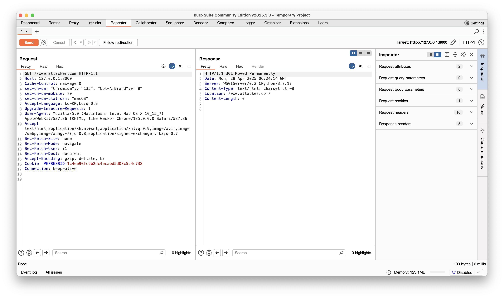

# CVE-2018-14574: Django Open Redirect 취약점

## 1. 취약점 개요
CVE-2018-14574는 **Django 2.0.7 이전 버전**과 **1.11.15 이전 버전**에서 발생하는 **Open Redirect 취약점**입니다. 이 취약점은 `CommonMiddleware`에서 발생하며, `APPEND_SLASH` 설정이 활성화된 상태에서 특정 URL 패턴을 이용해 악용될 수 있습니다. 공격자는 이 취약점을 이용해 사용자를 악의적인 외부 사이트로 리디렉션시킬 수 있습니다.

## 2. 취약점 영향
이 취약점은 사용자가 특정 URL을 방문하면, 서버가 `//` 형식의 URL을 외부 사이트로 잘못 해석하여 공격자가 설정한 URL로 리디렉션할 수 있습니다. 이는 **피싱 공격**이나 **사회 공학적 공격**에 악용될 수 있습니다.

### 영향받는 버전:
- Django 2.0.7 이전 버전
- Django 1.11.15 이전 버전

## 3. 취약점 발생 원인
이 취약점은 Django의 `CommonMiddleware`에서 `APPEND_SLASH` 설정이 활성화되어 있을 때 발생합니다. 이 설정은 URL의 끝에 슬래시가 없으면 자동으로 리디렉션하는 기능을 제공합니다. 하지만, 악의적인 사용자가 `//` 형식으로 URL을 조작하면, 브라우저는 이를 절대 경로로 인식하고 외부 사이트로 리디렉션하게 됩니다.

## 4. 취약점 재현 방법

1. **취약한 서버 구축**
   - Django 2.0.7 이전 버전 또는 1.11.15 이전 버전이 설치된 서버를 준비합니다.
   - `CommonMiddleware`와 `APPEND_SLASH` 설정이 활성화된 상태에서 서버를 실행합니다.

2. **Open Redirect 테스트**
   - 다음과 같은 URL을 사용하여 Open Redirect를 유도할 수 있습니다.
     ```
     http://your-ip:8000//www.attacker.com
     ```
   - 이 URL을 입력하면, 서버는 `//www.example.com`을 외부 사이트로 리디렉션하며, 이는 `example.com`으로 연결됩니다.

   - 

## 5. 취약점 해결 방법
이 취약점을 해결하려면, **Django 2.0.8** 이상 버전으로 업데이트해야 합니다. 최신 버전에서는 이 문제를 해결한 패치가 포함되어 있습니다.

Django 버전 업그레이드:
```bash
pip install --upgrade django