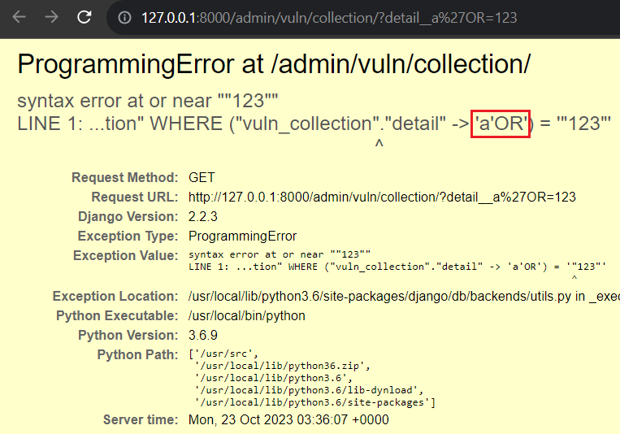

# CVE-2019-14234 

**Contributors**

-   [박윤(@moons03)](https://github.com/moons03) 

 

### 요약

- django의 얕은 키 변환에서 django.contrib.postgres.fields.JSONField의 키 및 인덱스 검색과 django.contrib.postgres.fields.HSToreField에 대한 키 검색에서 SQL Injection 취약점이 터집니다
- admin 페이지에 테이블 수정 페이지에서 쿼리로 `?detail__a%27b=123` 이런식으로해 SQL Injection을 할 수 있습니다

 

### 환경 구성 및 실행

- `docker compose up -d`를 실행하여 테스트 환경을 실행합니다.
- `http://127.0.0.1:8000/admin`에 접속해서 id:admin, pw:admin 으로 로그인 해줍니다
- `http://127.0.0.1:8000/admin/vuln/collection/?detail__a%27OR=123`으로 가면 django debug 부분에 SQL Injection이 된 것을 확인할 수 있습니다.

 

### 결과

 

### 정리

- 이 취약점은 Django 의 특정 조권일 때 발생하는 취약점으로 SQL Injection이 가능한, 정보 탈취가 가능한 매우 심각한 취약점 입니다. 이러한 취약점을 막기 위해서는 Django 버전을 최신버전으로 항상 유지하는 것이 매우 중요합니다