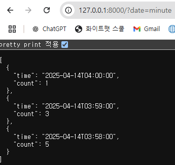
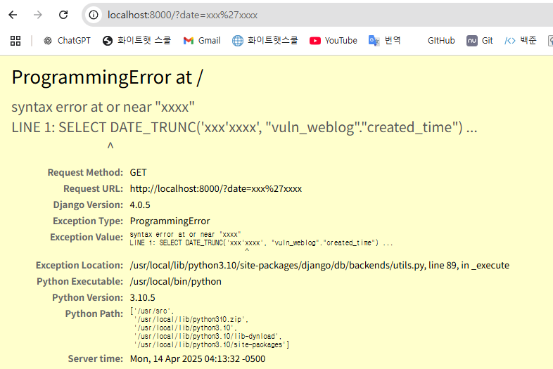

# CVE-2022-34265 / Django Trunc SQL Injection

> 화이트햇 스쿨 3기 (19반) - [김민곤(@KMINGON)](https://github.com/KMINGON)


## 개요

**취약점 번호:** CVE-2022-34265  
**취약점 종류:** SQL Injection  
**영향받는 버전:** Django 4.0.0 ~ 4.0.5 / 3.2.14 미만  
**공식 패치 버전:** Django 4.0.6 / 3.2.15

Django에서 날짜/시간 관련 데이터 추출 함수인 `Trunc()` 및 `Extract()`의 인자(`lookup_name`)를 사용자 입력값으로 직접 사용할 경우, 내부 SQL 구문에 무검증 삽입되어 SQL Injection이 가능한 취약점이 발견

## 환경 구성

> 취약한 Django 4.0.5 환경을 Docker 기반으로 실행하고, SQL Injection이 실제로 발생하는지 확인

### 실행 방법
- vulhub 에서 예제 파일 클론
`https://github.com/vulhub/vulhub/tree/master/django/CVE-2022-34265`

- 취약한 Django 4.0.5 서버 실행
```bash
git clone https://github.com/KMINGON/kr-vulhub.git
cd Django/CVE-2022-34265
docker compose up -d
```
실행 후 브라우저에서 다음 주소로 접속:

```
http://localhost:8000/?date=minute
```

## PoC 수행

### 정상 요청
- `http://localhost:8000/?date=minute` 요청 시 페이지 클릭 수가 분 단위로 출력됨
- 응답 JSON
```json
[
  {
    "time": "2025-04-14T04:00:00",
    "count": 1
  },
  {
    "time": "2025-04-14T03:59:00",
    "count": 3
  },
  {
    "time": "2025-04-14T03:58:00",
    "count": 5
  }
]
```

### 취약 요청
---
- `http://localhost:8000/?date=xxx'xxxx` 요청 시 SQL 오류 발생

- 오류 메시지
-> SELECT DATE_TRUNC('xxx'xxxx', "vuln_weblog"."created_time")

사용자 입력값이 SQL 구문에 직접 삽입되어 쿼리 조작이 발생한 것을 확인

### 취약점 분석
---

`views.py` 내부 코드:

```python
def vul(request):
    create_log(request)
    date = request.GET.get('date', 'minute')  # ⚠ 사용자 입력을 그대로 사용
    objects = list(
        WebLog.objects
        .annotate(time=Trunc('created_time', date))  # ⚠ SQL 함수에 직접 삽입
        .values('time')
        .order_by('-time')
        .annotate(count=Count('id'))
    )
    return JsonResponse(data=objects, safe=False)
```

- `request.GET.get('date')` 을 통해 받은 사용자 입력값 date가 `Trunc('created_time', date)` 의 두 번째 인자로 직접 삽입
- `Trunc()` 는 내부적으로 다음과 같은 SQL 구문을 생성
```sql
SELECT DATE_TRUNC('사용자입력값', "weblog"."created_time")
```
- 사용자가 악의적인 입력(xxx'xxxx)을 주면 SQL 문법 오류 또는 Injection 가능성이 발생

### 대응 방안
---
1. Django 4.0.6 이상으로 보안 패치 적용
2. 사용자 입력값을 함수 인자로 직접 사용하지 않도록 화이트리스트 필터링
```python
ALLOWED_LOOKUPS = ['minute', 'hour', 'day']

def vul(request):
    create_log(request)
    date = request.GET.get('date', 'minute')
    if date not in ALLOWED_LOOKUPS:
        return HttpResponseBadRequest("Invalid value")
    ...
```

## 참고 문헌
- [CVE-2022-34265 세부 정보 - NVD](https://nvd.nist.gov/vuln/detail/CVE-2022-34265)
- [Django 공식 보안 공지](https://www.djangoproject.com/weblog/2022/jul/04/security-releases/)
- [PoC 기반 환경: vulhub](https://github.com/vulhub/vulhub/tree/master/django/CVE-2022-34265)