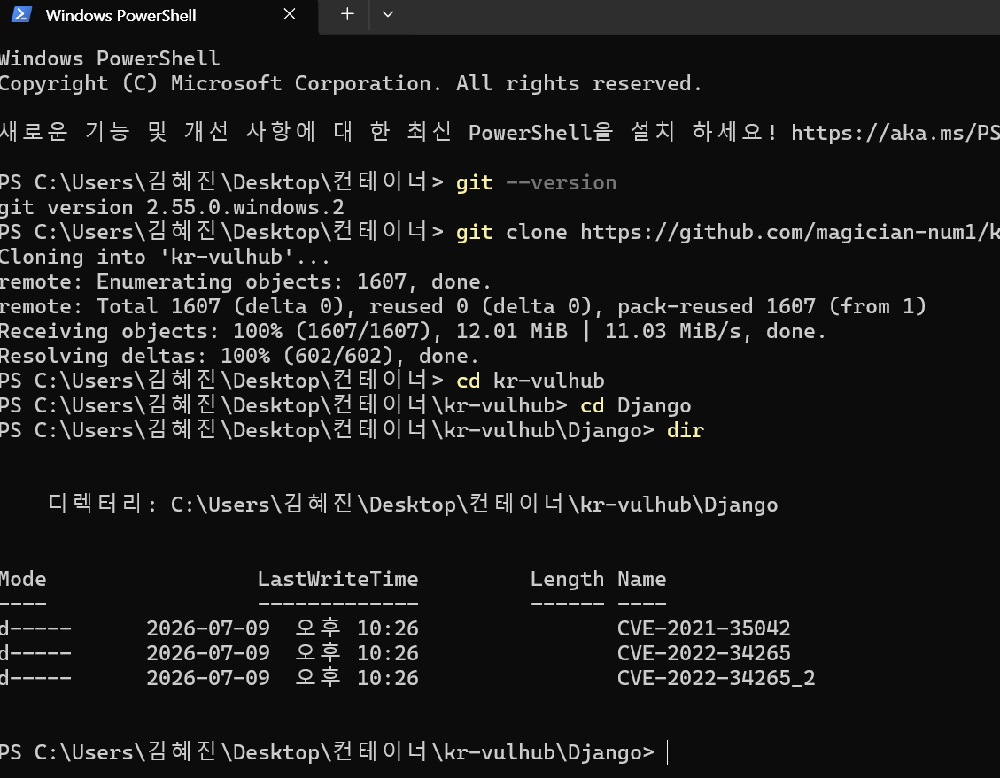
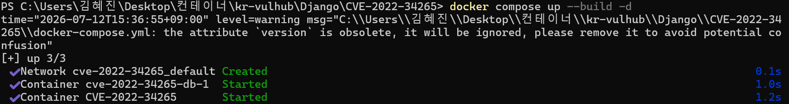
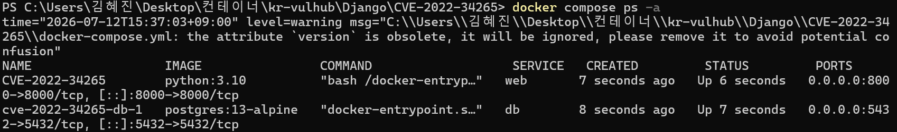
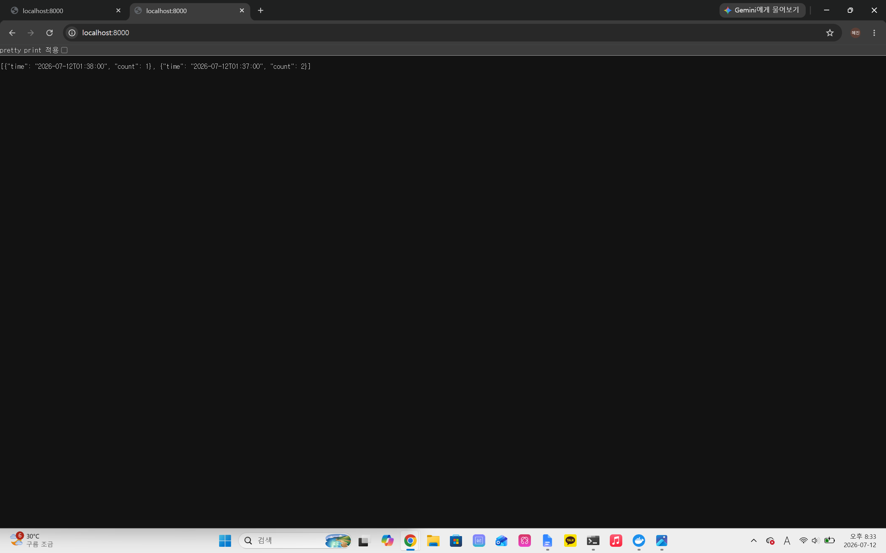
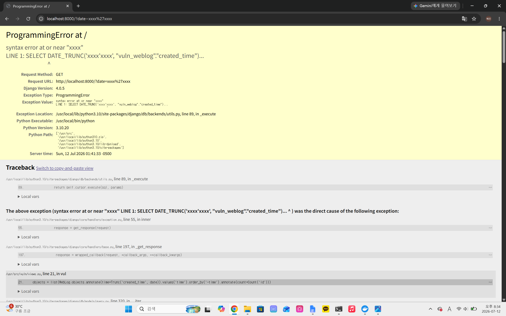

# kr-vulhub에 기여하기 

## 1. 실습 개요

이번 실습에서는 Docker를 이용하여 취약한 Django 환경을 구축하고, SQL Injection 취약점(CVE-2022-34265)을 직접 재현해 보는 것을 목표로 하였다.

실습을 진행하면서 Docker 환경 구축부터 취약점 재현, 원인 분석, 대응 방안까지 직접 확인해 보았다.

---

## 2. 기본 개념

### 2.1 CVE란?

CVE(Common Vulnerabilities and Exposures)는 공개된 보안 취약점을 일관된 번호로 식별하기 위한 체계이다.

예를 들어 `CVE-2022-34265`는 2022년에 공개된 취약점 중 하나를 식별하는 고유 번호이다. CVE 번호를 이용하면 취약점의 영향 범위, 패치 정보, 보안 권고 등을 여러 기관과 개발자가 동일한 기준으로 확인할 수 있다.

### 2.2 Django란?

Django는 Python으로 작성된 웹 프레임워크이다. URL 처리, 데이터베이스 연동, 템플릿, 인증 등 웹 애플리케이션 개발에 필요한 기능을 제공한다.

Django는 ORM(Object-Relational Mapping)을 통해 Python 코드로 데이터베이스를 다룰 수 있게 해준다. 그러나 ORM을 사용하더라도 외부 입력을 안전하게 제한하지 않으면 SQL Injection이 발생할 수 있다.

### 2.3 SQL Injection이란?

SQL Injection은 외부에서 입력받은 값이 안전하게 검증되지 않은 채 SQL 구문에 포함될 때 발생하는 취약점이다.

입력값을 제대로 검증하지 않으면 공격자가 의도하지 않은 SQL 문을 실행할 수 있다.

이 경우 데이터 조회, 수정, 삭제와 같은 문제가 발생할 수 있으며 서비스에도 영향을 줄 수 있다.

이번 실습에서는 실제 데이터를 탈취하는 공격 대신, 작은따옴표가 포함된 값을 전달하여 SQL 구문 오류가 발생하는지를 확인하였다.

### 2.4 `Trunc()` 함수란?

Django의 `Trunc()` 함수는 날짜와 시간 데이터를 특정 단위로 잘라 집계할 때 사용한다.

예를 들어 다음 시간이 있다고 가정한다.

```text
2026-07-12 20:35:27
```

이를 `minute` 단위로 처리하면 초 단위가 제거되어 다음과 같이 표현될 수 있다.

```text
2026-07-12 20:35:00
```

### 2.5 `Extract()` 함수란?

`Extract()` 함수는 날짜와 시간 데이터에서 연도, 월, 일, 시각 등의 특정 부분을 추출할 때 사용한다.

예를 들어 다음 날짜에서 `month`를 추출하면 `7`이 반환된다.

```text
2026-07-12 20:35:27
```

---

## 3. 취약점 요약

| 항목 | 내용 |
|---|---|
| CVE | CVE-2022-34265 |
| 취약점 유형 | SQL Injection |
| 대상 | Django |
| 취약 함수 | `Trunc(kind)`, `Extract(lookup_name)` |
| 실습 Django 버전 | 4.0.5 |
| 패치 버전 | 4.0.6, 3.2.14 |
| 실습 데이터베이스 | PostgreSQL 13 |
| 공식 심각도 | High(Django 보안 정책 기준) |
| NVD CVSS v3.1 | 9.8 Critical |

CVE-2022-34265는 신뢰할 수 없는 입력값을 `Trunc()` 함수의 `kind` 또는 `Extract()` 함수의 `lookup_name` 값으로 사용할 때 SQL Injection이 발생할 수 있는 취약점이다.

Django는 2022년 7월 4일 보안 업데이트인 Django 4.0.6과 3.2.14를 발표하여 해당 문제를 수정하였다.

---

## 4. 취약 조건

다음 조건을 만족할 때 취약점이 발생할 수 있다.

- 취약한 Django 버전을 사용하는 경우
  - Django 3.2.14 미만
  - Django 4.0.6 미만
- 애플리케이션에서 `Trunc()` 또는 `Extract()`를 사용하는 경우
- 외부에서 전달된 값을 `kind` 또는 `lookup_name`에 사용하는 경우
- 입력값을 안전한 목록으로 제한하지 않은 경우

반대로 `year`, `month`, `day`, `hour`, `minute`처럼 미리 허용된 안전한 값만 선택할 수 있도록 제한한 애플리케이션은 해당 공격의 영향을 받지 않는다.

본 실습 환경은 Django 4.0.5에서 URL의 `date` 파라미터를 `Trunc()` 함수의 날짜 단위 값으로 사용하도록 구성되어 있다.

---

## 5. 환경 구성

### 5.1 사용 환경

| 구분 | 내용 |
|---|---|
| 운영체제 | Windows 11 |
| 컨테이너 도구 | Docker Desktop / Docker Compose |
| 명령어 실행 | Windows PowerShell |
| 버전 관리 | Git for Windows |
| 웹 프레임워크 | Django 4.0.5 |
| Python | Python 3.10 |
| 데이터베이스 | PostgreSQL 13 Alpine |
| 브라우저 | Google Chrome |
| 웹 포트 | 8000 |
| 데이터베이스 포트 | 5432 |

### 5.2 Docker란?

Docker는 프로그램을 실행하는 데 필요한 환경을 하나의 컨테이너로 만들어 실행하는 기술이다.

운영체제가 달라도 같은 환경을 쉽게 만들 수 있기 때문에 보안 실습에서 많이 사용된다.

### 5.3 Docker Compose란?

Docker Compose는 여러 컨테이너의 설정을 Compose 파일에 정의하고 한 번에 실행할 수 있게 해주는 도구이다.

이번 환경은 다음 두 서비스를 함께 실행한다.

- Django 웹 애플리케이션
- PostgreSQL 데이터베이스

환경 실행에는 다음 명령어를 사용한다.

```bash
docker compose up --build -d
```

| 구성 | 의미 |
|---|---|
| `docker compose` | 현재 폴더의 Compose 설정 사용 |
| `up` | 서비스 생성 및 실행 |
| `--build` | 필요한 이미지를 다시 빌드 |
| `-d` | 백그라운드에서 실행 |

---

## 6. 환경 구축 절차

### 6.1 저장소 Clone

Fork한 저장소를 로컬 컴퓨터로 Clone하였다.

Windows에서 셸 스크립트의 줄바꿈이 CRLF로 변환되는 것을 방지하기 위해 Clone 전에 다음 설정을 적용할 수 있다.

```powershell
git clone https://github.com/magician-num1/kr-vulhub.git
```



### 6.2 실습 폴더 이동

```powershell
cd kr-vulhub/Django/CVE-2022-34265
```

PowerShell에서 경로를 직접 지정할 경우 다음과 같이 입력할 수도 있다.

```powershell
cd "C:\Users\김혜진\Desktop\컨테이너\kr-vulhub\Django\CVE-2022-34265"
```

### 6.3 Docker Compose 실행

다음 명령어 하나로 Django와 PostgreSQL 환경을 생성하고 실행하였다.

```powershell
docker compose up --build -d
```



실행 결과에서 네트워크가 생성되고 Django 및 PostgreSQL 컨테이너가 `Started` 상태가 된 것을 확인하였다.

### 6.4 컨테이너 실행 상태 확인

```powershell
docker compose ps -a
```



웹 컨테이너와 데이터베이스 컨테이너가 모두 `Up` 상태이며 다음 포트가 연결된 것을 확인하였다.

- Django: `8000:8000`
- PostgreSQL: `5432:5432`

---

## 7. 정상 동작 확인

브라우저에서 다음 주소로 접속하였다.

```text
http://localhost:8000
```



시간과 클릭 수가 JSON 형태로 출력되었다.

예시는 다음과 같다.

```json
[
  {
    "time": "2026-07-12T01:38:00",
    "count": 1
  },
  {
    "time": "2026-07-12T01:37:00",
    "count": 2
  }
]
```

이를 통해 다음 사항을 확인하였다.

- Django 웹 서버가 정상적으로 실행됨
- 8000번 포트로 접속 가능함
- Django와 PostgreSQL이 정상적으로 연결됨
- 데이터 조회 및 JSON 응답이 정상적으로 처리됨

---

## 8. PoC 재현

### 8.1 PoC란?

PoC(Proof of Concept)는 취약점이 실제로 존재하며 재현 가능한지를 확인하는 최소한의 증명 과정이다.

이번 PoC에서는 데이터 탈취나 변조를 수행하지 않고, 조작된 입력값이 SQL 구문에 포함되어 오류를 발생시키는지를 확인하였다.

### 8.2 브라우저를 이용한 PoC

다음 URL을 브라우저 주소창에 입력하였다.

```text
http://localhost:8000/?date=xxxx%27xxxx
```

`%27`은 URL Encoding된 작은따옴표(`'`)이다. 따라서 서버에는 다음 입력값이 전달된다.

```text
xxxx'xxxx
```

### 8.3 PowerShell을 이용한 PoC 코드

브라우저뿐 아니라 다음 명령어를 복사하여 동일한 요청을 보낼 수 있다.

```powershell
curl.exe "http://localhost:8000/?date=xxxx%27xxxx"
```

정상 요청과 비교하려면 다음 명령어를 사용할 수 있다.

```powershell
curl.exe "http://localhost:8000/?date=minute"
```

### 8.4 입력값에 의한 SQL 구문 변화

정상적인 날짜 단위가 사용되면 SQL 구문의 개념적인 형태는 다음과 같다.

```sql
DATE_TRUNC('minute', created_time)
```

하지만 작은따옴표가 포함된 입력이 충분한 검증 없이 사용되면 다음과 같이 SQL 구문의 문자열 경계가 깨질 수 있다.

```sql
DATE_TRUNC('xxxx'xxxx', created_time)
```

이로 인해 PostgreSQL이 SQL 구문을 정상적으로 해석하지 못하고 문법 오류를 반환한다.

---

## 9. 실행 결과



브라우저에서 다음 내용을 확인하였다.

```text
ProgrammingError at /
syntax error at or near "xxxx"
```

오류 화면에는 다음과 같이 사용자 입력값이 반영된 SQL 일부도 표시되었다.

```sql
SELECT DATE_TRUNC('xxxx'xxxx', "vuln_weblog"."created_time") ...
```

이 결과는 외부에서 전달한 `date` 파라미터가 SQL 함수의 인자에 영향을 주었다는 것을 보여준다.

따라서 본 실습에서는 CVE-2022-34265의 SQL Injection 취약점이 재현되었다고 판단하였다.

다만 이번 PoC는 SQL 문법 오류 발생을 통해 입력값이 SQL 구문에 영향을 미치는 것을 확인한 것이다. 실제 데이터 조회·변조·삭제는 수행하지 않았다.

---

## 10. 취약 원인 분석

애플리케이션은 URL에서 전달받은 `date` 값을 Django의 `Trunc()` 함수에 전달한다.

개념적인 취약 코드 흐름은 다음과 같다.

```python
date = request.GET.get("date", "minute")

WebLog.objects.annotate(
    time=Trunc("created_time", date)
)
```

외부 입력값인 `date`가 충분한 검증 없이 `Trunc()` 함수의 `kind` 값으로 전달될 경우 SQL 구문의 구조에 영향을 줄 수 있다.

핵심 원인은 다음과 같다.

1. 외부 입력값을 신뢰함
2. 허용 가능한 날짜 단위를 제한하지 않음
3. 입력값이 데이터가 아닌 SQL 함수 구성 요소로 사용됨
4. 취약한 Django 버전에서 해당 값을 안전하게 처리하지 못함

---

## 11. 대응 방안

### 11.1 Django 보안 업데이트 적용

가장 중요한 대응 방안은 보안 패치가 적용된 버전으로 업데이트하는 것이다.

```text
Django 4.0 계열 → 4.0.6 이상
Django 3.2 계열 → 3.2.14 이상
```

가능하면 지원이 종료된 구버전 대신 현재 보안 지원을 받는 최신 버전을 사용해야 한다.

### 11.2 화이트리스트 입력 검증

날짜 단위로 허용할 값만 목록으로 정의한다.

```python
ALLOWED_DATE_KINDS = {
    "year",
    "month",
    "day",
    "hour",
    "minute",
}

date = request.GET.get("date", "minute")

if date not in ALLOWED_DATE_KINDS:
    date = "minute"
```

이렇게 하면 작은따옴표나 SQL 구문을 포함한 임의의 문자열이 `Trunc()` 함수에 전달되는 것을 방지할 수 있다.

### 11.3 운영 환경에서 DEBUG 비활성화

실습 환경은 오류 원인을 확인하기 위해 상세한 Django 디버그 페이지를 표시한다.

실제 운영 환경에서는 다음과 같이 설정해야 한다.

```python
DEBUG = False
```

디버그 페이지에는 SQL 구문, 파일 경로, 소스 코드 위치, 환경 정보 등이 노출될 수 있다. `DEBUG=False`는 취약점 자체를 수정하지는 않지만 공격자에게 제공되는 내부 정보를 줄일 수 있다.

### 11.4 입력값 검증

사용자가 입력할 수 있는 값을 year, month, day, hour, minute처럼 미리 정해진 값으로 제한하면 SQL Injection을 예방할 수 있다.
### 11.5 의존성 점검 및 패치 관리

Django뿐 아니라 Python 패키지와 데이터베이스 등 전체 의존성의 보안 업데이트를 정기적으로 확인해야 한다.

---

## 12. 실습 후기

이번 실습은 Docker를 이용하여 취약한 웹 환경을 직접 구축하고 SQL Injection 취약점을 재현해 본 첫 실습이었다.

처음에는 Docker, Git, GitHub의 Fork와 Clone, Pull Request 같은 개념이 모두 익숙하지 않아 환경을 구성하는 것부터 어려움을 겪었다. 특히 Docker Engine이 실행되지 않아 컨테이너가 생성되지 않거나, Windows의 줄바꿈(CRLF) 문제로 쉘 스크립트가 정상적으로 실행되지 않는 오류가 발생하여 원인을 찾는 데 시간이 많이 걸렸다. 오류 메시지를 하나씩 찾아보고 수정하면서 환경을 다시 구축하는 과정을 반복했고, 결국 취약 환경을 정상적으로 실행할 수 있었다.

취약 환경이 실행된 후에는 `docker compose ps` 명령어를 통해 Django와 PostgreSQL 컨테이너가 정상적으로 실행되는 것을 확인하고, 브라우저에서 웹 페이지가 정상적으로 동작하는 것도 확인하였다. 이후 악성 URL을 입력했을 때 ProgrammingError가 발생하는 모습을 직접 보면서 사용자의 입력값이 SQL 문에 영향을 줄 수 있다는 점을 눈으로 확인할 수 있었다.

이번 실습을 하기 전에는 SQL Injection을 단순히 로그인 창에서만 발생하는 공격이라고 생각했지만, 날짜 처리 함수와 같이 예상하지 못한 부분에서도 입력값 검증이 부족하면 취약점이 발생할 수 있다는 점을 새롭게 알게 되었다. 또한 Docker를 이용하면 복잡한 환경도 비교적 쉽게 구성하고 동일한 환경을 재현할 수 있다는 점도 직접 경험할 수 있었다.

이번 과제를 통해 취약점을 단순히 이론으로 공부하는 것보다 직접 환경을 구축하고, 오류를 해결하며, 취약점을 재현하는 과정이 보안을 이해하는 데 훨씬 도움이 된다는 것을 느꼈다. 앞으로도 다양한 CVE 환경을 직접 실습하면서 Docker와 웹 보안에 대한 이해를 더 넓혀 나가고 싶다.
