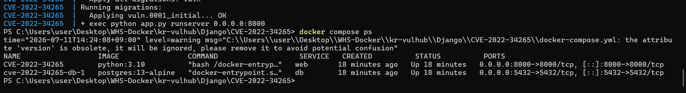
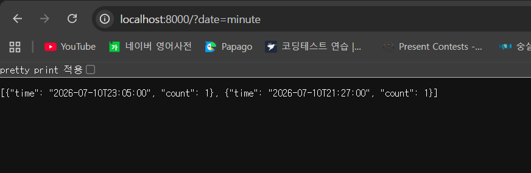
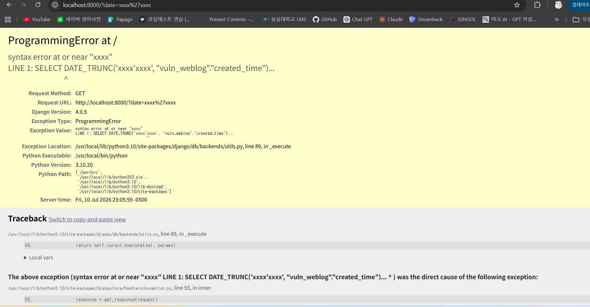
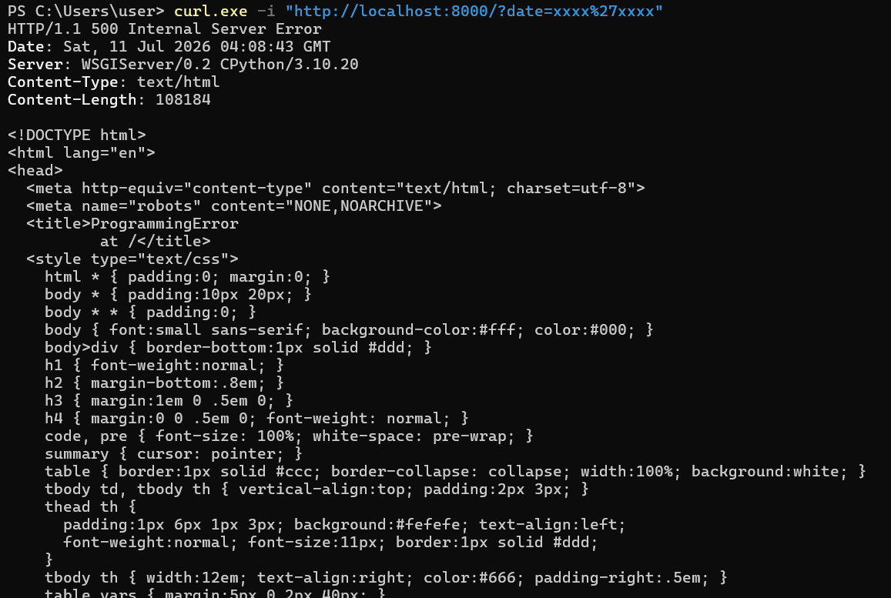

# CVE-2022-34265

## Contributor

-LH-GWAN

# 1. 취약점 요약

**CVE 번호** : CVE-2022-34265

**환경**

- Django 4.0.6 미만, Django 3.2.14 미만

**종류**

- SQL Injection

Django의 `Trunc()`와 `Extract()` 함수에서 사용자 입력값을 충분히 검증하지 않아 SQL Injection이 발생하는 취약점입니다.

공격자가 `date` 를 조작하여 PostgreSQL에 전달되는 SQL Query가 변조되어 데이터베이스 오류를 발생시키거나 SQL Injection 공격으로 이어질 수 있습니다.

# 2. 환경 구성

- Windows 11
- Docker Desktop
- Docker Compose
- Python 3.10
- PostgreSQL 13
- Django 4.0.5

## 실행

```docker compose up -d```

## 실행 결과



Docker Compose를 이용하여 Django와 PostgreSQL 컨테이너가 정상적으로 실행되는 것을 확인하였습니다.

# 3. 취약 조건

취약한 코드

```
date = request.GET.get('date', 'minute')

objects = list(
    WebLog.objects
    .annotate(time=Trunc('created_time', date))
    .values('time')
    .order_by('-time')
    .annotate(count=Count('id'))
)
```

사용자가 입력한 `date` 값이 아무런 검증 없이 `Trunc()` 함수로 전달됩니다.
결국 이는 공격자가 특수문자 `'` 등을 삽입하면 SQL Query가 변조되어 SQL Injection이 발생합니다.

# 4. 재현 절차

## 4-1 취약 환경 실행

```docker compose up -d```

정상 실행 여부 확인

```docker compose ps```

## 4-2 정상 요청

아래 URL 접속

```http://localhost:8000/?date=minute```

접속 결과 정상적으로 JSON 데이터가 출력되는 것을 확인할 수 있습니다.



## 4-3 SQL Injection PoC

아래 URL 접속

```http://localhost:8000/?date=xxxx%27xxxx```

# 5. PoC 코드

브라우저에서 확인

```http://localhost:8000/?date=xxxx%27xxxx```



curl로 확인

```curl.exe -i "http://localhost:8000/?date=xxxx%27xxxx"```



# 6. 실행 결과

SQL Injection이 발생하면서 Django에서 Database Error가 발생하였습니다.

- HTTP Status : 500 Internal Server Error
- Exception : ProgrammingError
- Django Version : 4.0.5

SQL
```SELECT DATE_TRUNC('xxxx'xxxx', "vuln_weblog"."created_time")```

사용자가 입력한 "'"이 SQL Query 내부로 그대로 전달되는 것을 확인하였습니다.

이는 사용자 입력이 적절하게 검증되지 않아 SQL Query가 변조되는 취약점이 존재함을 의미합니다.

# 7. 대응 방안

- Django 4.0.6 이상으로 업데이트
- Django 3.2.14 이상 사용
- 사용자 입력값 검증
- White List 적용

예)

```
ALLOW = [
    "minute",
    "hour",
    "day",
    "week",
    "month",
    "year"
]

date = request.GET.get("date")

if date not in ALLOW:
    return HttpResponse(status=400)
```

+ 최신 버전의 Django에서는 해당 취약점이 패치되어, 동일한 SQL Injection이 발생하지 않습니다.