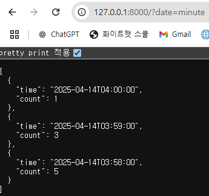
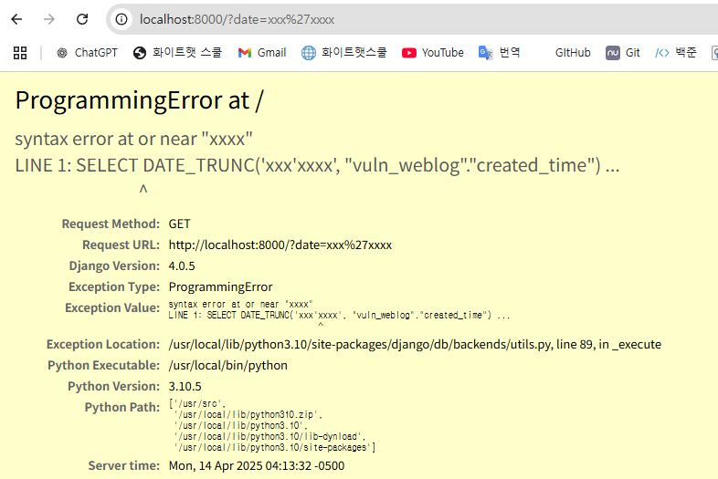

# CVE-2022-34265

**Contributors**

-   [김민곤(@KMINGON)](https://github.com/KMINGON)

<br/>

# Django Trunc(kind) SQL Injection (CVE-2022-34265)

Django에서 날짜/시간 관련 데이터 추출 함수인 `Trunc()` 및 `Extract()`의 인자(`lookup_name`)를 사용자 입력값으로 직접 사용할 경우, 내부 SQL 구문에 무검증 삽입되어 SQL Injection이 가능한 취약점이다.

**영향받는 버전:** Django 4.0.0 ~ 4.0.5 / 3.2.14 미만  
**공식 패치 버전:** Django 4.0.6 / 3.2.15

참고 자료:

- <https://nvd.nist.gov/vuln/detail/CVE-2022-34265>
- <https://www.djangoproject.com/weblog/2022/jul/04/security-releases/>

## 환경 설정

취약한 Django 4.0.5 서버를 시작한다:

```
docker compose up -d
```

실행 후 `http://your-ip:8000/?date=minute`로 접속한다.

## 취약점 재현

### 정상 요청

`http://your-ip:8000/?date=minute` 요청 시 페이지 클릭 수가 분 단위로 출력된다:



### SQL Injection

`http://your-ip:8000/?date=xxx'xxxx` 요청 시 SQL 오류가 발생한다:



`views.py` 내부의 취약 코드:

```python
def vul(request):
    date = request.GET.get('date', 'minute')  # 사용자 입력을 그대로 사용
    objects = list(
        WebLog.objects
        .annotate(time=Trunc('created_time', date))  # SQL 함수에 직접 삽입
        ...
    )
```

`Trunc('created_time', date)`가 내부적으로 `SELECT DATE_TRUNC('사용자입력', ...)` SQL을 생성하므로, 악의적인 입력이 SQL 구문에 직접 삽입된다.

## 환경 종료

```
docker compose down
```

## 대응 방안

- Django 4.0.6 이상으로 업데이트한다.
- 사용자 입력값을 함수 인자로 직접 사용하지 않도록 화이트리스트 필터링을 적용한다.
