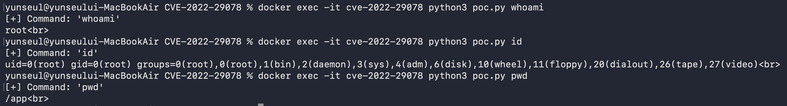

## CVE-2022-29078 | EJS SSTI
> [WHS 4기 오윤경(y7nse4l)](https://github.com/Yunse4l)

### 취약점 설명
EJS(Embedded JavaScript)는 Node.js 환경에서 널리 사용되는 템플릿 엔진으로 HTML 안에 JavaScript 코드를 삽입하여 동적인 웹페이지를 생성한다. CVE-2022-29078은 EJS의 템플릿 렌더링 과정에서 발생하는 SSTI 취약점으로 EJS 3.1.6 이하 버전에서 발생한다. 공격자는 EJS가 템플릿을 렌더링할 때 사용하는 특정 옵션의 입력값 검증이 미흡하다는 점을 악용하여 서버에서 임의의 JavaScript 코드를 실행할 수 있다.

| 항목       | 내용                                                      |
|----------|---------------------------------------------------------|
| CVE ID   | CVE-2022-29078                                          |
| 대상 소프트웨어 | ejs (npm package)                                       |
| 취약한 버전   | ≤ 3.1.6                                                 |
| 패치된 버전   | 3.1.7                                                   |
| 취약점 유형   | Server-Side Template Injection (CWE-94: Code Injection) |
| 영향       | 원격 코드 실행 (RCE)                                          |
| CVSS 3.1 | 9.8 (Critical)                                          |

### 취약한 조건
이 폴더의 app.js와 같이 사용자 입력 객체인 `req.query`를 렌더링 옵션으로 그대로 전달하는 경우 공격자는 이를 통해 EJS의 내부 옵션을 주입하여 원격 코드를 실행할 수 있다.

```
app.get('/', (req,res) => {
    res.render('index', req.query);
})
```

### 환경 구성

| 항목      | 내용                                 |
|---------|------------------------------------|
| 런타임     | Node.js 18 (Docker node:18-alpine) |
| 웹 프레임워크 | Express                            |
| 템플릿 엔진  | EJS 3.1.6                          |
| 포트      | 3000                               |

이 폴더의 전체 파일을 다운로드한 후 아래 명령어를 입력하여 취약한 환경을 구성한 Docker 컨테이너를 실행한다.
```
docker-compose up -d --build
```

Docker 컨테이너가 실행되면 기본적으로 http://localhost:3000/ 에서 웹 서버가 실행된다.<br>
app.js의 코드는 EJS SSTI 취약점과 관련된 [Github 이슈](https://github.com/mde/ejs/issues/720)의 예제 코드를 참고하여 작성하였다.

### 재현 절차
아래의 명령어를 입력하여 원격으로 코드를 실행한다.
```
docker exec -it cve-2022-29078 python3 poc.py <실행할 리눅스 명령어>
```
예시:
```
docker exec -it cve-2022-29078 python3 poc.py id
```
### 실행 결과


### 대응 방안
사용자 입력 객체 전체(`req.query`)를 렌더링 옵션으로 그대로 전달하지 않아야 한다.<br>
아래의 코드와 같이 필요한 값만 명시적으로 추출하여 전달한다.
```
res.render('index', { name: req.query.name });
```