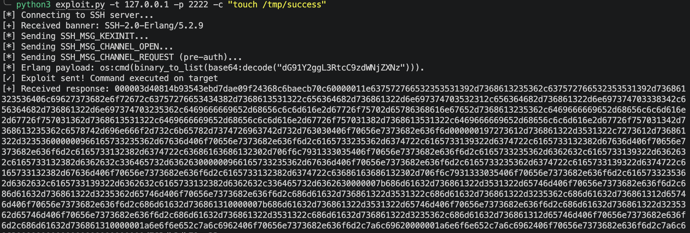
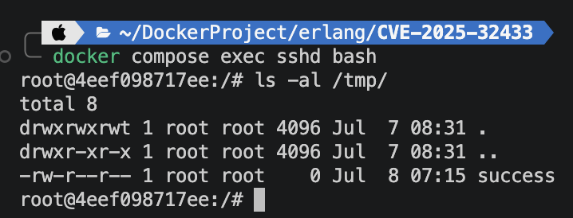
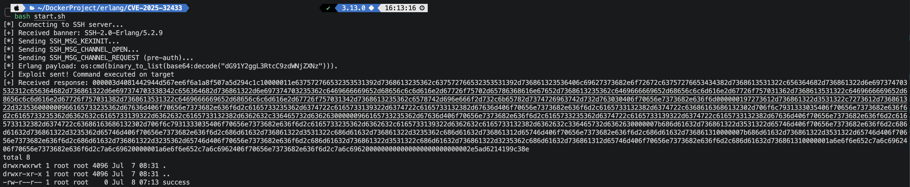

# CVE-2025-32433

**Contributors**
- 이동희(@chdonghui)

## 요약
- Erlang/OTP 서버에서 공격자가 인증되지 않은 원격 코드 실행(RCE)을 수행할 수 있는 취약점
- SSH 프로토콜 메시지 처리 결함을 악용함으로써 악의적인 행위자는 영향을 받은 시스템에 무단으로 접근해 임의의 명령 실행 가능

## 실행 환경
- MacOS: Tahoe Version 26.5.1
- Docker Desktop: Docker version 29.0.1

## References:
- Github Security Advisory 문서
	- https://github.com/erlang/otp/security/advisories/GHSA-37cp-fgq5-7wc2
- Github erlang 패치 (diff)
	- https://github.com/erlang/otp/commit/6eef04130afc8b0ccb63c9a0d8650209cf54892f#diff-ceeb1aeeb602e1424c13d9da9383e0782f65869d6e64e015c194145b1a64edcd
- 원문 vulhub에서 참고한 python exploit 코드
	-  https://github.com/ProDefense/CVE-2025-32433
- AI를 활용한 PoC 코드 작성 과정 및 exploit 코드 해설
	- [https://platformsecurity.com/blog/CVE-2025-32433-poc](https://platformsecurity.com/blog/CVE-2025-32433-poc)
- SSH 프로토콜 기본 규칙
	- https://datatracker.ietf.org/doc/html/rfc4254
- vulhub 원본 문서
	- https://github.com/vulhub/vulhub/tree/master/erlang/CVE-2025-32433


## Erlang/OTP SSH의 인증되지 않은 원격 코드 실행(CVE-2025-32433)

**Erlang/OTP의 개념**
- Erlang은 스웨덴 통신회사 에릭슨(Ericsson)이 전화 교환 시스템을 만들기 위해 개발한 프로그래밍 언어입니다.
- OTP(Open Telecom Platform)은 Erlang과 함께 제공되는 라이브러리, 도구, 설계 원칙의 모음입니다.
- 안정적인 시스템을 위한 범용 프레임워크로 대규모 동시 접속이 필요한 금융 시스템, 게임 서버, 메시징 서비스 등에 사용됩니다.
- Erlang/OTP SSH는 Erlang/OTP 플랫폼에 내장된 SSH 서버 구성 요소입니다.

**영향 여부**
- Erlang/OTP를 사용하는 모든 사용되는 기반이 되는 Erlang/OTP 버전과 관계없이 이 취약점의 영향을 받습니다.
- 애플리케이션이 Erlang/OTP SSH 라이브러리를 사용해 SSH 접근을 제공한다면 영향을 받는 것으로 간주할 수 있습니다.
- 영향을 받는 버전은 다음과 같습니다.
	- OTP >= 17.0
	- ssh(OTP) >= 3.0.1

**피해 (Impact)**
- 이 취약점은 Erlang/OTP SSH 서버를 실행하는 호스트에 네트워크로 접근 가능한 악의적 행위자가 인증 없이 원격 코드 실행을 수행할 수 있게 합니다.
- 해당 호스트의 침해로 이어져 제3자에 의한 민감 데이터의 무단 접근 및 조작, 또는 서비스 거부(DoS) 공격을 초래할 수 있습니다.

**대응 방안 (Mitigation)**
- 해당 버전 이상으로 업데이트를 권장합니다.
	- OTP-27.3.3 (OTP-27용)
	- OTP-26.2.5.11 (OTP-26용)
	- OTP-25-3.2.20 (OTP-25용)
- 임시 우회 방법: 수정된 버전으로 업그레이드 하기 전까지 SSH 서버를 비활성화 하거나 방화벽으로 접근을 차단할 것을 권장합니다.

## 환경 구성 (Environment Setup)
1. Docker Desktop을 실행합니다.
MacOS에서는 터미널에서 아래 명령어를 사용할 수 있습니다.
```
$ open -a "Docker Desktop"
```

2. docker 파일이 있는 폴더로 이동합니다.
```
$ cd erlang/CVE-2025-32433
```
3. docker 서버를 시작합니다.
다음 명령을 실행하여 Erlang/OTP 27.3.2 기반 SSH 서버를 시작합니다.
```
docker compose up -d
```
시작 후, 컨테이너는 2222 포트에서 대기하는 Erlang SSH 서비스를 실행하며, 이 포트는 호스트의 2222 포트에 매핑됩니다. SSH 도구나 제공된 exploit.py 스크립트를 사용해 접근할 수 있습니다. start.sh 스크립트를 실행하면 취약점 실행 및 확인을 한 번에 할 수 있습니다.

## 취약점 재현 (Vulnerability Reproduction)
제공된 exploit.py 스크립트를 사용해 취약점을 재현합니다. 예를 들어, 다음 명령은 대상 컨테이너 내부에 파일을 생성합니다.
```
python exploit.py -t 127.0.0.1 -p 2222 -c "touch /tmp/success"
```

이 스크립트는 특수하게 조작된 SSH_MSG_CHANNEL_REQUEST(메시지 번호 94) 패킷을 전송하여 서버의 메시지 결함을 악용해 인증되지 않은 단계에서의 명령을 실행합니다. SSH 프로토콜의 규칙인 RFC 4254에 따르면 메시지 구조는 다음과 같습니다. 
```
byte      SSH_MSG_CHANNEL_REQUEST
uint32    recipient channel
string    "exec"
boolean   want reply
string    command
```
- `byte`: 메시지 종류 번호 (채널 요청이라는 표시)
- `uint32`: 어느 채널에 대한 요청인지 (채널 번호)
- `string "exec"`: 요청 종류가 "명령 실행"이라는 것
- `boolean`: 응답을 받고 싶은지 여부
- `string command`: 실행할 실제 명령

인증이 완료된 뒤에만 처리되어야 하지만 취약한 버전의 서버 코드에는 `handle_msg` 함수에 "이 메시지가 왔을 때 인증이 끝났는지 확인하는 검사"가 빠져 있었습니다. 때문에 인증이 안된 상태에서 공격자가 명령을 실행할 수 있습니다.
```erlang
Connection#connection{requests = Rest}};

handle_msg(#ssh_msg_disconnect{code = Code,
			       description = Description},
	   Connection, _, _SSH) ->
    {disconnect, {Code, Description}, handle_stop(Connection)}.
```

익스플로잇에 성공한 후, 컨테이너에 진입하면 `tmp/success` 파일이 생성된 것을 확인할 수 있습니다.
```
$ docker compose exec sshd bash
# ls -al /tmp/
```


제공된 satrt.sh 스크립트를 사용해 한번에 취약점을 재현할 수 있습니다.
```
bash start.sh
```



